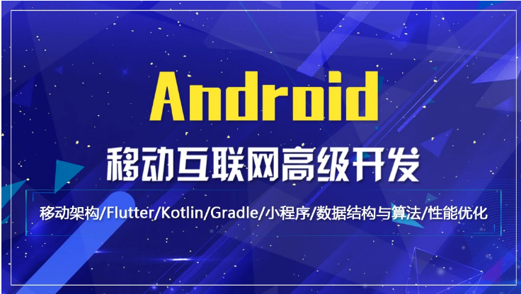
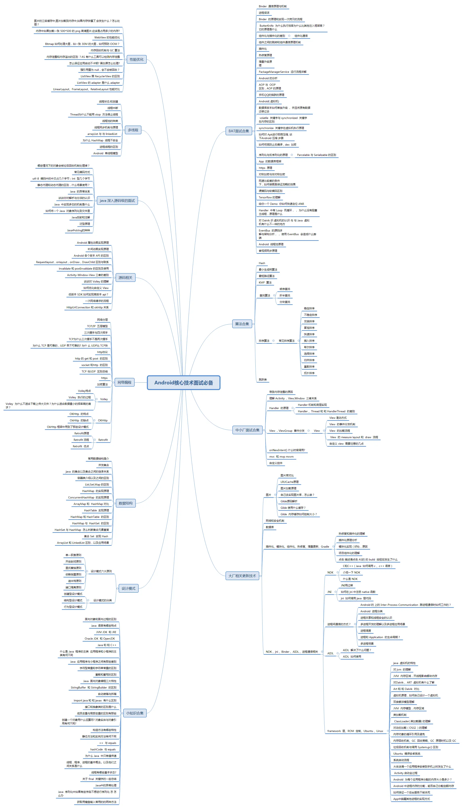
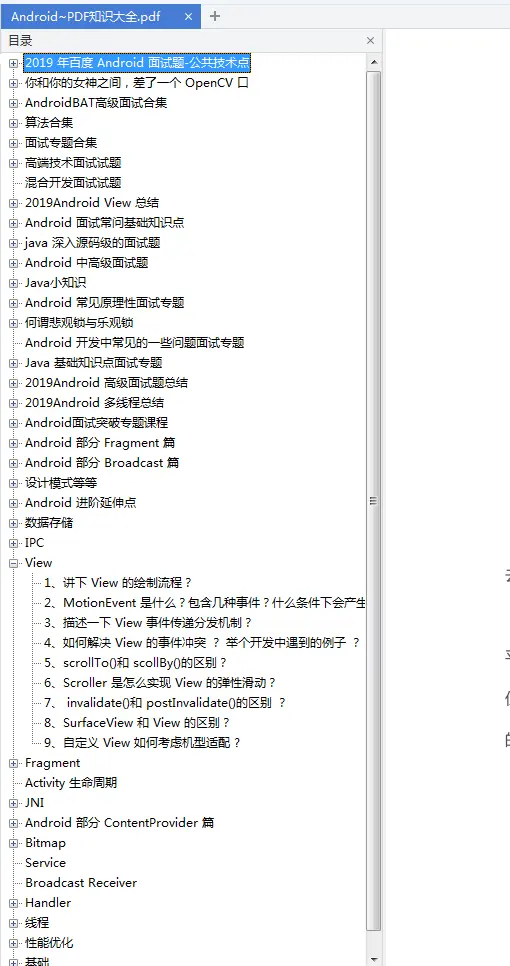

# Android 高级面试

### 

#### 写给Android的一封信
### 对于身边正在面试和面试中的人，加上我以往的面试经历整理了如下面试备考路线，和PDF版（有相应的视频教程在后面）
### 
### 

最近半年，常常有人问我 “Android就业市场究竟怎么样，我还能不能坚持下去 ?”

现在想想，移动互联网的发展不知不觉已经十多年了，Mobile First 也已经变成了 AI First。换句话说，我们已经不再是“风口上的猪”。移动开发的光环和溢价开始慢慢消失，并且正在向 AI、区块链等新的领域转移。移动开发的新鲜血液也已经变少，最明显的是国内应届生都纷纷涌向了 AI 方向。

​       可以说，国内移动互联网的红利期已经过去了，现在是增量下降、存量厮杀，从争夺用户到争夺时长。比较明显的是手机厂商纷纷互联网化，与传统互联网企业直接竞争。另外一方面，过去渠道的打法失灵，小程序、快应用等新兴渠道崛起，无论是手机厂商，还是各大 App 都把出海摆到了战略的位置。

各大培训市场也不再培训Android，**作为开发Android的我们该何去何从？**

​        其实如果你技术深度足够，大必不用为就业而忧愁。每个行业何尝不是这样，最开始的风口，到慢慢的成熟。Android初级在2019年的日子里风光不再， 靠会四大组件就能够获取到满意薪资的时代一去不复返。**经过一波一波的淘汰与洗牌，剩下的都是技术的金子。就像大浪褪去，裸泳的会慢慢上岸。**而真正坚持下来的一定会取得不错成绩。毕竟Android市场是如此之大。从Android高级的蓬勃的就业岗位需求来看，能坚信我们每一位Android开发者的梦想 。

 接下来我们针对Android高级展开的完整面试题 
 ### kotlin(视频）
 - [kotlin大全1-10视频代码](https://github.com/xiangjiana/Android-MS/blob/master/img/Kotlin_%E5%89%AF%E6%9C%AC.png)
 ### flutter（视频）
 - [flutter视频包](https://github.com/xiangjiana/Android-MS/blob/master/img/flutter.png)
 ### 音视频高手开发从0开始认识（视频）
 - [音视频高手开发系列视频1-10](https://github.com/xiangjiana/Android-MS/blob/master/img/%E9%9F%B3%E8%A7%86%E9%A2%91%E5%BC%80%E5%8F%911-10%E8%A7%86%E9%A2%91.png)
 ### 最新视频更新：
 - [1.90分钟搞定图片加载框架Glide，面试实战一条龙](https://github.com/xiangjiana/Android-MS/blob/master/img/VX.png)

 - [2.项目越做越复杂？组件化开发替你解决所有问题](https://github.com/xiangjiana/Android-MS/blob/master/img/VX.png)
 
  - [3.阿里面试题：单利模式下引发的血案，DCL双端锁下的CAS与ABA问题](https://github.com/xiangjiana/Android-MS/blob/master/img/VX.png)
  
 - [4.即学即用的Android高级开发技能-大长图加载原理及手写实现](https://github.com/xiangjiana/Android-MS/blob/master/img/VX.png)
 
  - [5.Android动态加载技术的进阶，实现资源更新框架](https://github.com/xiangjiana/Android-MS/blob/master/img/VX.png)
  
  - [6.Binder机制详解，用Binder中mmap思想解决你的APP卡顿问题](https://github.com/xiangjiana/Android-MS/blob/master/img/VX.png)
  
  - [7.北上广深10年面试经验老司机倾囊相授，让你少走5-10年弯路的面试私房课（职业路径.简历规划.面试官心理分析.技术面试实战，Glide，Okhttp，优化面试题助你打通任督二脉）](https://github.com/xiangjiana/Android-MS/blob/master/img/VX.png)
  
 - [8.不会NDK怎么玩热修复？今晚教你从Java层实现腾讯Tinker热修复](https://github.com/xiangjiana/Android-MS/blob/master/img/VX.png)
 
- [9.迈向架构师的第一步-从打造自己的网络访问框架开始](https://github.com/xiangjiana/Android-MS/blob/master/img/VX.png)

- [10.Android项目的最终进化,插件化开发让你的应用加载海量插件](https://github.com/xiangjiana/Android-MS/blob/master/img/VX.png)

- [11.告别“搬运工”手写微信，QQ都在用的数据框框架](https://github.com/xiangjiana/Android-MS/blob/master/img/VX.png)

- [12.JVM虚拟机层看Klass 对象生成机制，揭秘从未看过的细节](https://github.com/xiangjiana/Android-MS/blob/master/img/VX.png)

- [13.Android编译时技术的实战，打造全自动注入框架ButterKnife](https://github.com/xiangjiana/Android-MS/blob/master/img/VX.png)

- [14.性能优从只会开发到全盘掌控App性能，只需要从这节课开始化](https://github.com/xiangjiana/Android-MS/blob/master/img/VX.png)

- [15.老司机打破Bitmap常规思维，从Skia引擎看Bitmap加载原理](https://github.com/xiangjiana/Android-MS/blob/master/img/VX.png)

- [16.你的应用做了埋点上传吗？手写编译时今日头条的埋点架构](https://github.com/xiangjiana/Android-MS/blob/master/img/VX.png)

- [17.NDK大牛带你一堂课搞定一线大厂音视频面试集合](https://github.com/xiangjiana/Android-MS/blob/master/img/VX.png)

- [18.想成为架构师吗？，如果连网络访问框架都拧不清怎么行？](https://github.com/xiangjiana/Android-MS/blob/master/img/VX.png)

### 2020最新Android面试题目系列：
 - [面试官：你有用过Flutter吗? Flutter架构是怎么样，为什么会比其他如ReactNative好](https://www.jianshu.com/p/3e2d9b23cfd6)
 
 - [如何加载100M的图片却不撑爆内存,一张 100M 的大图，如何预防 OOM？](https://www.jianshu.com/p/878e4ddaa51b)
  
 - [宝宝巴士：Kotlin为什么会火起来，有什么特点，跟Java区别](https://www.jianshu.com/p/dd9c0b9af2a1)
  
 - [IGG：Android内存回收机制原理是什么](https://www.jianshu.com/p/2b2642ce379f)
  
 - [怒刷Android面试100题，再也不担心不能吊打面试官了](https://www.jianshu.com/p/c01c3d0b1ee9)
 
 - [字节跳动:Android R如何访问文件，修改文件，你们对R适配了吗](https://www.jianshu.com/p/994b72f06af9)
  
  - [字节跳动：IO优化是怎么做的，使用 SharedPreferences为什么这么卡，mmkv原理是什么](https://www.jianshu.com/p/12428890ae1e)
   
  - [2020年腾讯丶百度丶字节丶OPPO等Android面试大全，附带教你如何写好简历](https://www.jianshu.com/p/af7938c116bb)
   
 - [面试官说：大家都说 Java 反射效率低，你知道原因在哪里么](https://www.jianshu.com/p/4a32b9b71115)
 
 - [Android 开发中的架构模式 -- MVC / MVP / MVVM](https://www.jianshu.com/p/218f9432ee52)
 
 - [关于阿里推出的路由框架ARouter源码解析](https://www.jianshu.com/p/7b4d085e23a9)
  
 - [脱了马甲我也认识你: 聊聊 Android 中类的真实形态](https://www.jianshu.com/p/1094f6e4444f)
  

### 互联网的寒冬下，如何手握安卓70万年薪。一堂课带你走进象牙塔

[为什么会发生互联网的寒冬](android/videowhy.md)

[音频降噪原理，音频原理](android/voice.md)

[音视频是什么，视频为什么需要压缩](android/videowhy.md)

[视频压缩压缩的是什么信息? 帧内压缩与帧间压缩原理](android/videoencode.md)

[之前有做过直播吗?你们是通过什么方式实现直播的? 直播互动是如何做的](android/live.md)

[腾讯课堂-直播中 网速比较差的条件下，低延时怎么实现](android/live-optimitor.md)

[腾讯课堂-硬编码与软编码区别，录屏时如何选取硬编与软编](android/mediacodec.md)

[微信---音视频通话如何实现，视频会议原理](android/mediacodec.md)

[5G时代如何重生移动互联网,带你看看什么是5G应用]()

[小米--万物互联实现原理](android/net.md)

## 2019Android年高级面试

 * [2019年Bat面试集合](#2019年Bat面试集合)
 * [架构相关面试](#架构相关面试)
 * [NDK相关面试](#NDK相关面试)
 * [算法相关面试](#算法相关面试)
 * [高级UI相关面试](#高级UI相关面试)
 * [性能优化相关面试](#性能优化相关面试)
 * [专业领域相关面试](#专业领域相关面试)
 * [其他](#其他)

### 2019年Bat面试集合

> 阿里巴巴面试集合

- [Android P禁止了http对你们有影响吗？https原理你知道吗？](android/https.md)

- [什么是对称加密，什么是非对称加密，公钥与私钥属于对称加密吗](android/cert.md)

- [https请求会不会存在被拦截的可能？你对这方面有过研究吗](android/cert.md)

- [之前有做过直播吗?你们是通过什么方式实现直播的? 直播互动是如何做的](android/live.md)

- [腾讯课堂-直播中 网速比较差的条件下，如何使画面保证流畅的效果](android/live-optimitor.md)

- [腾讯课堂-硬编码与软编码区别，录屏时如何选取硬编与软编](android/mediacodec.md)

- [Flutter为什么会做到一处写 处处运行 与RN的区别](https://github.com/xiangjiana/Android-MS/edit/master/README.md)

- [Flutter的图形引擎与Android的渲染引擎原理](https://github.com/xiangjiana/Android-MS/edit/master/README.md)

- [对于Tersorflow你怎么理解的，有做过人工智能的应用吗](android/tersorflow.md)

- [为什么Android会出现卡顿](https://github.com/xiangjiana/Android-MS/edit/master/README.md)

- [给你一个Demo 你如何快速定位ANR](android/anr.md)

- [Ha是如何实现线程通信的](study/framework/Android消息机制.md)

- [Glide对Bitmap的缓存与解码复用如何做到的](https://github.com/xiangjiana/Android-MS/edit/master/README.md)

- [说说你对Dalvik虚拟机的认识 ](android/dalvik.md)

- [接下来说说 Android 虚拟机Dalvik与ART区别在哪里？](android/artordalvik.md)

- [Handler的原理是什么?能深入分析下 Handler的实现机制吗？](./study/framework/Handler机制源码.md)

- [ Handler中有Loop死循环，为什么没有阻塞主线程，原理是什么](study/framework/Android消息机制.md)

  

> 腾讯面试集合

- [详细说说Binder通信原理与机制](android/binder.md)

- [Linux自带多种进程通信方式，为什么Android都没采用二偏偏使用Binder通信](android/binder1.md)

- [谈一谈Binder的原理和实现一次拷贝的流程](android/binder2.md)

- [进程保活如何做到，你们保活率有多高？](android/process.md)

- [ButterKnife为什么执行效率为什么比其他注入框架高？它的原理是什么](android/butterknife.md)

- [组件化如何实现，组件化与插件化的差别在哪里，该怎么选型](android/commpont.md)

- [说下组件之间的跳转和组件通信原理机制](android/commpontrounter.md)

- [有没有使用过组件化，组件化通信如何做到的，ARouter有用过吗](android/router.md)

- [有用过插件化吗？谈谈插件化原理？](android/plugin.md)

- [热修复连环炮(热修复是什么  有接触过tinker吗，tinker原理是什么)](tencent/tinker.md)

- [增量升级为什么减少升级代价，增量升级原理](tencent/update.md)

- [ PMS之前了解过吗?你对PMS怎么看的，能聊聊PMS的详细实现流程吗](android/pms.md)

- [ AMS在Android的作用是什么，Activtiy启动跟AMS有什么关系](android/ams.md)

- [你知道什么是AOP吗？AOP与OOP有什么区别，谈谈AOP的原理](android/aop.md)

- [网易云--手机QQ的换肤是怎么做到的，你对换肤有了解吗？看过换肤的原理没？](android/load.md)

- [垃圾回收机制是如何实现的](android/traked.md)

- [数据库版本如何单独升级，并且将原有数据迁移过去](tencent/sqlite.md)

- [如何设计一个多用户，多角色的App架构](android/thread.md)

- [谈谈volatile关键字与synchronized关键字在内存的区别](android/volatile.md)

- [synchronize关键字在虚拟机执行原理是什么，能谈一谈什么是内存可见性，锁升级吗](android/synchronize.md)

- [类比于微信，如何对Apk进行极限压缩,谈下Android压缩8大步 ](android/AndResGuard.md)

- [如何彻底防止反编译，dex加密怎么做 ](android/dex.md)

- [序列化与反序列化的原理，Android的Parcelable与Serializable区别是什么](android/herms.md)

- [你曾经有没有对SqliteDatabase做过封装，你自己有设计过数据库框架吗?或者只是停留在使用ormlite  greenDao这类框架](android/sqlite.md)

  
### 视频区域
- [项目越做越复杂？组件化开发替你解决所有问题](https://github.com/xiangjiana/Android-MS/blob/master/img/VX.png)

- [阿里面试题单利模式下引发的血案，DCL双端锁下的CAS与ABA问题](https://github.com/xiangjiana/Android-MS/blob/master/img/VX.png)

- [Android高级架构师-手写组件Lifecycle](https://github.com/xiangjiana/Android-MS/blob/master/img/VX.png)

- [Android高级架构师-组件Navigation详解](https://github.com/xiangjiana/Android-MS/blob/master/img/VX.png)

- [Android高级架构师-组件DataBinding-Ex：双向绑定篇](https://github.com/xiangjiana/Android-MS/blob/master/img/VX.png)

- [Android高级架构师-最新Jetpack架构详解](https://github.com/xiangjiana/Android-MS/blob/master/img/VX.png)

- [Foundation（框架）](https://github.com/xiangjiana/Android-MS/blob/master/img/VX.png)

- [Jetpack源码分析。巨人是如何炼成的](https://github.com/xiangjiana/Android-MS/blob/master/img/VX.png)

- [MVVM+Jetpack实现的GitHub客户端](https://github.com/xiangjiana/Android-MS/blob/master/img/VX.png)

- [编译时技术的实践](https://github.com/xiangjiana/Android-MS/blob/master/img/VX.png)

- [ButterKnife详解与原理分析](https://github.com/xiangjiana/Android-MS/blob/master/img/VX.png)

- [Dagger2核心原理分析](https://github.com/xiangjiana/Android-MS/blob/master/img/VX.png)

- [饿了么进程通信核心技术herms详解](https://github.com/xiangjiana/Android-MS/blob/master/img/VX.png)

- [手写handler，引发内存泄漏的根源](https://github.com/xiangjiana/Android-MS/blob/master/img/VX.png)

- [组件化架构设计](https://github.com/xiangjiana/Android-MS/blob/master/img/VX.png)

- [插件化框架设计](https://github.com/xiangjiana/Android-MS/blob/master/img/VX.png)

- [手写热修复框架Tinker](https://github.com/xiangjiana/Android-MS/blob/master/img/VX.png)

- [网易云换肤技术详解](https://github.com/xiangjiana/Android-MS/blob/master/img/VX.png)

- [图片加载框架Glide](https://github.com/xiangjiana/Android-MS/blob/master/img/VX.png)

- [网络加载框架OKHTTP详解](https://github.com/xiangjiana/Android-MS/blob/master/img/VX.png)

- [Rxjava2架构分析与源码详解](https://github.com/xiangjiana/Android-MS/blob/master/img/VX.png)

- [C/C++入门语法以及基础知识](https://github.com/xiangjiana/Android-MS/blob/master/img/VX.png)

- [5G时代引领者-NDK-JNI编程实战](https://github.com/xiangjiana/Android-MS/blob/master/img/VX.png)

- [5G时代引领者-NDK-构建脚本语法进阶](https://github.com/xiangjiana/Android-MS/blob/master/img/VX.png)

- [5G时代引领者-NDK-Linux编程知识](https://github.com/xiangjiana/Android-MS/blob/master/img/VX.png)

- [NDK实战应用](https://github.com/xiangjiana/Android-MS/blob/master/img/VX.png)

> 字节跳动面试集合

- [谈谈线程池原理](android/thread1.md)

- [抖音-谈下音视频同步原理，音频和视频能绝对同步吗](android/play_ffmpeg.md)

- [抖音-有做过直播特效吗? 说说直播特效的实现原理与难点](android/live_meiyan.md)

- [抖音-Include、Merge、ViewStub的作用和原理](https://github.com/xiangjiana/Android-MS/edit/master/README.md)

- [抖音-如何在脸部区域增加特效，怎样才能使这个特效跟随脸部](https://github.com/xiangjiana/Android-MS/edit/master/README.md)

- [抖音-Include、Merge、ViewStub的作用和原理](https://github.com/xiangjiana/Android-MS/edit/master/README.md)

- [抖音-Opencv中定位人脸的五个点是如何做到的](https://github.com/xiangjiana/Android-MS/edit/master/README.md)

- [今日头条-为什么RecyclerView加载首屏会慢一些](https://github.com/xiangjiana/Android-MS/edit/master/README.md)

- [今日头条-View绘制机制，onMeasure  onLayout ,onDraw方法的调用机制谈一下](https://github.com/xiangjiana/Android-MS/edit/master/README.md)

- [今日头条-ThreadLocal底层原理和Handler的关系](https://github.com/xiangjiana/Android-MS/edit/master/README.md)

- [今日头条-sync关键字和lock的区别?  他们对线程的控制原理简单说下](https://github.com/xiangjiana/Android-MS/edit/master/README.md)

  

### 架构相关面试

[为什么会用到EventBus,EventBus的源码详解与架构分析，使用EventBus会造成什么弊端](android/eventbus.md)

[AOP面向切面编程原理](https://github.com/xiangjiana/Android-MS/edit/master/README.md)

[说说饿了么Hermes跨进程架构原理](https://github.com/xiangjiana/Android-MS/edit/master/README.md)

[Message链表原理与重用机制是怎么实现](https://github.com/xiangjiana/Android-MS/edit/master/README.md)

[QQ是怎么做到皮肤换肤的，谈谈换肤原理](https://github.com/xiangjiana/Android-MS/edit/master/README.md)

[阿里巴巴ARouter原理执行流程，对组件化开发有什么好处](https://github.com/xiangjiana/Android-MS/edit/master/README.md)

[RePlugin插件化通过什么方式实现强兼容](https://github.com/xiangjiana/Android-MS/edit/master/README.md)

[谈谈对Rxjava的底层认识，如何做到线程切换的](https://github.com/xiangjiana/Android-MS/edit/master/README.md)

[APT实现手写Dagger注入式框架](https://github.com/xiangjiana/Android-MS/edit/master/README.md)

[-----持续更新   未完待续-------](#)

### NDK相关面试

 [Java中有指针吗？说说 为什么C会需要指针](https://github.com/xiangjiana/Android-MS/edit/master/README.md)

[MakeFile编译一个so库的流程](https://github.com/xiangjiana/Android-MS/edit/master/README.md)

[CmakeList.txt中find_library语法是什么意思](https://github.com/xiangjiana/Android-MS/edit/master/README.md)

[谈谈阿里云andfix热修复原理](https://github.com/xiangjiana/Android-MS/edit/master/README.md)

[直播推流中，通过rtmp协议发送一个packet包的流程](https://github.com/xiangjiana/Android-MS/edit/master/README.md)

[直播中为什么需要将摄像头的NV21数据通过x264编码 再发送](https://github.com/xiangjiana/Android-MS/edit/master/README.md)

[怎么编译一个FFmpeg 并且集成到AndroidStudio中](https://github.com/xiangjiana/Android-MS/edit/master/README.md)

[webrtc是如何实现点对点通信的](https://github.com/xiangjiana/Android-MS/edit/master/README.md)

[谈下webrtc 内网穿透原理](https://github.com/xiangjiana/Android-MS/edit/master/README.md)

[-----持续更新   未完待续-------](#)

### 算法相关面试

- [Hash值是如何生成](./basic/1-algo/2-hash.md)
- [谈谈HashMap的原理](./basic/1-algo/2-hash.md)
- [最小生成树算法](./basic/1-algo/3-mst.md)
- [最短路径算法](./basic/1-algo/4-path.md)
- [KMP算法](./basic/1-algo/5-kmp.md)
- [查找算法](./basic/1-algo/6-search.md)
- [排序算法](./basic/1-algo/7-sort.md)
- [跳跃表](./basic/1-algo/9-skip_list.md)
- [对称加密与非对称加密是如何实现的](./basic/1-algo/9-skip_list.md)
- [-----持续更新   未完待续-------](#)

### 高级UI相关面试

[你知道Bat公司如何对屏幕适配的](https://github.com/xiangjiana/Android-MS/edit/master/README.md)

[谈谈对刘海屏开发与适配方案](https://github.com/xiangjiana/Android-MS/edit/master/README.md)

[Android9.0Api适配举例有哪些不一样的地方](https://github.com/xiangjiana/Android-MS/edit/master/README.md)

[讲讲你对UI绘制流程及其原理的](https://github.com/xiangjiana/Android-MS/edit/master/README.md)

[谈谈你对事件传递机制的认识](https://github.com/xiangjiana/Android-MS/edit/master/README.md)

[在自定义View中如何开启硬件加速](https://github.com/xiangjiana/Android-MS/edit/master/README.md)

[淘宝如何做到展示亿级商品（强排版，强交互实现机制）](https://github.com/xiangjiana/Android-MS/edit/master/README.md)

[-----持续更新   未完待续-------](#)

### 专业领域相关面试

> Opengl面试

[-----持续更新   未完待续-------](#)

> 智能家居串口面试

[-----持续更新   未完待续-------](#)

> 图形识别Opencv面试

[-----持续更新   未完待续-------](#)

[GitHub干货集合](https://github.com/xiangjiana/Android-MS/edit/master/README.md)

#### 后续持续更新中，添加技术交流群备注github  VX：mm14525201314

##### 加微信号，获取Android 2020年面试视频。发送"面试 "即可领取   另附企业内推，架构设计资料，相关视频资料

[
