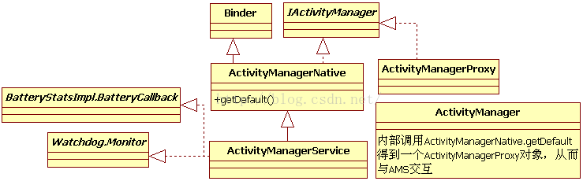
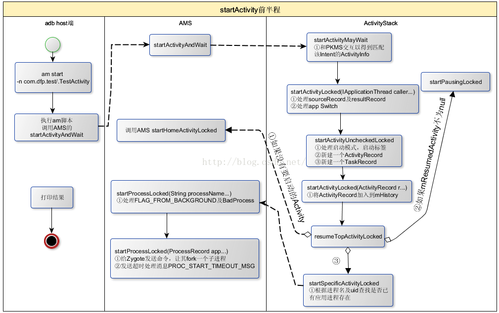
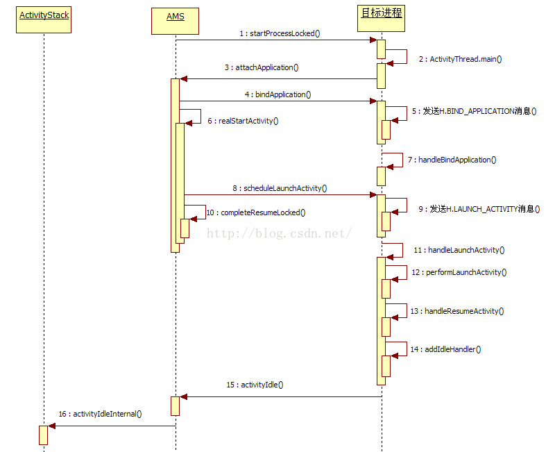
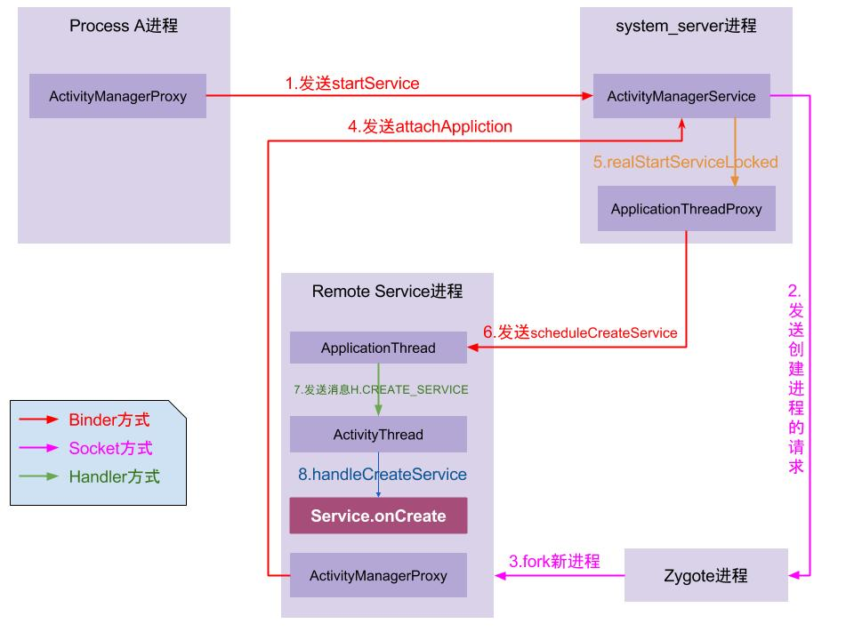
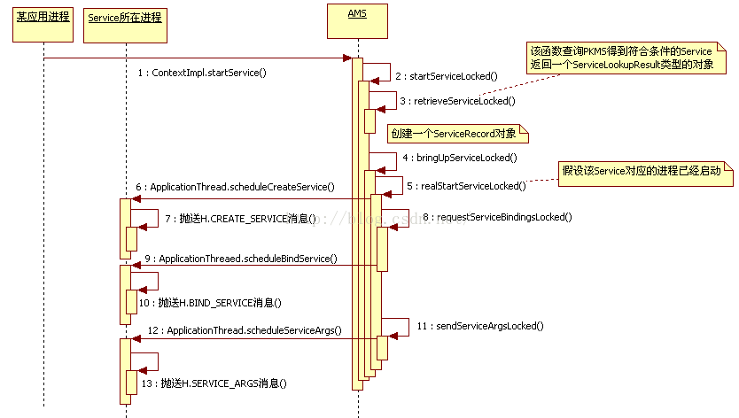
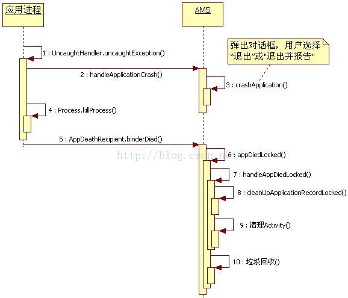

#### 面试---AMS在Android起到什么作用，简单的分析下Android的源码

本专栏专注分享大型Bat面试知识，后续会持续更新，喜欢的话麻烦点击一个star

> **面试官:  AMS在Android起到什么作用，简单的分析下Android的源码**

> **心理分析**：这道题在发生在大多数场景下。面对这道题 很多求职很茫然，不知道该如何说起。AMS本身比较复杂难以理解。工作多年也很难弄清AMS的作用，其实我们大可从以下几点入手**组件启动**、**进程切换**、**Crash异常**入手

> **求职者:**AMS难以表述  我们就从最熟知 的Activity启动入手，逐步深入和分析，用定力告诉面试官，我层深入研究过。接下来我们从五条线分析AMS作用及机制

##### 概述

##### 相信大多数动脑同学对文章中提到的ActivityManagerService（以后简称AMS）都有所耳闻。

AMS是Android中**最核心的服务**，主要负责系统中四大组件的**启动、切换、调度及应用进程的管理和调度**等工作，其职责与操作系统中的进程管理和调度模块相类似，因此它在Android中非常重要。
AMS是碰到的第一块难啃的骨头[①]，涉及的知识点较多。为了帮助读者更好地理解AMS，接下来将带小伙伴么按五条不同的线来分析它。

- **第一条线**：同其他服务一样，将分析SystemServer中AMS的调用轨迹。
- **第二条线**：以am命令启动一个Activity为例，分析应用进程的创建、Activity的启动，以及它们和AMS之间的交互等知识。
- **第三条线和第四条线**：分别以Broadcast和Service为例，分析AMS中Broadcast和Service的相关处理流程。
- **第五条线**：以一个Crash的应用进程为出发点，分析AMS如何打理该应用进程的身后事。
  除了这五条线外，还将统一分析在这五条线中频繁出现的与AMS中应用进程的调度、内存管理等相关的知识。
  提示ContentProvider将放到下一章分析，不过本章将涉及和ContentProvider有关的知识点。
  先来看AMS的家族图谱:

](htt

由图可知：

- AMS由ActivityManagerNative（以后简称AMN）类派生，并实现Watchdog.Monitor和BatteryStatsImpl.BatteryCallback接口。而AMN由Binder派生，实现了IActivityManager接口。
- 客户端使用ActivityManager类。由于AMS是系统核心服务，很多API不能开放供客户端使用，所以设计者没有让ActivityManager直接加入AMS家族。在ActivityManager类内部通过调用AMN的getDefault函数得到一个ActivityManagerProxy对象，通过它可与AMS通信。

AMS由SystemServer的ServerThread线程创建;

### 1. 初识ActivityManagerService总结

本节所分析的4个关键函数均较复杂，与之相关的知识点总结如下：

- AMS的main函数：创建AMS实例，其中最重要的工作是创建Android运行环境，得到一个ActivityThread和一个Context对象。
- AMS的setSystemProcess函数：该函数注册AMS和meminfo等服务到ServiceManager中。另外，它为SystemServer创建了一个ProcessRecord对象。由于AMS是Java世界的进程管理及调度中心，要做到对Java进程一视同仁，尽管SystemServer贵为系统进程，此时也不得不将其并入AMS的管理范围内。
- AMS的installSystemProviders：为SystemServer加载SettingsProvider。
- AMS的systemReady：做系统启动完毕前最后一些扫尾工作。该函数调用完毕后，HomeActivity将呈现在用户面前。
  对AMS 调用轨迹分析是我们破解AMS的第一条线，希望读者反复阅读，以真正理解其中涉及的知识点，尤其是和Android运行环境及Context相关的知识。

### 2. startActivity

**总结**
本文详细startActivity的整个启动流程，

- 流程[2.1 ~2.4]:运行在调用者所在进程，比如从桌面启动Activity，则调用者所在进程为launcher进程，launcher进程利用ActivityManagerProxy作为Binder Client，进入system_server进程(AMS相应的Server端)。
- 流程[2.5 ~2.18]:运行在system_server系统进程，整个过程最为复杂、核心的过程，下面其中部分步骤：
- 流程[2.7]：会调用到resolveActivity()，借助PackageManager来查询系统中所有符合要求的Activity，当存在多个满足条件的Activity则会弹框让用户来选择;
- 流程[2.8]：创建ActivityRecord对象，并检查是否运行App切换，然后再处理mPendingActivityLaunches中的activity;
- 流程[2.9]：为Activity找到或创建新的Task对象，设置flags信息；
- 流程[2.13]：当没有处于非finishing状态的Activity，则直接回到桌面； 否则，当mResumedActivity不为空则执行startPausingLocked()暂停该activity;然后再进入startSpecificActivityLocked()环节;
- 流程[2.14]：当目标进程已存在则直接进入流程[2.17]，当进程不存在则创建进程，经过层层调用还是会进入流程[2.17];
- 流程[2.17]：system_server进程利用的ATP(Binder Client)，经过Binder，程序接下来进入目标进程。
- 流程[2.19 ~2.18]:运行在目标进程，通过Handler消息机制，该进程中的Binder线程向主线程发送H.LAUNCH_ACTIVITY，最终会通过反射创建目标Activity，然后进入onCreate()生命周期。
  从另一个角度下图来概括：

[]

##### **启动流程**：

1. 点击桌面App图标，Launcher进程采用Binder IPC向system_server进程发起startActivity请求；
2. system_server进程接收到请求后，向zygote进程发送创建进程的请求；
3. Zygote进程fork出新的子进程，即App进程；
4. App进程，通过Binder IPC向sytem_server进程发起attachApplication请求；
5. system_server进程在收到请求后，进行一系列准备工作后，再通过binder IPC向App进程发送scheduleLaunchActivity请求；
6. App进程的binder线程（ApplicationThread）在收到请求后，通过handler向主线程发送LAUNCH_ACTIVITY消息；
7. 主线程在收到Message后，通过发射机制创建目标Activity，并回调Activity.onCreate()等方法。
   到此，App便正式启动，开始进入Activity生命周期，执行完onCreate/onStart/onResume方法，UI渲染结束后便可以看到App的主界面。

[

startActivity后半程总结

[]

##### **starActivity总结**

Activity的启动就介绍到这里。这一路分析下来，相信读者也和笔者一样觉得此行绝不轻松。先回顾一下此次旅程：

- 行程的起点是am。am是Android中很重要的程序，读者务必要掌握它的用法。我们利用am start命令，发起本次目标Activity的启动请求。
- 接下来进入ActivityManagerService和ActivityStack这两个核心类。对于启动Activity来说，这段行程又可分细分为两个阶段：第一阶段的主要工作就是根据启动模式和启动标志找到或创建ActivityRecord及对应的TaskRecord；第二阶段工作就是处理Activity启动或切换相关的工作。
- 首先讨论了AMS直接创建目标进程并运行Activity的流程，其中涉及目标进程的创建，在目标进程中Android运行环境的初始化，目标Activity的创建以及触发onCreate、onStart及onResume等其生命周期中重要函数调用等相关知识点。
- 接着又讨论了AMS先pause当前Activity，然后再创建目标进程并运行Activity的流程。其中牵扯到两个应用进程和AMS的交互，其难度之大可见一斑。
  读者在阅读本节时，务必要区分此旅程中两个阶段工作的重点：其一是找到合适的ActivityRecord和TaskRecord；其二是调度相关进程进行Activity切换。在SDK文档中，介绍最为详细的是第一阶段中系统的处理策略，例如启动模式、启动标志的作用等。第二阶段工作其实是与Android组件调度相关的工作。SDK文档只是针对单个Activity进行生命周期方面的介绍。
  坦诚地说，这次旅程略过不少逻辑情况。原因有二，一方面受限于精力和篇幅，另方面是作为调度核心类，和AMS相关的代码及处理逻辑非常复杂，而且其间还夹杂了与WMS的交互逻辑，使复杂度更甚。再者，笔者个人感觉这部分代码绝谈不上高效、严谨和美观，甚至有些丑陋（在分析它们的过程中，远没有研究Audio、Surface时那种畅快淋漓的感觉）。
  此处列出几个供读者深入研究的点：
- 各种启动模式、启动标志的处理流程。
- Configuration发生变化时Activity的处理，以及在Activity中对状态保存及恢复的处理流程。
- Activity生命周期各个阶段的转换及相关处理。Android 2.3以后新增的与Fragment的生命周期相关的转换及处理。

### 3. 广播处理总结

### 4. startService流程图

**总结**
5.1 流程说明
在整个startService过程，从进程角度看服务启动过程

- **Process A进程**：是指调用startService命令所在的进程，也就是启动服务的发起端进程，比如点击桌面App图标，此处Process A便是Launcher所在进程。
- **system_server进程**：系统进程，是java framework框架的核心载体，里面运行了大量的系统服务，比如这里提供ApplicationThreadProxy（简称ATP），ActivityManagerService（简称AMS），这个两个服务都运行在system_server进程的不同线程中，由于ATP和AMS都是基于IBinder接口，都是binder线程，binder线程的创建与销毁都是由binder驱动来决定的，每个进程binder线程个数的上限为16。
- **Zygote进程**：是由init进程孵化而来的，用于创建Java层进程的母体，所有的Java层进程都是由Zygote进程孵化而来；
- **Remote Service进程**：远程服务所在进程，是由Zygote进程孵化而来的用于运行Remote服务的进程。主线程主要负责Activity/Service等组件的生命周期以及UI相关操作都运行在这个线程； 另外，每个App进程中至少会有两个binder线程 ApplicationThread(简称AT)和ActivityManagerProxy（简称AMP），当然还有其他线程，这里不是重点就不提了。

[

图中涉及3种IPC通信方式：Binder、Socket以及Handler，在图中分别用3种不同的颜色来代表这3种通信方式。一般来说，同一进程内的线程间通信采用的是 Handler消息队列机制，不同进程间的通信采用的是binder机制，另外与Zygote进程通信采用的Socket。

**启动流程**：

1. Process A进程采用Binder IPC向system_server进程发起startService请求；
2. system_server进程接收到请求后，向zygote进程发送创建进程的请求；
3. zygote进程fork出新的子进程Remote Service进程；
4. Remote Service进程，通过Binder IPC向sytem_server进程发起attachApplication请求；
5. system_server进程在收到请求后，进行一系列准备工作后，再通过binder IPC向remote Service进程发送scheduleCreateService请求；
6. Remote Service进程的binder线程在收到请求后，通过handler向主线程发送CREATE_SERVICE消息；
7. 主线程在收到Message后，通过发射机制创建目标Service，并回调Service.onCreate()方法。
   到此，服务便正式启动完成。当创建的是本地服务或者服务所属进程已创建时，则无需经过上述步骤2、3，直接创建服务即可。

[

### 5. AMS中的进程管理

前面曾反复提到，Android平台中很少能接触到进程的概念，取而代之的是有明确定义的四大组件。但是作为运行在Linux用户空间内的一个系统或框架，Android不仅不能脱离进程，反而要大力利用Linux OS提供的进程管理机制和手段，更好地为自己服务。作为Android平台中组件运行管理的核心服务，ActivityManagerService当仁不让地接手了这方面的工作。目前，AMS对进程的管理仅涉及两个方面：

- 调节进程的调度优先级和调度策略。
- 调节进程的OOM值。

##### 6. App的Crash处理总结

应用进程进行Crash处理的流程。[

------

##### 一.概述

ActivityManagerService是Framework层的核心服务之一,ActivityManagerService是Binder的子类,它的功能主要以下三点:

- 四大组件的统一调度
- 进程管理
- 内存管理

##### 三.ActivityManagerService的启动过程

ActivityManagerService的启动是在systemserver进程的startBootstrapServices方法中启动的.
SystemServiceManager.startService(ActivityManagerService.Lifecycle.class) 功能主要：
创建ActivityManagerService.Lifecycle对象；
调用Lifecycle.onStart()方法。

##### 四.主要功能之一的四大组件的统一调度

ActivityManagerService最主要的功能就是统一的管理者activity,service,broadcast,provider的创建,运行,关闭.我们在应用程序中启动acitivity,关闭acitiviy等操作最终都是要通过ams来统一管理的.这个过程非常的复杂,不是一下子可以讲的清楚的,我这里推荐老罗的博客来讲解四大组件的启动过程:

Android应用程序内部启动Activity过程（startActivity）的源代码分析
Android系统在新进程中启动自定义服务过程（startService）的原理分析
Android应用程序注册广播接收器（registerReceiver）的过程分析
Android应用程序发送广播（sendBroadcast）的过程分析
Android应用程序组件Content Provider简要介绍和学习计划

##### 五.主要功能之一的内存管理

我们知道当一个进程中的acitiviy全部都关闭以后,这个空进程并不会立即就被杀死.而是要等到系统内存不够时才会杀死.但是实际上ActivityManagerService并不能够管理内存,android的内存管理是Linux内核中的内存管理模块和OOM进程一起管理的.Android进程在运行的时候,会通过Ams把每一个应用程序的oom_adj值告诉OOM进程,这个值的范围在-16-15,值越低说明越重要,越不会被杀死.当发生内存低的时候,Linux内核内存管理模块会通知OOm进程根据AMs提供的优先级强制退出值较高的进程.因此Ams在内存管理中只是扮演着一个提供进程oom_adj值的功能.真正的内存管理还是要调用OOM进程来完成.下面通过调用Activity的finish()方法来看看内存释放的情况.

当我们手动调用finish()方法或者按back键时都是会关闭activity的,,在调用finish的时候只是会先调用ams的finishActivityLocked方法将当前要关闭的acitiviy的finish状态设置为true,然后就会先去启动新的acitiviy,当新的acitiviy启动完成以后就会通过消息机制通知Ams,Ams在调用activityIdleInternalLocked方法来关闭之前的acitiviy.