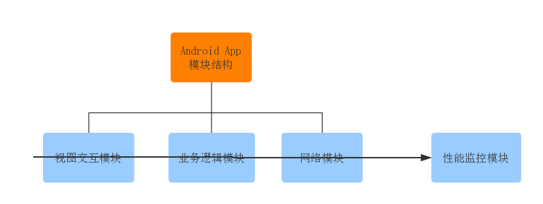
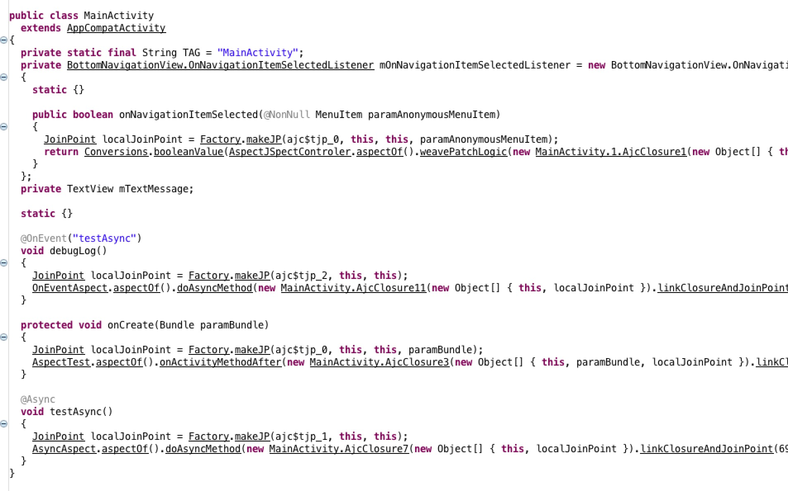

#### 腾讯---你知道什么是AOP吗？AOP与OOP有什么区别，谈谈AOP的原理是什么

本专栏专注分享大型Bat面试知识，后续会持续更新，喜欢的话麻烦点击一个star

> **面试官**:  你知道什么是AOP吗？AOP与OOP有什么区别，谈谈AOP的原理是什么


> **心理分析**：一旦问到aop面试官在开发自己的项目中 肯定是用到了aop切面编程的。这个时候求职者需要格外注意，特别是aop 在编译时的性能优势，apk编译的原理讲起。切勿将aop的概念弄混，一定要将oop面向对象与aop面向切面的场景说出来

> **求职者:** aop实现的三大方式（反射 （xutil） apt注解（ButterKnife）  aspect （本文即将讲到的）） 说出各自的优缺点


### 一、AOP概念

百度百科中对AOP的解释如下:
在软件业，AOP为Aspect Oriented Programming的缩写，意为：面向切面编程，通过预编译方式和运行期动态代理实现程序功能的统一维护的一种技术。

**AOP是OOP的延续**，是软件开发中的一个热点，也是很多框架如 java中的Spring框架中的一个重要内容，是函数式编程的一种衍生范型。 利用AOP可以对业务逻辑的各个部分进行隔离，从而使得业务逻辑各部分之间的耦合度降低，提高程序的可重用性，同时提高了开发的效率。

AOP只是一种思想的统称，实现这种思想的方法有挺多。AOP通过预编译方式和运行期动态代理实现程序功能的统一维护的一种技术。利用AOP可以对业务逻辑的各个部分进行隔离，从而使得业务逻辑各部分之间的耦合度降低，提高程序的可重用性，提高开发效率。

#### （1）AOP与OOP的关系

**OOP（面向对象编程）**针对业务处理过程的实体及其属性和行为进行抽象封装，以获得更加清晰高效的逻辑单元划分。但是也有它的缺点，最明显的就是关注点聚焦时，面向对象无法简单的解决这个问题，一个关注点是面向所有而不是单一的类，不受类的边界的约束，因此OOP无法将关注点聚焦来解决，只能分散到各个类中。
**AOP（面向切面编程）**则是针对业务处理过程中的**切面进行提取**，它所面对的是处理过程中的某个步骤或阶段，以获得逻辑过程中各部分之间低耦合性的隔离效果。这两种设计思想在目标上有着本质的差异。
**AOP并不是与OOP对立的**，而是为了弥补OOP的不足。**OOP解决了竖向的问题，AOP则解决横向的问题**。因为有了AOP我们的调试和监控就变得简单清晰。

简单的来讲，AOP是一种：可以在不改变原来代码的基础上，通过“动态注入”代码，来改变原来执行结果的技术。

#### （2）AOP主要应用场景

日志记录，性能统计，安全控制，事务处理，异常处理等等。

#### （3）主要目标

将日志记录，性能统计，安全控制，事务处理，异常处理等代码从业务逻辑代码中划分出来，通过对这些行为的分离，我们希望可以将它们独立到非指导业务逻辑的方法中，进而改变这些行为的时候不影响业务逻辑的代码。

[](http://android9527.com/images/aop/aop2.png)

上图是一个APP模块结构示例，按照照OOP的思想划分为“视图交互”，“业务逻辑”，“网络”等三个模块，而现在假设想要对所有模块的每个方法耗时（性能监控模块）进行统计。这个性能监控模块的功能就是需要横跨并嵌入众多模块里的，这就是典型的AOP的应用场景。

AOP的目标是把这些横跨并嵌入众多模块里的功能（如监控每个方法的性能） 集中起来，放到一个统一的地方来控制和管理。如果说，OOP如果是把问题划分到单个模块的话，那么AOP就是把涉及到众多模块的某一类问题进行统一管理。

对比：

| 功能     | OOP                            | AOP                              |
| -------- | ------------------------------ | -------------------------------- |
| 增加日志 | 所有功能模块单独添加，容易出错 | 能够将同一个关注点聚焦在一处解决 |
| 修改日志 | 功能代码分散，不方便调试       | 能够实现一处修改，处处生效       |

例如：在不改变 main 方法的同时通过代码注入的方式达到目的


```
/**
 * Before
 */
public class Test {
    public static void main(String[] args) {
        // do something
    }
}

/**
 * After
 */
public class Test {
    public static void main(String[] args) {
        long start = System.currentTimeMillis();
        // do something
        long end = System.currentTimeMillis() - start;
    }
}
```

### 二、AOP代码注入时机

代码注入主要注解机制，根据注解时机的不同，主要分为运行时、加载时和编译时。

运行时：你的代码对增强代码的需求很明确，比如，必须使用动态代理（这可以说并不是真正的代码注入）。
加载时：当目标类被Dalvik或者ART加载的时候修改才会被执行。这是对Java字节码文件或者Android的dex文件进行的注入操作。
编译时：在打包发布程序之前，通过向编译过程添加额外的步骤来修改被编译的类。**aspect切面编程正是运用到编译时**

### 三、AOP的几种实现方式

- Java 中的动态代理，运行时动态创建 Proxy 类实例
- APT，注解处理器，编译时生成 .java 代码
- Javassist for Android：一个移植到Android平台的非常知名的操纵字节码的java库，对 class 字节码进行修改
- **AspectJ：和Java语言无缝衔接的面向切面的编程的扩展工具（可用于Android）。**


### 四,Android中使用 AspectJ

代表项目：Hugo(打印每个方法的执行时间)     sa-sdk-android（全埋点技术）

##### （1）原理

AspectJ 意思就是Java的Aspect，Java的AOP。它的核心是ajc（编译器 aspectjtools）和 weaver（织入器 aspectjweaver）。

ajc编译器：基于Java编译器之上的，它是用来编译.aj文件，aspectj在Java编译器的基础上增加了一些它自己的关键字和方法。因此，ajc也可以编译Java代码。

weaver织入器：为了在java编译器上使用AspectJ而不依赖于Ajc编译器，aspectJ 5出现了 @AspectJ，使用注释的方式编写AspectJ代码，可以在任何Java编译器上使用。
由于AndroidStudio默认是没有ajc编译器的，所以在Android中使用@AspectJ来编写。它在代码的编译期间扫描目标程序，根据切点（PointCut）匹配,将开发者编写的Aspect程序编织（Weave）到目标程序的.class文件中，对目标程序作了重构（重构单位是JoinPoint），目的就是建立目标程序与Aspect程序的连接（获得执行的对象、方法、参数等上下文信息），从而达到AOP的目的。

##### （2）AspectJ 术语

**切面（Aspect）**：一个关注点的模块化，这个关注点实现可能另外横切多个对象。其实就是共有功能的实现。如日志切面、权限切面、事务切面等。

**通知（Advice）**：是切面的具体实现。以目标方法为参照点，根据放置的地方不同，可分为

1. 前置通知（Before）、
2. 后置通知（AfterReturning）、
3. 异常通知（AfterThrowing）、
4. 最终通知（After）
5. 环绕通知（Around）5种。

在实际应用中通常是切面类中的一个方法，具体属于哪类通知由配置指定的。

**切入点（Pointcut）**：用于定义通知应该切入到哪些连接点上。不同的通知通常需要切入到不同的连接点上，这种精准的匹配是由切入点的正则表达式来定义的。
**连接点（JoinPoint）**：就是程序在运行过程中能够插入切面的地点。例如，方法调用、异常抛出或字段修改等。

**目标对象（Target Object）**：包含连接点的对象，也被称作被通知或被代理对象。这些对象中已经只剩下干干净净的核心业务逻辑代码了，所有的共有功能等代码则是等待AOP容器的切入。

**AOP代理（AOP Proxy）**：将通知应用到目标对象之后被动态创建的对象。可以简单地理解为，代理对象的功能等于目标对象的核心业务逻辑功能加上共有功能。代理对象对于使用者而言是透明的，是程序运行过程中的产物。

**编织（Weaving）**：将切面应用到目标对象从而创建一个新的代理对象的过程。这个过程可以发生在编译期、类装载期及运行期，当然不同的发生点有着不同的前提条件。譬如发生在编译期的话，就要求有一个支持这种AOP实现的特殊编译器（如AspectJ编译器）；

发生在类装载期，就要求有一个支持AOP实现的特殊类装载器；只有发生在运行期，则可直接通过Java语言的反射机制与动态代理机制来动态实现（如摇一摇）。

**引入（Introduction）：**添加方法或字段到被通知的类。

##### （3）在Android项目中使用AspectJ

- gradle配置的方式：引入AspectJ是有点复杂的，需要引入大量的gradle命令配置有点麻烦，在build文件中添加了一些脚本，文章出处：<https://fernandocejas.com/2014/08/03/aspect-oriented-programming-in-android/>
- 使用 gradle 插件（也是对 gradle 命令进行了包装）：Jake Wharton 大神的 hugo 项目（一款日志打印的插件）

上海沪江团队的 gradle_plugin_android_aspectjx 一个基于AspectJ并在此基础上扩展出来可应用于Android开发平台的AOP框架，可作用于java源码，class文件及jar包，同时支持kotlin的应用。

AOP的用处非常广，从spring到Android，各个地方都有使用，特别是在后端，Spring中已经使用的非常方便了，而且功能非常强大，但是在Android中，AspectJ的实现是略阉割的版本，并不是所有功能都支持，但对于一般的客户端开发来说，已经完全足够用了。

##### （4）以 AspectJX 接入说明

- 首先，需要在项目根目录的build.gradle中增加依赖：

```
buildscript {
    repositories {
        jcenter()
    }
    dependencies {
        classpath 'com.android.tools.build:gradle:2.3.3'
        classpath 'com.hujiang.aspectjx:gradle-android-plugin-aspectjx:2.0.4'
    }
}
```

- 然后module项目的 build.gradle 中加入 AspectJ 的依赖：

```
apply plugin: 'android-aspectjx'
dependencies {
        compile 'org.aspectj:aspectjrt:1.8.+'
    }

aspectjx {
    //排除所有package路径中包含`android.support`的class文件及库（jar文件）
    exclude 'org.apache.httpcomponents'
    exclude 'android.support'
}
```

- 具体配置参见github地址 <https://github.com/HujiangTechnology/gradle_plugin_android_aspectjx>
- 我们通过一段简单的代码来了解下基本的使用方法和功能，新建一个AspectTest类文件，代码如下：


```
@Aspect
public class AspectTest {

    private static final String TAG = "xuyisheng";

    @Before("execution(* android.app.Activity.on**(..))")
    public void onActivityMethodBefore(JoinPoint joinPoint) throws Throwable {
        String key = joinPoint.getSignature().toString();
        Log.e(TAG, "onActivityMethodBefore: " + key);
    }

    @After("execution(* android.app.Activity.on**(..))")
    public void onActivityMethodAfter(JoinPoint joinPoint) throws Throwable {
        String key = joinPoint.getSignature().toString();
        Log.e(TAG, "onActivityMethodAfter: " + key);
    }

    @Around("execution(* android.app.Activity.on**(..))")
    public void onActivityMethodAfter(ProceedingJoinPoint joinPoint) throws Throwable {
        String key = joinPoint.getSignature().toString();
        Log.e(TAG, "onActivityMethodBefore: " + key);
        joinPoint.proceed();
        Log.e(TAG, "onActivityMethodAfter: " + key);
    }
}
```

在类的最开始，我们使用 @Aspect 注解来定义这样一个AspectJ文件，编译器在编译的时候，就会自动去解析，并不需要主动去调用AspectJ类里面的代码。

##### （5）编织速度优化建议

- 尽量使用精确的匹配规则,降低匹配时间。
- 排除不需要扫描的包。

通过这种方式编译后，我们来看下生成的代码是怎样的。AspectJ的原理实际上是在编译的时候，根据一定的规则解析，然后插入一些代码，通过aspectj生成的代码，会在Build目录下：




### 四、总结：

##### Aspectj：

- AspectJ除了hook之外，AspectJ还可以为目标类添加变量，接口。另外，AspectJ也有抽象，继承等各种更高级的玩法。它能够在编译期间直接修改源代码生成class。
- AspectJ语法比较多，但是掌握几个简单常用的，就能实现绝大多数切片，完全兼容Java（纯Java语言开发，然后使用AspectJ注解，简称@AspectJ。）