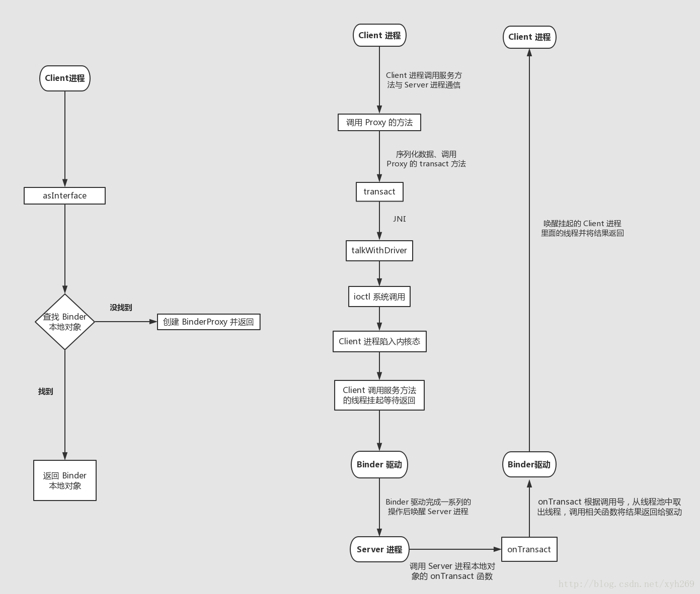
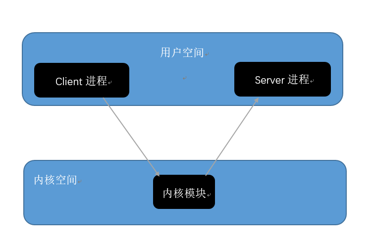
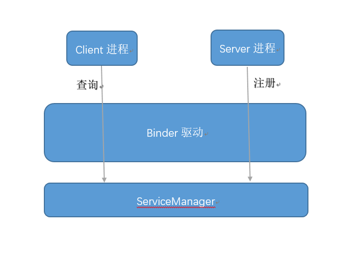

#### 详细说说Binder通信原理与机制

> 本专栏专注分享大型Bat面试知识，后续会持续更新，喜欢的话麻烦点击一个star

先上一张Binder 的工作流程图。（如果不清晰，可以 复制图片链接到浏览器 或 保存到本地 查看，我经常都是这样看图的哈）

一开始上手，陌生的东西比较多，But，其实并不复杂。喔，流程图是用 ProcessOn 画的。很棒的在线画图工具。

出发前预备子弹
我们知道进程之间，虚拟地址不同，是不能直接通信的，这是一种保护机制。打开任务管理器，查看一下N多的进程，试想一下如果这些进程直接通信会带来什么后果？

而用户空间可以通过System calls（系统回调）与内核空间通信的，如果在内核空间中有一个模块，能够完成数据的转发，那么是不是两个进程就可以通信了呢？如下图：

上面提到一些用户空间、内核空间的概念，用户空间也能大概猜到是什么东西，而内核空间，就知道它是很底层的东西好了。而模块呢，可以简单的理解为实现一个功能的程序或一个硬件电路等，比如玩单片机的时候，会有红外线模块，蓝牙模块，wifi模块等。这些概念的东西搜索一下百科知道就好。

##### Binder驱动

Binder驱动运行在内核空间，它就是那个内核模块了。Binder驱动很重要，承担了进程间通信的数据转发等。一提到驱动，也是比较熟悉，你插个U盘，需要驱动吧。而Binder驱动也差不多，虽然名字取得很好，功能还很强大。但也不是什么神奇的东西。

##### Binder跨进程通信模型

Binder的通信模型有4个角色：Binder Client、Binder Server、Binder Driver（Binder驱动）、ServiceManager。

想象一个情景：我到北京旅行，要给高中同学寄一张明信片，明信片肯定要写上地址吧，不然怎么寄给对方呢？那么我怎么拿到这个地址呢，很简单，翻一下毕业相册就好了。而这个记录着同学们通信地址的毕业相册，就相当与一个通讯录。在Binder的通信模型中扮演的是ServiceManager的角色。好，现在已经有了通信地址了，那么就找到邮局寄出去就好了。过几天同学就高高兴兴的收到了明信片。那么这个邮局在Binder通信模型中扮演的是Binder驱动的角色，而作为寄信人的我就是Binder Client，收信人同学就是Binder Server。

先上一张图来描述上面的那个情景：

可以看到，ServiceManager、Binder Client、Binder Server处于不同的进程，他们三个都在用户空间，而Binder驱动在内核空间。（我是特意把Binder驱动画的比较大的，因为Binder驱动的作用最大）

那先来简述一下这个通信模型：

首先是有一个ServiceManager，刚开始这个通讯录是空白的，然后Server进程向ServiceManager注册一个映射关系表，比如徐同学把自己的地址广东省广州市xx区写进通讯录，那么就形成了一张表：

> 徐同学 —> 广东省广州市xx区
>

之后Client进程想要和Server进程通信，首先向ServiceManager查询地址，ServiceManager收到查询的请求之后，返回查询结果给Client。

注意到这里不管是Server进程注册，还是Client查询，都是经过Binder驱动的，这也真是Binder驱动的作用所在，先不急，下面的原理会分析到。

这时候我就拿着地址就开始寄明信片咯。当我把明信片放扔进邮筒，之后的工作就是由邮局去完成了，也就是Binder驱动去完成通信的转发。

##### Binder通信原理

从寄明信片的例子中，邮递员从邮筒取出明信片，然后跨越千山万水将明信片送达。从这点我们也能想到，其实Binder驱动完成的工作是很重要的。

我们来还原一个Binder跨进程通信的过程。 
案例：Client进程调用Server进程的computer对象的add方法。

接下来的内容你可能需要知道代理模式才能更好的理解，不过没学习过代理模式也没关系，可以先读下去，然后在去补一下代理模式，再回来看这篇文章。思路会清晰很多。

> 1． Server进程向ServiceManager注册，告诉ServiceManager我是谁，我有什么，我能做什么。就好比徐同学（Server进程）有一台笔记本（computer对象），这台笔记本有个add方法。这时映射关系表就生成了。
>
> 2． Client进程向ServiceManager查询，我要调用Server进程的computer对象的add方法，可以看到这个过程经过Binder驱动，这时候Binder驱动就开始发挥他的作用了。当向ServiceManager查询完毕，是返回一个computer对象给Client进程吗？其实不然，Binder驱动将computer对象转换成了computerProxy对象，并转发给了Client进程，因此，Client进程拿到的并不是真实的computer对象，而是一个代理对象，即computerProxy对象。很容易理解这个computerProxy对象也是有add方法，（如果连add方法都没有，岂不是欺骗了Client？），但是这个add方法只是对参数进行一些包装而已。 
>
> 3． 当Client进程调用add方法，这个消息发送给Binder驱动，这时驱动发现，原来是computerProxy，那么Client进程应该是需要调用computer对象的add方法的，这时驱动通知Server进程，调用你的computer对象的add方法，将结果给我。然后Server进程就将计算结果发送给驱动，驱动再转发给Client进程，这时Client进程还蒙在了鼓里，他以为自己调用的是真实的computer对象的add方法，其实他只是调用了代理而已。不过Client最终还是拿到了计算结果。

好了，一个通信过程就完成了。我们发现，其实Binder驱动就是一个中转。

##### 总结

再来梳理总结一下：当Client进程向ServiceManager查询Server进程（我要调用你的某个对象的某个方法了），这个过程也是一个跨进程通信的过程，也经过了Binder驱动，这时Binder驱动发挥它的作用，来了个狸猫换太子，将Server进程中的真实对象转换成代理对象，返回这个代理对象给Client进程。 
Client进程拿到了这个代理对象，然后调用这个代理对象的方法，Binder驱动继续发挥他的使命，它会通知Server进程执行计算工作，将Server进程中的真实对象执行的结果返回给了Client进程，这样Client进程还是如愿的得到了自己想要。跨进程通信完毕