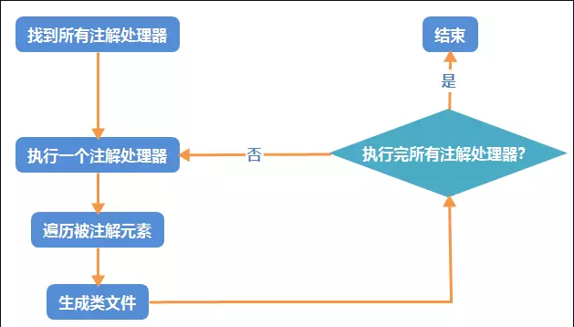
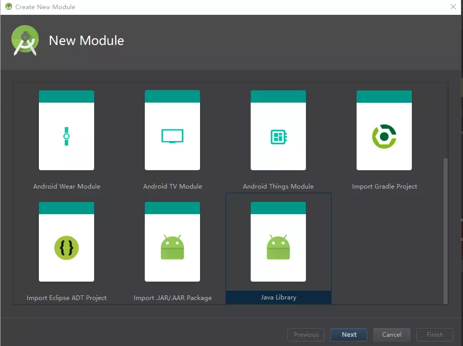
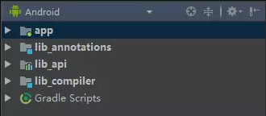
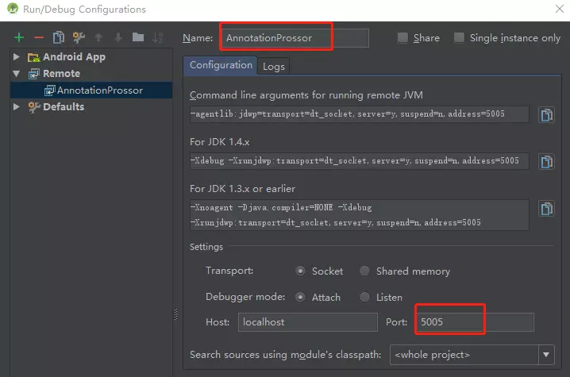

#### 腾讯---ButterKnife为什么执行效率为什么比其他注入框架高？它的原理是什么

本专栏专注分享大型Bat面试知识，后续会持续更新，喜欢的话麻烦点击一个star

> **面试官:  ButterKnife为什么执行效率为什么比其他注入框架高？它的原理是什么**


> **心理分析**： ButterKnife框架一直都是使用，很少又开发者对butterknife深入研究的，既然你是面试Android高级岗位，自然需要有相应被问到原理的准备，面试官想问你对注解处理器了解多少，Android编译流程有多少认识

> **求职者:**应该从 注解处理器原理 与优势说起，肯定注解处理器对解放生产力的作用。然后可以引申常见的 Butterknife，Dagger2，DBFlow。这才是加分项


##### 优势

1. 我们平常在使用Java进行开发Android时，经常会需要写很多重复冗余的样板代码，开发中最常见的一种，就是**findViewById**了，如果一个界面有很多**View**，写起来那叫一个要死要死。于是我们注解处理器可以帮助解决冗余的代码的，
2. 由于是在编译器进行生成的代码，并不是通过反射实现，所以性能优势是非常高的
3. 加快开发速度，由于减少了写繁琐的代码，会对项目进度起有利的作用


##### 接下来我们一起来看注解处理的原理

在android开发中，比较常用到的第三方库中，有不少用到了 **注解处理器(Annotation Processor)**。 比较常见的就有 **Butterknife**，**Dagger2**，**DBFlow** 等。

### 注解

Java中存在不少关于注解的Api, 比如`@Override`用于覆盖父类方法，`@Deprecated`表示已舍弃的类或方法属性等，android中又多了一些注解的扩展，如`@NonNull`, `@StringRes`, `@IntRes`等。

### 代码自动生成

使用代码自动生成，一是为了提高编码的效率，二是避免在运行期大量使用反射，通过在编译期利用反射生成辅助类和方法以供运行时使用。

注解处理器的处理步骤主要有以下：

1. 在java编译器中构建
2. 编译器开始执行未执行过的注解处理器
3. 循环处理注解元素(Element)，找到被该注解所修饰的类，方法，或者属性
4. 生成对应的类，并写入文件
5. 判断是否所有的注解处理器都已执行完毕，如果没有，继续下一个注解处理器的执行(回到步骤1)





### Butterknife注解处理器的例子

Butterknife的注解处理器的工作方式如下：

1. 定义一个非私有的属性变量
2. 添加该属性变量的注解和传入id
3. 调用`Butterknife.bind(..)`方法。

当你点击Android Studio的`Build`按钮时，Butterknife先是按照上述步骤生成了对应的辅助类和方法。在代码执行到`bind(..)`方法时，Butterknife就去调用之前生成的辅助类方法，完成对被注解元素的赋值操作。

------

## 自定义注解处理器

了解了基本的知识点后，我们应该尝试去使用这些技巧。 接下来是实践时间，我们来开发一个简单的例子，利用注解处理器来自动产生随机数字和随机字符串。

1. 首先创建一个project。
2. 创建lib_annotations， 这是一个纯java的module，不包含任何android代码，只用于存放注解。
3. 创建lib_compiler， 这同样是一个纯java的module。该module依赖于步骤2创建的module_annotation,处理注解的代码都在这里，该moduule最终不会被打包进apk，所以你可以在这里导入任何你想要的任意大小依赖库。
4. 创建lib_api, 对该module不做要求，可以是android library或者java library或者其他的。该module用于调用步骤3生成的辅助类方法。








### 1. 添加注解

在lib_annotations中添加两个注解：`RandomString`, `RandomInt`，分别用于生成随机数字和随机字符串:

```
@Retention(CLASS)
@Target(value = FIELD)
public @interface RandomString {
}
复制代码
@Retention(CLASS)
@Target(value = FIELD)
public @interface RandomInt {
    int minValue() default 0;
    int maxValue() default 65535;
}
复制代码
```

- **@interface** 自定义注解，使用 @interface 作为类名修饰符
- **@Target** 该注解所能修饰的元素类型，可选类型如下：

```
public enum ElementType {
    TYPE, //类
    FIELD, //属性
    METHOD, //方法
    PARAMETER, //参数
    CONSTRUCTOR, //构造函数
    LOCAL_VARIABLE, 
    ANNOTATION_TYPE,
    PACKAGE,
    TYPE_PARAMETER,
    TYPE_USE;

    private ElementType() {
    }
}
复制代码
```

- **@Retention** 该注解的保留策略，有三种选项：

```
public enum RetentionPolicy {
    SOURCE, //被编译器所忽略

    CLASS, //被编译器保留至类文件，但不会保留至运行时

    RUNTIME //保留至类文件，且保留至运行时，能在运行时反射该注解修饰的对象
}
复制代码
```

### 2. 注解处理器

真正处理注解并生成代码的操作都在这里。 在写代码之前我们需要先导入两个重要的库，以及我们的注解模块：

```
compile 'com.google.auto.service:auto-service:1.0-rc4'
compile 'com.squareup:javapoet:1.9.0'
implementation project(':lib_annotations')
复制代码
```

新建类`RandomProcessor.java`:

```
@AutoService(Processor.class)
public class RandomProcessor extends AbstractProcessor{

    @Override
    public synchronized void init(ProcessingEnvironment processingEnvironment) {
        super.init(processingEnvironment);
    }

    @Override
    public SourceVersion getSupportedSourceVersion() {
        return super.getSupportedSourceVersion();
    }

    @Override
    public Set<String> getSupportedAnnotationTypes() {
        return super.getSupportedAnnotationTypes();
    }

    @Override
    public boolean process(Set<? extends TypeElement> set, RoundEnvironment roundEnvironment) {
        return false;
    }
}
复制代码
```

- **@AutoService** @AutoService(Processor.class)会告诉编译器该注解处理器的存在，并在编译时自动在`META-INF/services`下生成`javax.annotation.processing.Processor`文件，文件的内容为

```
com.rhythm7.lib_compiler.RandomProcessor
复制代码
```

也就是说，你所声明的注解处理器都会在被写入这个配置文件中。 这样子，当外部程序装载这个模块的时候，就能通过该模块的jar包下的META-INF/services下找到具体的注解处理器的实现类名，并加载实例化，完成模块的注入。 注解处理器需要实现`AbstractProcessor`接口，并实现对应的方法

- **init()** 可选 在该方法中可以获取到`processingEnvironment`对象，借由该对象可以获取到生成代码的文件对象, debug输出对象，以及一些相关工具类
- **getSupportedSourceVersion()** 返回所支持的java版本，一般返回当前所支持的最新java版本即可
- **getSupportedAnnotationTypes()** 你所需要处理的所有注解，该方法的返回值会被`process()`方法所接收
- **process()** 必须实现 扫描所有被注解的元素，并作处理，最后生成文件。该方法的返回值为boolean类型，若返回true,则代表本次处理的注解已经都被处理，不希望下一个注解处理器继续处理，否则下一个注解处理器会继续处理。

#### 初始化

较详细代码如下:

```
private static final List<Class<? extends Annotation>> RANDOM_TYPES
        = Arrays.asList(RandomInt.class, RandomString.class);

private Messager messager;
private Types typesUtil;
private Elements elementsUtil;
private Filer filer;

private TypeonProcess()per.init(processingEnv);
    messager = processingEnv.getMessager(); 
    typesUtil = processingEnv.getTypeUtils();
    elementsUtil = processingEnv.getElementUtils();
    filer = processingEnv.getFiler();
}

@Override
public SourceVersion getSupportedSourceVersion() {
    return SourceVersion.latestSupported();
}

@Override
public Set<String> getSupportedAnnotationTypes() {
    Set<String> annotations = new LinkedHashSet<>();

    for (Class<? extends Annotation> annotation : RANDOM_TYPES) {
        annotations.add(annotation.getCanonicalName());
    }
    return annotations;
}
复制代码
```

#### 处理注解

在`process()`方法中执行以下操作：

1. 扫描所有注解元素，并对注解元素的类型做判断

```
for (Element element : roundEnv.getElementsAnnotatedWith(RandomInt.class)) {
    //AnnotatedRandomInt是对被RandomInt注解的Elment的简单封装
    AnnotatedRandomInt randomElement = new AnnotatedRandomInt(element);
    messager.printMessage(Diagnostic.Kind.NOTE, randomElement.toString());
    //判断被注解的类型是否符合要求
    if (!element.asType().getKind().equals(TypeKind.INT)) { 
        messager.printMessage(Diagnostic.Kind.ERROR, randomElement.getSimpleClassName().toString() + "#"
          + randomElement.getElementName().toString() + " is not in valid type int");
    }
  
    //按被注解元素所在类的完整类名为key将被注解元素存储进Map中，后面会根据key生成类文件
    String qualifier = randomElement.getQualifiedClassName().toString();
    if (annotatedElementMap.get(qualifier) == null) {
        annotatedElementMap.put(qualifier, new ArrayList<AnnotatedRandomElement>());
    }
    annotatedElementMap.get(qualifier).add(randomElement);
}
复制代码
```

#### 生成类文件

将之前以注解所在类为key的map遍历，并以key值为分组生成类文件。

```
for (Map.Entry<String, List<AnnotatedRandomElement>> entry : annotatedElementMap.entrySet()) {
    MethodSpec constructor = createConstructor(entry.getValue());
    TypeSpec binder = createClass(getClassName(entry.getKey()), constructor);
    JavaFile javaFile = JavaFile.builder(getPackage(entry.getKey()), binder).build();
    javaFile.writeTo(filer);
}
复制代码
```

生成类、构造函数、代码段以及文件都是利用到了`javapoet`依赖库。当然你也可以选择拼接字符串和自己用文件IO写入，但是用`javapoet`要更方便得多。

```
private MethodSpec createConstructor(List<AnnotatedRandomElement> randomElements) {
    AnnotatedRandomElement firstElement = randomElements.get(0);
    MethodSpec.Builder builder = MethodSpec.constructorBuilder()
            .addModifiers(Modifier.PUBLIC)
            .addParameter(TypeName.get(firstElement.getElement().getEnclosingElement().asType()), "target");
    for (int i = 0; i < randomElements.size(); i++) {
        addStatement(builder, randomElements.get(i));
    }
    return builder.build();
}

private void addStatement(MethodSpec.Builder builder, AnnotatedRandomElement randomElement) {
    builder.addStatement(String.format(
            "target.%1$s = %2$s",
            randomElement.getElementName().toString(),
            randomElement.getRandomValue())
    );
}

private TypeSpec createClass(String className, MethodSpec constructor) {
    return TypeSpec.classBuilder(className + "_Random")
            .addModifiers(Modifier.PUBLIC, Modifier.FINAL)
            .addMethod(constructor)
            .build();
}

private String getPackage(String qualifier) {
    return qualifier.substring(0, qualifier.lastIndexOf("."));
}

private String getClassName(String qualifier) {
    return qualifier.substring(qualifier.lastIndexOf(".") + 1);
}
复制代码
```

通过以上几行代码，创建了类文件。在类的构造函数中添加参数`(target)`, 并为每一个被注解元素添加语句`"target.%1$s = %2$s"`，最后通过`javaFile.writeTo(filer)`完成文件写入。

### 3. 调用生成类的方法

在lib_api中新建一个类：`RandomUtil.java`，添加注入方法：

```
public static void inject(Object object) {
    Class bindingClass = Class.forName(object.getClass().getCanonicalName() + "_Random"); 
    Constructor constructor = bindingClass.getConstructor(object.getClass());
    constructor.newInstance(object);
}
复制代码
```

这里利用反射找到了以“Object类名_Random”命名的生成类，并调用它的构造方法。而在我们之前的注解处理器中，我们已在生成类的构造方法中实现了属性的赋值操作。

### 4. 使用生成类

在app module中依赖刚才创建的库：

```
implementation project(':lib_annotations')
implementation project(':lib_api')
annotationProcessor project(':lib_compiler')
复制代码
```

在Activity中的使用

```
public class MainActivity extends AppCompatActivity {
    @RandomInt(minValue = 10, maxValue = 1000)
    int mRandomInt;

    @RandomString
    String mRandomString;

    @Override
    protected void onCreate(Bundle savedInstanceState) {
        super.onCreate(savedInstanceState);
        setContentView(R.layout.activity_main);

        RandomUtil.inject(this);

        Log.i("RandomInt ==> ", mRandomInt + "");
        Log.i("RandomString ==> ", mRandomString);
    }
}
复制代码
```

编译，运行，查看结果：

```
RandomInt ==>: 700
RandomString ==>: HhRayFyTtt
复制代码
```

被注解的元素成功被自动赋值，说明注入成功。

[注解处理的使用可参考完整的demo地址](<https://github.com/jaminchanks/AnnotationProcess-Demo>)


------

## 调试

注解处理器的debug跟普通的代码debug有点不同：

在当前工程路径下输入命令

```
gradlew --no-daemon -Dorg.gradle.debug=true :app:clean :app:compileDebugJavaWithJavac
复制代码
```

并在`Edit Configurations`中新添加一个远程配置(remote)，名字随意，端口为5005。 然后点击debug按钮，就可以连接上远程调试器进行Annotation的调试了。




