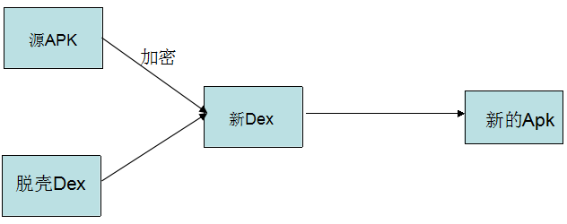
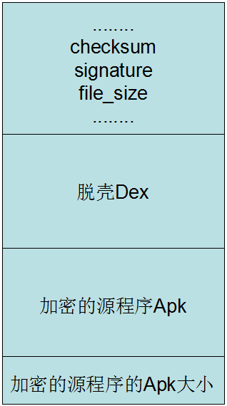
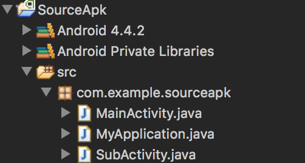
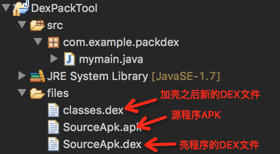
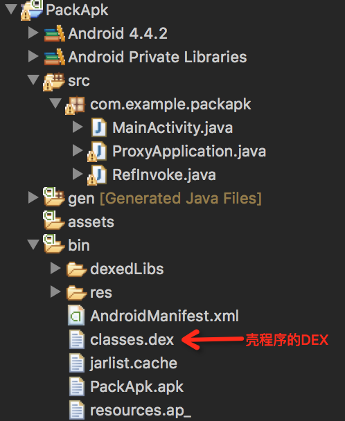
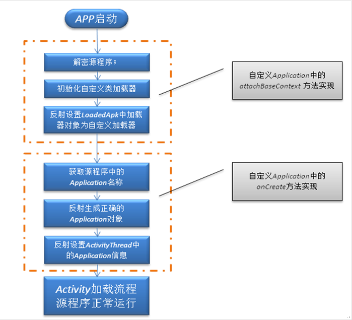
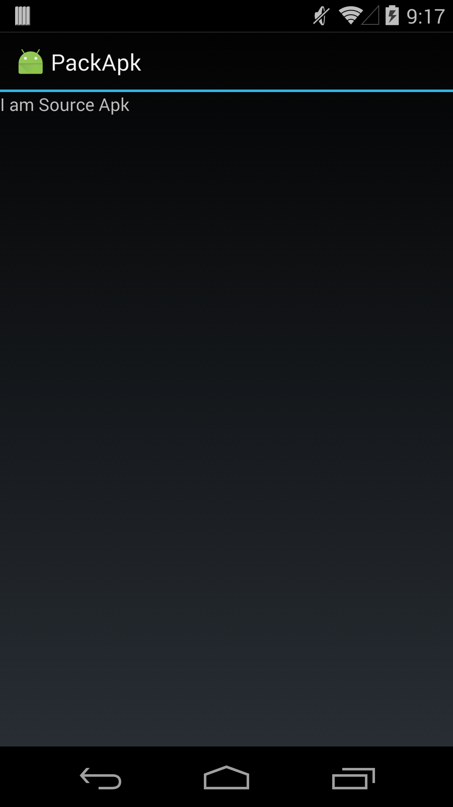

#### 腾讯---如何彻底防止反编译，dex加密怎么做 

本专栏专注分享大型Bat面试知识，后续会持续更新，喜欢的话麻烦点击一个star

> **面试官:  如何彻底防止反编译，dex加密怎么做 **


> **心理分析**：面试官想知道你是否有过对dex加固相关的经验，该题想考的是dex加固流程，dex编码有没有了解

> **求职者:**应该从dex加固流程 ，从项目中开始，dex加固--打包--验证 说起。接下来给大家讲解dex原理分析

### 

## 原理解析

下面看一下Android中加壳的原理：
[
在加固过程中需要三个对象：

- 需要加密的APK（源程序APK）
- 壳程序APK（负责解密APK工作）
- 加密工具（将源APK进行加密和壳程序的DEX合并）

**主要步骤**
用加密算法对源程序APK进行加密，再将其与壳程序APK的DEX文件合并生成新的DEX文件，最后替换壳程序中的原DEX文件即可。得到新的APK也叫做脱壳程序APK，它已经不是一个完整意义上的APK程序了，它的主要工作是：负责解密源程序APK，然后加载APK，让其正常运行起来。
在这个过程中需要了解的知识是：**如何将源程序APK和壳程序APK进行合并**
这需要了解DEX文件的格式，下面简单介绍一下：

| address | name            | size/byte | value                 |
| ------- | --------------- | --------- | --------------------- |
| 0       | magic[8]        | 8         | 0x6465 780a 3033 3500 |
| 8       | checksum        | 4         | 0xc136 5e17           |
| c       | signature[20]   | 20        |                       |
| 20      | file_size       | 4         | 0x02e4                |
| 24      | header_size     | 4         | 0x70                  |
| 28      | endian_tag      | 4         | 0x12345678            |
| 2C      | link_size       | 4         | 0x00                  |
| 30      | link_off        | 4         | 0x00                  |
| 34      | map_off         | 4         | 0x0244                |
| 38      | string_ids_size | 4         | 0x0e                  |
| 3c      | string_ids_off  | 4         | 0x70                  |
| 40      | type_ids_size   | 4         | 0x07                  |
| 44      | type_ids_off    | 4         | 0xa8                  |
| 48      | proto_ids_size  | 4         | 0x03                  |
| 4C      | proto_ids_off   | 4         | 0xc4                  |
| 50      | field_ids_size  | 4         | 0x01                  |
| 54      | field_ids_off   | 4         | 0xe8                  |
| 58      | method_ids_size | 4         | 0x04                  |
| 5C      | method_ids_off  | 4         | 0xf0                  |
| 60      | class_defs_size | 4         | 0x01                  |
| 64      | class_defs_off  | 4         | 0x0110                |
| 68      | data_size       | 4         | 0x01b4                |
| 6C      | data_off        | 4         | 0x0130                |

现在只要关注其中三个部分：

- checksum（文件校验码）使用alder32算法校验文件，除去magic、checksum外余下的所有文件区域，用于检查文件错误。
- signature 使用SHA-1算法hash出去magic、checksum和signature外余下的所有文件区域，用于唯一识别本文件。
- file_size DEX文件大小。

我们需要将加密之后的源程序APK文件写入到DEX中，那么就需要修改`checksum`，因为它的值和文件内容有关。`signature`也是一样，也是唯一识别文件的算法，还有DEX文件的大小。
还需要一个操作，就是标注加密之后的源程序APK文件的大小，因为运行解密的时候，需要知道APK的大小，才能正确得到源程序APK。这个值直接放到文件的末尾就可以了。
修改之后的DEX文件的格式如下：

知道了原理，下面就是代码实现了。这里有三个工程：

- 源程序项目（需要加密的APK）
- 壳项目（解密源程序APK和加载APK）
- 对源APK进行加密和壳项目的DEX的合并

## 项目案例

下面先来看一下源程序
1.需要加密的源程序项目：SourceApk
[
需要一个Application类，这个到后面说为什么需要：
MyApplication.java

```
package com.example.sourceapk;
public class MyApplication extends Application {
    @Override
    public void onCreate() {
        super.onCreate();
        Log.i("demo", "source apk onCreate:" + this);
    }
}
```


就是打印一下onCreate方法。
MainActivity.java

```
package com.example.sourceapk;

public class MainActivity extends Activity {

    @Override
    protected void onCreate(Bundle savedInstanceState) {
        super.onCreate(savedInstanceState);
        
        TextView content = new TextView(this);
        content.setText("I am Source Apk");
        content.setOnClickListener(new OnClickListener(){
            @Override
            public void onClick(View arg0) {
                Intent intent = new Intent(MainActivity.this, SubActivity.class);
                startActivity(intent);
            }});
        setContentView(content);
        
        Log.i("demo", "app:"+getApplicationContext());   
    }
}
```


2.加壳程序项目：DexPackTool
[
加壳程序其实就是一个Java工程，它的工作就是加密源程序APK，然后将其写入到壳程序的DEX文件里，修改文件头，得到一个新的DEX文件。
看一下代码：

```
package com.example.packdex;

public class mymain {
    public static void main(String[] args) {
        try {
            File payloadSrcFile = new File("files/SourceApk.apk");   // 需要加壳的源程序
            System.out.println("apk size:"+payloadSrcFile.length());
            File packDexFile = new File("files/SourceApk.dex");  // 壳程序dex
            byte[] payloadArray = encrpt(readFileBytes(payloadSrcFile)); // 以二进制形式读出源apk，并进行加密处理
            byte[] packDexArray = readFileBytes(packDexFile); // 以二进制形式读出dex
            /* 合并文件 */
            int payloadLen = payloadArray.length;
            int packDexLen = packDexArray.length;
            int totalLen = payloadLen + packDexLen + 4; // 多出4字节是存放长度的
            byte[] newdex = new byte[totalLen]; // 申请了新的长度
            // 添加解壳代码
            System.arraycopy(packDexArray, 0, newdex, 0, packDexLen); // 先拷贝dex内容
            // 添加加密后的解壳数据
            System.arraycopy(payloadArray, 0, newdex, packDexLen, payloadLen); // 再在dex内容后面拷贝apk的内容
            // 添加解壳数据长度
            System.arraycopy(intToByte(payloadLen), 0, newdex, totalLen-4, 4); // 最后4字节为长度
            // 修改DEX file size文件头
            fixFileSizeHeader(newdex);
            // 修改DEX SHA1 文件头
            fixSHA1Header(newdex);
            // 修改DEX CheckSum文件头
            fixCheckSumHeader(newdex);

            String str = "files/classes.dex"; // 创建一个新文件
            File file = new File(str);
            if (!file.exists()) {
                file.createNewFile();
            }
            
            FileOutputStream localFileOutputStream = new FileOutputStream(str);
            localFileOutputStream.write(newdex); // 将新计算出的二进制dex数据写入文件
            localFileOutputStream.flush();
            localFileOutputStream.close();
        } catch (Exception e) {
            e.printStackTrace();
        }
    }
    
    // 直接返回数据，读者可以添加自己加密方法
    private static byte[] encrpt(byte[] srcdata){
        for (int i = 0; i < srcdata.length; i++) {
            srcdata[i] = (byte)(0xFF ^ srcdata[i]);
        }
        return srcdata;
    }
    ...
}
```


加密算法很简单，只是对每个字节进行异或一下。

> 这里是为了简单，所以就用了很简单的加密算法，其实为了增加破解难度，我们应该使用更高效的加密算法，同时最好将加密操作放到native层去做。

这里需要两个输入文件：

- 源程序APK文件：SourceApk.apk
- 壳程序的DEX文件：SourceApk.dex

第一个文件就是源程序项目编译之后的APK文件，第二个文件是下面要讲的第三个项目：壳程序项目中的classes.dex文件，修改名称之后得到。
3.壳程序项目：PackApk
[
先来了解一下壳程序项目的工作：

- 通过反射置换android.app.ActivityThread中的mClassLoader为加载解密出APK的DexClassLoader，该DexClassLoader一方面加载了源程序，另一方面以原mClassLoader为父节点，这就保证即加载了源程序，又没有放弃原先加载的资源与系统代码。
  关于这部分内容不了解的可以看一下[Android动态加载之免安装运行程序](http://pwn4.fun/2016/08/26/Android%E5%8A%A8%E6%80%81%E5%8A%A0%E8%BD%BD%E4%B9%8B%E5%85%8D%E5%AE%89%E8%A3%85%E8%BF%90%E8%A1%8C%E7%A8%8B%E5%BA%8F/)这篇文章。
- 找到源程序的Application，通过反射建立并运行。
  这里需要注意的是，我们现在是加载一个完整的APK，让他运行起来。一个APK运行的时候都是有一个Application对象的，这个也是一个程序运行之后的全局类，所以我们必须找到解密之后的源程序APK的Application类，运行它的onCreate方法，这样源程序APK才开始它的运行生命周期。后面会说如何得到源程序APK的Application类：使用meta标签进行设置。

下面看一下整体流程：
[
下面看一下代码：
ProxyApplication.java
1) 得到壳程序APK中的DEX文件，然后从这个文件中得到源程序APK进行解密、加载

```
// 这是context赋值
@Override
protected void attachBaseContext(Context base) {
    super.attachBaseContext(base);
    try {
        // 创建两个文件夹payload_odex、payload_lib，私有的，可写的文件目录
        File odex = this.getDir("payload_odex", MODE_PRIVATE);
        File libs = this.getDir("payload_lib", MODE_PRIVATE);
        odexPath = odex.getAbsolutePath();
        libPath = libs.getAbsolutePath();
        apkFileName = odex.getAbsolutePath() + "/payload.apk";
        File dexFile = new File(apkFileName);
        Log.i("demo", "apk size:"+dexFile.length());
        if (!dexFile.exists())
        {
            dexFile.createNewFile();  //在payload_odex文件夹内，创建payload.apk
            // 读取程序classes.dex文件
            byte[] dexdata = this.readDexFileFromApk();
            
            // 分离出解壳后的apk文件已用于动态加载
            this.splitPayLoadFromDex(dexdata);
        }
        // 配置动态加载环境
        Object currentActivityThread = RefInvoke.invokeStaticMethod(
                "android.app.ActivityThread", "currentActivityThread",
                new Class[] {}, new Object[] {});//获取主线程对象 
        String packageName = this.getPackageName();//当前apk的包名
        ArrayMap mPackages = (ArrayMap) RefInvoke.getFieldOjbect(
                "android.app.ActivityThread", currentActivityThread,
                "mPackages");
        WeakReference wr = (WeakReference) mPackages.get(packageName);
        // 创建被加壳apk的DexClassLoader对象  加载apk内的类和本地代码（c/c++代码）
        DexClassLoader dLoader = new DexClassLoader(apkFileName, odexPath,
                libPath, (ClassLoader) RefInvoke.getFieldOjbect(
                        "android.app.LoadedApk", wr.get(), "mClassLoader"));
        //把当前进程的mClassLoader设置成了被加壳apk的DexClassLoader
        RefInvoke.setFieldOjbect("android.app.LoadedApk", "mClassLoader",
                wr.get(), dLoader);
        
        Log.i("demo","classloader:"+dLoader);
        try{
            Object actObj = dLoader.loadClass("com.example.sourceapk.MainActivity");
            Log.i("demo", "actObj:"+actObj);
        }catch(Exception e){
            Log.i("demo", "activity:"+Log.getStackTraceString(e));
        }
    } catch (Exception e) {
        Log.i("demo", "error:"+Log.getStackTraceString(e));
        e.printStackTrace();
    }
}
```


这里需要注意的一个问题，就是我们需要找到一个时机，就是在壳程序还没有运行起来的时候，来加载源程序的APK，执行它的onCreate方法，那么这个时机不能太晚，不然的话，就是运行壳程序，而不是源程序了。查看源码我们知道。Application中有一个方法：attachBaseContext这个方法，它在Application的onCreate方法执行前就会执行了，所以我们的工作就需要在这里进行。
A) 从APK中获取到DEX文件

```
/**
 * 从apk包里面获取dex文件内容（byte）
 * @return
 * @throws IOException
 */
private byte[] readDexFileFromApk() throws IOException {
    ByteArrayOutputStream dexByteArrayOutputStream = new ByteArrayOutputStream();
    ZipInputStream localZipInputStream = new ZipInputStream(
            new BufferedInputStream(new FileInputStream(
                    this.getApplicationInfo().sourceDir)));
    while (true) {
        ZipEntry localZipEntry = localZipInputStream.getNextEntry();
        if (localZipEntry == null) {
            localZipInputStream.close();
            break;
        }
        if (localZipEntry.getName().equals("classes.dex")) {
            byte[] arrayOfByte = new byte[1024];
            while (true) {
                int i = localZipInputStream.read(arrayOfByte);
                if (i == -1)
                    break;
                dexByteArrayOutputStream.write(arrayOfByte, 0, i);
            }
        }
        localZipInputStream.closeEntry();
    }
    localZipInputStream.close();
    return dexByteArrayOutputStream.toByteArray();
}
```


B) 从壳程序DEX中得到源程序APK文件

```
/**
 * 释放被加壳的apk文件，so文件
 * @param data
 * @throws IOException
 */
private void splitPayLoadFromDex(byte[] apkdata) throws IOException {
    int ablen = apkdata.length;
    //取被加壳apk的长度   这里的长度取值，对应加壳时长度的赋值都可以做些简化
    byte[] dexlen = new byte[4];
    System.arraycopy(apkdata, ablen - 4, dexlen, 0, 4);
    ByteArrayInputStream bais = new ByteArrayInputStream(dexlen);
    DataInputStream in = new DataInputStream(bais);
    int readInt = in.readInt();
    System.out.println(Integer.toHexString(readInt));
    byte[] newdex = new byte[readInt];
    //把被加壳的源程序apk内容拷贝到newdex中
    System.arraycopy(apkdata, ablen - 4 - readInt, newdex, 0, readInt);
    //这里应该加上对于apk的解密操作，若加壳是加密处理的话

    // 对源程序Apk进行解密
    newdex = decrypt(newdex);
    
    // 写入apk文件   
    File file = new File(apkFileName);
    try {
        FileOutputStream localFileOutputStream = new FileOutputStream(file);
        localFileOutputStream.write(newdex);
        localFileOutputStream.close();
    } catch (IOException localIOException) {
        throw new RuntimeException(localIOException);
    }
    
    // 分析被加壳的apk文件
    ZipInputStream localZipInputStream = new ZipInputStream(
            new BufferedInputStream(new FileInputStream(file)));
    while (true) {
        ZipEntry localZipEntry = localZipInputStream.getNextEntry(); // 这个也遍历子目录
        if (localZipEntry == null) {
            localZipInputStream.close();
            break;
        }
        // 取出被加壳apk用到的so文件，放到libPath中（data/data/包名/payload_lib)
        String name = localZipEntry.getName();
        if (name.startsWith("lib/") && name.endsWith(".so")) {
            File storeFile = new File(libPath + "/"
                    + name.substring(name.lastIndexOf('/')));
            storeFile.createNewFile();
            FileOutputStream fos = new FileOutputStream(storeFile);
            byte[] arrayOfByte = new byte[1024];
            while (true) {
                int i = localZipInputStream.read(arrayOfByte);
                if (i == -1)
                    break;
                fos.write(arrayOfByte, 0, i);
            }
            fos.flush();
            fos.close();
        }
        localZipInputStream.closeEntry();
    }
    localZipInputStream.close();
}
```


C) 解密源程序APK

```
//直接返回数据，读者可以添加自己解密方法
private byte[] decrypt(byte[] srcdata) {
    for(int i=0;i<srcdata.length;i++){
        srcdata[i] = (byte)(0xFF ^ srcdata[i]);
    }
    return srcdata;
}
```


2) 找到源程序的Application程序，让其运行

```
@Override
public void onCreate() {
    {
        //loadResources(apkFileName);
        Log.i("demo", "onCreate");
        // 如果源应用配置有Appliction对象，则替换为源应用Applicaiton，以便不影响源程序逻辑。
        String appClassName = null;
        try {
            ApplicationInfo ai = this.getPackageManager()
                    .getApplicationInfo(this.getPackageName(),
                            PackageManager.GET_META_DATA);
            Bundle bundle = ai.metaData;
            if (bundle != null && bundle.containsKey("APPLICATION_CLASS_NAME")) {
                appClassName = bundle.getString("APPLICATION_CLASS_NAME");//className 是配置在xml文件中的。
            } else {
                Log.i("demo", "have no application class name");
                return;
            }
        } catch (NameNotFoundException e) {
            Log.i("demo", "error:"+Log.getStackTraceString(e));
            e.printStackTrace();
        }
        //有值的话调用该Applicaiton
        Object currentActivityThread = RefInvoke.invokeStaticMethod(
                "android.app.ActivityThread", "currentActivityThread",
                new Class[] {}, new Object[] {});
        Object mBoundApplication = RefInvoke.getFieldOjbect(
                "android.app.ActivityThread", currentActivityThread,
                "mBoundApplication");
        Object loadedApkInfo = RefInvoke.getFieldOjbect(
                "android.app.ActivityThread$AppBindData",
                mBoundApplication, "info");
        //把当前进程的mApplication 设置成了null
        RefInvoke.setFieldOjbect("android.app.LoadedApk", "mApplication",
                loadedApkInfo, null);
        Object oldApplication = RefInvoke.getFieldOjbect(
                "android.app.ActivityThread", currentActivityThread,
                "mInitialApplication");
        //http://www.codeceo.com/article/android-context.html
        ArrayList<Application> mAllApplications = (ArrayList<Application>) RefInvoke
                .getFieldOjbect("android.app.ActivityThread",
                        currentActivityThread, "mAllApplications");
        mAllApplications.remove(oldApplication); // 删除oldApplication
        
        ApplicationInfo appinfo_In_LoadedApk = (ApplicationInfo) RefInvoke
                .getFieldOjbect("android.app.LoadedApk", loadedApkInfo,
                        "mApplicationInfo");
        ApplicationInfo appinfo_In_AppBindData = (ApplicationInfo) RefInvoke
                .getFieldOjbect("android.app.ActivityThread$AppBindData",
                        mBoundApplication, "appInfo");
        appinfo_In_LoadedApk.className = appClassName;
        appinfo_In_AppBindData.className = appClassName;
        Application app = (Application) RefInvoke.invokeMethod(
                "android.app.LoadedApk", "makeApplication", loadedApkInfo,
                new Class[] { boolean.class, Instrumentation.class },
                new Object[] { false, null }); // 执行 makeApplication（false,null）
        RefInvoke.setFieldOjbect("android.app.ActivityThread",
                "mInitialApplication", currentActivityThread, app);

        ArrayMap mProviderMap = (ArrayMap) RefInvoke.getFieldOjbect(
                "android.app.ActivityThread", currentActivityThread,
                "mProviderMap");
        Iterator it = mProviderMap.values().iterator();
        while (it.hasNext()) {
            Object providerClientRecord = it.next();
            Object localProvider = RefInvoke.getFieldOjbect(
                    "android.app.ActivityThread$ProviderClientRecord",
                    providerClientRecord, "mLocalProvider");
            RefInvoke.setFieldOjbect("android.content.ContentProvider",
                    "mContext", localProvider, app);
        }
        Log.i("demo", "app:"+app);
        app.onCreate();
    }
}
```


直接在壳程序的Application中的onCreate方法中进行就可以了。这里还可以看到是通过AndroidManifest.xml中的meta标签获取源程序APK中的Application对象的。
下面来看一下AndroidManifest.xml文件中的内容：

```
<application
    android:allowBackup="true"
    android:icon="@drawable/ic_launcher"
    android:label="@string/app_name"
    android:name="com.example.packapk.ProxyApplication">
    
    <meta-data android:name="APPLICATION_CLASS_NAME" android:value="com.example.sourceapk.MyApplication"/>
```


这里我们定义了源程序APK的Application类名。
[项目下载](https://pan.baidu.com/s/1hsjW6HI)

## 运行程序

下面就看看程序的运行步骤：

- 第一步：得到源程序APK文件和壳程序的DEX文件
  运行源程序和壳程序项目，之后得到这两个文件（将壳程序的classes.dex文件改名为SourceApk.dex），然后使用加密工具进行加壳。
- 第二步：替换壳程序中的classes.dex文件
  我们在第一步中得到加壳之后的classes.dex文件之后，将其与PackApk.apk中的原classes.dex文件替换。
- 第三步：在第二步的时候得到替换之后的PackApk.apk文件，这个文件因为被修改了，所以我们需要重新对它签名，不然运行也是报错的。
  签名之后的文件就可以运行了，效果如下：
  [](http://pwn4.fun/images/packedapk/result.png)

**reference**