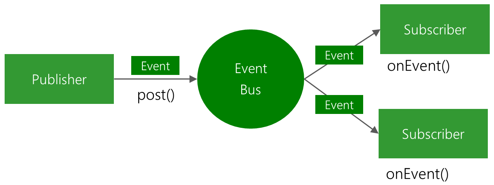

#### 腾讯---为什么会用到EventBus,EventBus的源码详解与架构分析，使用EventBus会造成什么弊端

本专栏专注分享大型Bat面试知识，后续会持续更新，喜欢的话麻烦点击一个star

> **面试官**:  为什么会用到EventBus,EventBus的源码详解与架构分析，使用EventBus会造成什么弊端


> **心理分析**：eventbus对程序员相爱相恨，爱 爱在太方便了，恨 恨在对程序的可读性有致命的伤害，小公司会用但面试的时候不会考，大公司不会用，但面试的时候使劲考。从该文中我们可以找到如何面试上大公司的线索和机会

> **求职者:**  求职者应该从 eventbus弊端入手，然后深入源码入手，告诉面试官 我不仅用过 还深入研究过。最后因为他的可读性 抛弃了它，所以这才是最厉害的


#### EventBus 需要解决的问题

在日常编码里面，我们会遇到很多网络请求，数据库操作等等，一般情况下这些操作都是通过观察者模式来实现的。

通过Volley来简单举个例子：

```
ImageRequest request = new ImageRequest(url,
    new Response.Listener<Bitmap>() {
        @Override
        public void onResponse(Bitmap bitmap) {
            mImageView.setImageBitmap(bitmap);
        }
    }, 0, 0, null,
    new Response.ErrorListener() {
        public void onErrorResponse(VolleyError error) {
            mImageView.setImageResource(R.drawable.image_load_error);
        }
    });
```

 此时，你会发现并且开始思考一个问题，如果很多**观察者模式**需要使用了？

 比如，你正在开发一个东西，需要监听网络状态变化，App的安装情况，内容的下载情况。

当存在很多观察者模式，「如何将这些事件通知到监听者」是可以复用的模块，这就是EventBus存在的意义。这里需要大家想明白一个问题，观察者模式本身就是一个可以复用的模块。

> 1. 内容下载模块
> 2. 电量监听模块
> 3. App按照通知

**他们都可以通过EventBus将自身的事件发布出去，使用者只需要在这个模块里面，注册对于自己感兴趣的内容就行。**



#### EventBus 带来的好处和引入的问题

1. 好处比较明显，就是独立出一个发布订阅模块，调用者可以通过使用这个模块，屏蔽一些线程切换问题，简单地实现发布订阅功能。
2. 坏处可能比较隐晦，但这些需要足够引起我们的重视

3. **大量的滥用**，将导致逻辑的分散，**出现问题后很难定位**。
   没办法实现强类型，在编译的时候就发现问题，（Otto实现了这个，但性能有问题）。在实现上通过一个很弱的协议，比如onEvent{XXX}, {XXX}表示ThreadModel，来实现线程的切换。后面在代码解析的时候，会说明这个问题。
4. **代码可读性有些问题**，IDE无法识别这些协议，对IDE不友好。
   总得来说，如果项目里面有大量的事件交互，那么还是可以通过EventBus来实现，否则还是推荐自己在模块内部实现观察者模式

#### EventBus 源码解析

##### EventBus.java

源码阅读从外观类开始，这里是 EventBus.java，核心接口都在这个类里面实现，对内容感兴趣的调用方使用 register 方法，当有事件产生的时候，会在onEvent的时候收到相应的回调。

> register(Object object);
>
> registerSticky(Object object);
>
> unRegister(Object object);
>
> post(Object object);

**先看看初始化部分，看看如何实现单例的（可选的）。**

// volatile 这里是需要重视的，这个关键字保证了defaultInstance在不同线程间的可见性，也就是说在多线程环境下，看到的仍然是最新修改的值。

```
static volatile EventBus defaultInstance;
/** Convenience singleton for apps using a process-wide EventBus instance. */
public static EventBus getDefault() {
    // 这一步不存在线程问题，volatile保证了。如果没有defaultInstance实例化出来，
    if (defaultInstance == null) {
        synchronized (EventBus.class) {
            // 进入同步块的时候，不能保证defaultInstance没有被实例化出来，所以需要进行double-check
            if (defaultInstance == null) {
                defaultInstance = new EventBus();
            }
        }
    }
    return defaultInstance;
}

// 这里实现的时候，考虑的是defaultInstance 不一定是每个人都需要创建的，否则没必要使用lazy的实现方式
// 下面是一种实现方式
static {
    defaultInstance = new EventBus();
}
```


EventBus实现了EventBusBuilder，通过Builder的方式使得构建的时候更加容易

```2
public static EventBusBuilder builder() {
    return new EventBusBuilder();
}
```


下面重点看看`register(Object subscriber, boolean sticky, int priority)`方法

```
private synchronized void register(Object subscriber, boolean sticky, int priority) {
    // 用 subscriberMethodFinder 提供的方法，找到在 subscriber 这个类里面，订阅的内容。
    List<SubscriberMethod> subscriberMethods
        = subscriberMethodFinder.findSubscriberMethods(subscriber.getClass());
    for (SubscriberMethod subscriberMethod : subscriberMethods) {
        // 遍历这些方法，subscribe 这些事件
        subscribe(subscriber, subscriberMethod, sticky, priority);
    }
}

```


findSubscriberMethods 这个方法是实现 EventBus 的核心代码，这里面包含了 EventBus 隐式定义的交互协议。从这个方法里面，可以看到如何争取地使用EventBus。

 ```
List<SubscriberMethod> findSubscriberMethods(Class<?> subscriberClass) {
    String key = subscriberClass.getName();
    List<SubscriberMethod> subscriberMethods;
    // 如果这个 Class 对应的方法被缓存，直接返回。
    synchronized (methodCache) {
        subscriberMethods = methodCache.get(key);
    }
    // 这个方法其实可以放在 前面的 synchronized 模块里面
    if (subscriberMethods != null) {
        return subscriberMethods;
    }
    subscriberMethods = new ArrayList<SubscriberMethod>();
    Class<?> clazz = subscriberClass;
    HashSet<String> eventTypesFound = new HashSet<String>();
    StringBuilder methodKeyBuilder = new StringBuilder();
    while (clazz != null) {
        String name = clazz.getName();
        // 跳过JDK里面的类
        if (name.startsWith("java.") || name.startsWith("javax.") || name.startsWith("android.")) {
            // Skip system classes, this just degrades performance
            break;
        }

        // Starting with EventBus 2.2 we enforced methods to be public (might change with annotations again)
        // 获取所有声明的方法
        Method[] methods = clazz.getDeclaredMethods();
        for (Method method : methods) {
            String methodName = method.getName();
            if (methodName.startsWith(ON_EVENT_METHOD_NAME)) {
                int modifiers = method.getModifiers();
                if ((modifiers & Modifier.PUBLIC) != 0 && (modifiers & MODIFIERS_IGNORE) == 0) {
                    // 方法是 Public 的
                    Class<?>[] parameterTypes = method.getParameterTypes();
                    if (parameterTypes.length == 1) {
                        String modifierString = methodName.substring(ON_EVENT_METHOD_NAME.length());
                        ThreadMode threadMode;

                        // 方法的前缀是否是 ‘OnEvent’， 如果是‘OnEvent’，查看后面的字符串，这里定义了 4 种基本类型
                        // ThreadModel 会在后面介绍
                        if (modifierString.length() == 0) {
                            threadMode = ThreadMode.PostThread;
                        } else if (modifierString.equals("MainThread")) {
                            threadMode = ThreadMode.MainThread;
                        } else if (modifierString.equals("BackgroundThread")) {
                            threadMode = ThreadMode.BackgroundThread;
                        } else if (modifierString.equals("Async")) {
                            threadMode = ThreadMode.Async;
                        } else {
                            if (skipMethodVerificationForClasses.containsKey(clazz)) {
                                continue;
                            } else {
                                throw new EventBusException("Illegal onEvent method, check for typos: " + method);
                            }
                        }

                        // 获取参数类型
                        Class<?> eventType = parameterTypes[0];
                        methodKeyBuilder.setLength(0);
                        methodKeyBuilder.append(methodName);
                        methodKeyBuilder.append('>').append(eventType.getName());
                        // 得到类似于一个句柄的东西，比如 onEventMainThread>DownloadInfo
                        String methodKey = methodKeyBuilder.toString();
                        if (eventTypesFound.add(methodKey)) {
                            // Only add if not already found in a sub class
                            subscriberMethods.add(new SubscriberMethod(method, threadMode, eventType));
                        }
                    }
                } else if (!skipMethodVerificationForClasses.containsKey(clazz)) {
                    Log.d(EventBus.TAG, "Skipping method (not public, static or abstract): " + clazz + "."
                            + methodName);
                }
            }
        }
        // 这里要为 EventBus 点个赞了，EventBus 是支持继承的
        clazz = clazz.getSuperclass();
    }
    if (subscriberMethods.isEmpty()) {
        throw new EventBusException("Subscriber " + subscriberClass + " has no public methods called "
                + ON_EVENT_METHOD_NAME);
    } else {
        synchronized (methodCache) {
            methodCache.put(key, subscriberMethods);
        }
        return subscriberMethods;
    }
}

 ```


 现在看下如何把 subscriberClass 里面的内容订阅到 EventBus 里面去。

```
// Must be called in synchronized block
private void subscribe(Object subscriber, SubscriberMethod subscriberMethod, boolean sticky, int priority) {
    Class<?> eventType = subscriberMethod.eventType;
    // 获取订阅了某种类型数据的 Subscription 。 使用了 CopyOnWriteArrayList ，这个是线程安全的，
    // CopyOnWriteArrayList 会在更新的时候，重新生成一份 copy，其他线程使用的是 
    // copy，不存在什么线程安全性的问题。
    CopyOnWriteArrayList<Subscription> subscriptions = subscriptionsByEventType.get(eventType);
    Subscription newSubscription = new Subscription(subscriber, subscriberMethod, priority);
    if (subscriptions == null) {
        subscriptions = new CopyOnWriteArrayList<Subscription>();
        subscriptionsByEventType.put(eventType, subscriptions);
    } else {
        if (subscriptions.contains(newSubscription)) {
            throw new EventBusException("Subscriber " + subscriber.getClass() + " already registered to event "
                    + eventType);
        }
    }

    // Starting with EventBus 2.2 we enforced methods to be public (might change with annotations again)
    // subscriberMethod.method.setAccessible(true);

    int size = subscriptions.size();
    for (int i = 0; i <= size; i++) {
        // 根据优先级进行插入，其实这里可以替换为优先级队列的
        if (i == size || newSubscription.priority > subscriptions.get(i).priority) {
            subscriptions.add(i, newSubscription);
            break;
        }
    }

    List<Class<?>> subscribedEvents = typesBySubscriber.get(subscriber);
    if (subscribedEvents == null) {
        subscribedEvents = new ArrayList<Class<?>>();
        typesBySubscriber.put(subscriber, subscribedEvents);
    }
    subscribedEvents.add(eventType);

    if (sticky) {
        // 是否支持继承，这个可以在 Builder 的时候指定，如果不支持，那么可能有20%以上的性能提升
        if (eventInheritance) {
            // Existing sticky events of all subclasses of eventType have to be considered.
            // Note: Iterating over all events may be inefficient with lots of sticky events,
            // thus data structure should be changed to allow a more efficient lookup
            // (e.g. an additional map storing sub classes of super classes: Class -> List<Class>).
            Set<Map.Entry<Class<?>, Object>> entries = stickyEvents.entrySet();
            for (Map.Entry<Class<?>, Object> entry : entries) {
                Class<?> candidateEventType = entry.getKey();
                if (eventType.isAssignableFrom(candidateEventType)) {
                    Object stickyEvent = entry.getValue();
                    checkPostStickyEventToSubscription(newSubscription, stickyEvent);
                }
            }
        } else {
            // 检查是否有 sticky 的event， 如果存在就发布出去
            Object stickyEvent = stickyEvents.get(eventType);
            checkPostStickyEventToSubscription(newSubscription, stickyEvent);
        }
    }
}

```

**EventBus ThreadModel**
**EventBus 一共提供了 4 种 ThreadModel**，

 分别是 

> PostThread,
>
> MainThread, 
>
> ##### BackgroundThread, 
>
> Async

PostThread 默认实现，执行发生在同一个线程
MainThread 执行在UI 线程上
BackgroundThread 回调发生在非 UI 线程上
Async 永远执行在一个其他的线程上
以上这四种类型，足以支持观察者模式里面需要进行的异步处理。

##### EventBus 如何实现线程转换的

但凡经历一些实际项目，就会发现，经常存在「生产」和「消费」冲突的情况，这里就需要使用「生产者与消费者」模式。

EventBus 中 生产者和消费者模式的实现主要是在 PendingPostQueue里面。

PendingPostQueue 的实现比较简单，主要是通过在 enqueue 和 poll 的时候进行 synchronized 同步来实现的。

```
synchronized void enqueue(PendingPost pendingPost) {
    if (pendingPost == null) {
        throw new NullPointerException("null cannot be enqueued");
    }
    // 将 Post 插入到队列尾部
    if (tail != null) {
        tail.next = pendingPost;
        tail = pendingPost;
    } else if (head == null) {
        // 在最开始的时候，建立头部和尾部的索引
        head = tail = pendingPost;
    } else {
        throw new IllegalStateException("Head present, but no tail");
    }
    notifyAll();
}

synchronized PendingPost poll() {
    PendingPost pendingPost = head;
    // 从头部获取
    if (head != null) {
        head = head.next;
        if (head == null) {
            tail = null;
        }
    }
    return pendingPost;
}

```

```
// 这里需要注意的地方是 PendingPost， 这里维护了一个 pendingPostPool 的池子， 当PendingPost 不再需要的时候，就释放回池子里面去，避免了新建对象的开销。
static void releasePendingPost(PendingPost pendingPost) {
    pendingPost.event = null;
    pendingPost.subscription = null;
    pendingPost.next = null;
    synchronized (pendingPostPool) {
        // Don't let the pool grow indefinitely
        if (pendingPostPool.size() < 10000) {
            pendingPostPool.add(pendingPost);
        }
    }
}

```

### EventBus 如何发布事件的

```
// 每个ThreadModel (除了PostThread) 都维护了一个 Poster， 这个Post 里面维持了一个 ``生产者消费者模式``， 来消费和使用事件。
private void postToSubscription(Subscription subscription, Object event, boolean isMainThread) {
    switch (subscription.subscriberMethod.threadMode) {
        case PostThread:
            invokeSubscriber(subscription, event);
            break;
        case MainThread:
            // 主线程的poster
            if (isMainThread) {
                invokeSubscriber(subscription, event);
            } else {
                mainThreadPoster.enqueue(subscription, event);
            }
            break;
        case BackgroundThread:
            if (isMainThread) {
                backgroundPoster.enqueue(subscription, event);
            } else {
                invokeSubscriber(subscription, event);
            }
            break;
        case Async:
            asyncPoster.enqueue(subscription, event);
            break;
        default:
            throw new IllegalStateException("Unknown thread mode: " + subscription.subscriberMethod.threadMode);
    }
}

```

