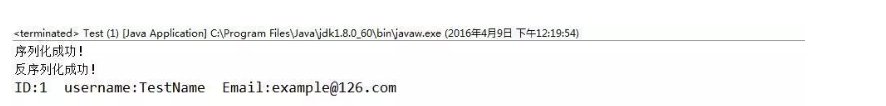

#### 腾讯---序列化与反序列化的原理，Android的Parcelable与Serializable区别是什么

本专栏专注分享大型Bat面试知识，后续会持续更新，喜欢的话麻烦点击一个star

> **面试官:  序列化与反序列化的原理，Android的Parcelable与Serializable区别是什么**


> **心理分析**：序列化与反序列化在面试中算得上是一个重点的话题，有时候稍微不对，面试官会认为开发没多久

> **求职者:**应该从Parcelable与Serializable的使用开始讲起

**一、序列化与反序列化**

由于在系统底层，数据的传输形式是简单的字节序列形式传递，即在底层，系统不认识对象，只认识字节序列，而为了达到进程通讯的目的，需要先将数据序列化，而序列化就是将对象转化字节序列的过程。相反地，当字节序列被运到相应的进程的时候，进程为了识别这些数据，就要将其反序列化，即把字节序列转化为对象。有了以上理解，接下来我们认识两个用于序列化和反序列化的接口：Serializable接口和Parcelable接口。

**二、Serializable接口**

Java提供了一个序列化接口，serialable接口，该接口在文档中定义如下：Marks classes that can be serialized by ObjectOutputStream and deserialized by ObjectInputStream.从这句话可看出，该接口只是标记了当前类是可以序列化的，是一个空接口，仅仅提供了标志功能，具体的序列化与反序列化操作是由ObjectOutputStream和ObjectInputStream完成的。
 　　继续读文档，发现该接口要求我们在实现了该接口的类中声明如下的一个变量：

```
private static final long serialVersionUID= 1L; 
```

这个变量有什么用呢？试想一下，如果没有手动指定该值，一开始序列化了classA,得到文件A，接着对classA的内部结构更改，比如添加了一个新的变量，那么此时反序列化则会失败，因为实际上系统在序列化的时候，会自动计算出一个serialVersionUID值，并保存在已经序列化好的数据中，此时修改了classA，那么反序列化的时候系统就会重新计算一个新的serialVersionUID值，那么两个值就会不相等，就会反序列化失败。所以，手动指定一个值，能很大程度上保存数据，防止数据丢失。
 　　接下来，我们来看一下序列化和反序列化的**具体步骤**：
 　　·对象的序列化：
 　　（1）实例化一个对象输出流：ObjectOutputStream,该对象输出流可以包装一个输出流，比如文件输出流。
 　　（2）使用ObjectOutputStream.writeObject(obj)进行写对象。
 　　·对象的反序列化：
 　　（1）实例化一个对象输入流：ObjectInputStream,该对象输入流可以包装一个输入流，比如文件输入流。
 　　（2）使用ObjectInputStream.readObject(obj)进行读对象。
 以下是一个实现序列化与反序列化的范例：
 ①User类，被序列化的类：

```
package com.chenyu.serialable;  
  
import java.io.Serializable;  
  
public class User implements Serializable {  
  
    private static final long serialVersionUID = 1L;  
      
    public int id;  
    public String username;  
    public String email;  
      
    public User(int id, String username, String email) {  
        this.id = id;  
        this.username = username;  
        this.email = email;  
    }   
}
```

②Test测试类，测试序列化与反序列化是否成功：

```
package com.chenyu.serialable;  
  
import java.io.FileInputStream;  
import java.io.FileNotFoundException;  
import java.io.FileOutputStream;  
import java.io.IOException;  
import java.io.ObjectInputStream;  
import java.io.ObjectOutputStream;  
  
public class Test {  
    public static void main(String[] args) throws FileNotFoundException, IOException, ClassNotFoundException {  
        //实例化User类  
        User user =new User(1,"TestName","example@126.com");  
        //序列化过程  
        ObjectOutputStream objectOutputStream = new ObjectOutputStream(new FileOutputStream("test.txt"));  
        objectOutputStream.writeObject(user);  
        objectOutputStream.close();  
        System.out.println("序列化成功！");  
        //反序列化过程  
        ObjectInputStream objectInputStream =new ObjectInputStream(new FileInputStream("test.txt"));  
        User newUser = (User) objectInputStream.readObject();  
        objectInputStream.close();  
        System.out.println("反序列化成功！");  
        System.out.println("ID:"+newUser.id+"  username:"+newUser.username+"  Email:"+newUser.email);  
    }  
} 
```

运行Test.java，得到如下结果：




Paste_Image.png

注意：

静态成员变量属于类，而不是对象，所以不会参与序列化；使用transient关键字标记的成员变量不参与序列化过程。


**三、Parcelable接口**

接下来我们要说的是Parcelable接口，该接口是Android提供的新的序列化方式。首先，先看官方文档对该接口的描述：Interface for classes whose instances can be written to and restored from a Parcel. Classes implementing the Parcelable interface must also have a static field called CREATOR, which is an object implementing the Parcelable.Creator interface.
 　　除了实现该接口的方法外，还需创建一个名叫CREATOR的静态对象，该对象实现了一个Parcelable.Creator的匿名内部类。以下是官方文档的一个类实现Parcelable接口的典型例子：

```
public class MyParcelable implements Parcelable {  
     private int mData;  
  
     public int describeContents() {  
         return 0;  
     }  
  
     public void writeToParcel(Parcel out, int flags) {  
         out.writeInt(mData);  
     }  
  
     public static final Parcelable.Creator<MyParcelable> CREATOR  
             = new Parcelable.Creator<MyParcelable>() {  
         public MyParcelable createFromParcel(Parcel in) {  
             return new MyParcelable(in);  
         }  
  
         public MyParcelable[] newArray(int size) {  
             return new MyParcelable[size];  
         }  
     };  
       
     private MyParcelable(Parcel in) {  
         mData = in.readInt();  
     }  
 } 
```

下面介绍一下以上各个方法的作用：
 　 ①writeToParcel(Parcel out,int flags):将当前对象写入序列化结构之中。
 　 ②createFromParcel(Parcel in):从序列化后的对象中创建原始对象
 　 ③newArray(int size):创建指定长度的原始对象数组
 　 ④MyParcelable(Parcel in):从序列化后的对象中创建原始对象
 　 由以上各个方法可知，writeToParcel方法负责将对象序列化，而CREATOR负责数据的反序列化，只要你的类实现了Parcelable接口，并实现以上方法，那么就能自动地对对象进行序列化和反序列化了。
 　注意：在writeToParcel方法中，调用了out.writeInt(data)方法，如果当前类有多个属性，比如：int id,String name,String email,那么方法体可以写为：

```
out.writeInt(id);  
out.writeString(name);  
out.writeString(email); 
```

这样写后，在相应的MyParcelable(Parcel in)反序列化方法也必须如下写：

```
in.readInt();  
in.readString();  
in.readString(); 
```

即顺序应该**一一对应**，否则，取出来的数据将会出错。
 　　到目前为止，介绍了Serialable接口和Parcelable接口，这是IPC机制中比较基础的概念，应熟练掌握。希望我的文章能对你们的学习起到帮助作用。

#### 四  Parcelable和Serializable的区别：

    android自定义对象可序列化有两个选择一个是Serializable和Parcelable

**一、对象为什么需要序列化**
   1.永久性保存对象，保存对象的字节序列到本地文件。
   2.通过序列化对象在网络中传递对象。
   3.通过序列化对象在进程间传递对象。

**二、当对象需要被序列化时如何选择所使用的接口**
   1.在使用内存的时候Parcelable比Serializable的性能高。
   2.Serializable在序列化的时候会产生大量的临时变量，从而引起频繁的GC（内存回收）。

   3.Parcelable不能使用在将对象存储在磁盘上这种情况，因为在外界的变化下Parcelable不能很好的保证数据的持续性。

 