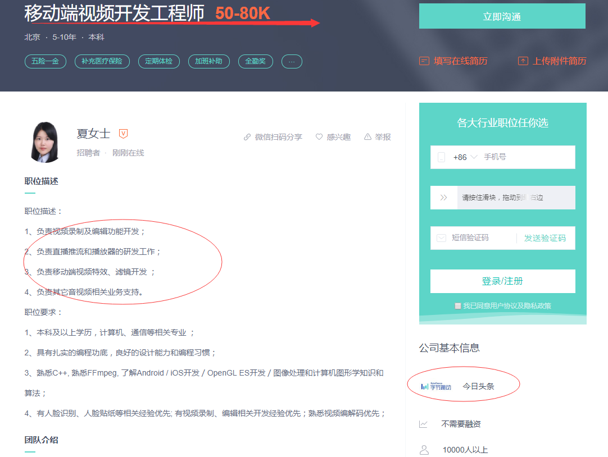

##### 字节跳动-直播中 网速比较差的条件下，如何使画面保证流畅的效果

本专栏专注分享大型Bat面试知识，后续会持续更新，喜欢的话麻烦点击一个star

> **面试官:  直播中 网速比较差的条件下，如何使画面保证流畅的效果**

##### 岗位场景

> **心理分析**：“ 网速比较差的条件下，如何使画面保证流畅的效果”  该问题可以转换成一个优化问题。直播技术最难的是优化，接下来我们从五个方面来进行直播优化

> **求职者: ** 遇到优化问题 一定要淡定，一步一步 调理清晰。面试官也不会完全记得有几种优化，他只是试探你  看你了不了解。如果遇到该问题  说话卡顿 结巴，面试官可以下定决定 你没弄过

音视频的直播系统是一个复杂的工程系统，要做到非常低延迟的直播，需要复杂的系统工程优化和对各组件非常熟悉的掌握。下面整理几个简单常用的调优技巧：

# 1 **编码优化**

1. **确保 Codec 开启了最低延迟的设置**。Codec 一般都会有低延迟优化的开关，对于 H.264 来说其效果尤其明显。很多人可能不知道 H.264 的解码器正常情况下会在显示之前缓存一定的视频帧，对于 QCIF 分辨率大小的视频（176 × 144）一般会缓存 16 帧，对于 720P 的视频则缓存 5 帧。对于第一帧的读取来说，这是一个很大的延迟。如果你的视频不是使用 H.264 来编码压缩的，确保没有使用到 B 帧，它对延迟也会有较大的影响，因为视频中 B 帧的解码依赖于前后的视频帧，会增加延迟。

2. **编码器一般都会有码控造成的延迟，一般也叫做初始化延迟或者视频缓存检验器 VBV 的缓存大小**，把它当成编码器和解码器比特流之间的缓存，在不影响视频质量的情况下可以将其设置得尽可能小也可以降低延迟。

3. **如果是仅仅优化首开延迟，可以在视频帧间插入较多的关键帧**，这样客户端收到视频流之后可以尽快解码。但如果需要优化传输过程中的累计延迟，尽可能少使用关键帧也就是 I 帧（GOP 变大），在保证同等视频质量的情况下，I 帧越多，码率越大，传输所需的网络带宽越多，也就意味着累计延迟可能越大。这个优化效果可能在秒级延迟的系统中不是很明显，但是在 100 ms 甚至更低延迟的系统中就会非常明显。同时，尽量使用 ACC-LC Codec 来编码音频，HE-ACC 或者 HE-ACC 2 虽然编码效率高，但是编码所需时间更长，而产生更大体积的音频造成的传输延迟对于视频流的传输来说影响更小。

4. **不要使用视频 MJPEG 的视频压缩格式，至少使用不带 B 帧的 MPEG4 视频压缩格式（Simple profile）**，甚至最好使用 H.264 baseline profile（X264 还有一个「-tune zerolatency」的优化开关）。这样一个简单的优化可以降低延迟，因为它能够以更低的码率编码全帧率视频。

5. **如果使用了 FFmpeg，降低「-probesize 」和「 -analyze duration」参数的值**，这两个值用于视频帧信息监测和用于监测的时长，这两个值越大对编码延迟的影响越大，在直播场景下对于视频流来说 analyzeduration 参数甚至没有必要设定。 

6. **固定码率编码 CBR 可以一定程度上消除网络抖动影响**，如果能够使用可变码率编码 VBR 可以节省一些不必要的网络带宽，降低一定的延迟。因此建议尽量使用 VBR 进行编码。

# **2 传输协议优化**

1. **在服务端节点和节点之间尽量使用 RTMP** 而非基于 HTTP 的 HLS 协议进行传输，这样可以降低整体的传输延迟。这个主要针对终端用户使用 HLS 进行播放的情况。

2. **如果终端用户使用 RTMP 来播放**，尽量在靠近推流端的收流节点进行转码，这样传输的视频流比原始视频流更小。

3. **如果有必要，可以使用定制的 UDP 协议来替换 TCP 协议，省去弱网环节下的丢包重传可以降低延迟**。它的主要缺点在于，基于 UDP 协议进行定制的协议的视频流的传输和分发不够通用，CDN 厂商支持的是标准的传输协议。另一个缺点在于可能出现丢包导致的花屏或者模糊（缺少关键帧的解码参考），这就要求协议定制方在 UDP 基础之上做好丢包控制。 

# **3 传输网络优化**

1. 我们曾经介绍过实时流传输网络，它是一种新型的节点自组织的网状传输网络，既适合国内多运营商网络条件下的传输优化，也适合众多海外直播的需求。

2. **在服务端节点中缓存当前 GOP**，配合播放器端优化视频首开时间。

3. **服务端实时记录每个视频流流向每个环节时的秒级帧率和码率**，实时监控码率和帧率的波动。

4. **客户端（推流和播放）通过查询服务端准实时获取当前最优节点（5 秒一次）**，准实时下线当前故障节点和线路。

# **4 推流、播放优化**

1. **考察发送端系统自带的网络 buffer 大小**，系统可能在发送数据之前缓存数据，这个参数的调优也需要找到一个平衡点。

2. **播放端缓存控制对于视频的首开延迟也有较大影响，如果仅优化首开延迟**，**可以在 0 缓存情况下在数据到达的时候立即解码**。但如果在弱网环境下为了消除网络抖动造成的影响，设置一定的缓存也有必要，因此需要在直播的稳定性和首开延迟优化上找到平衡，调整优化缓冲区大小这个值。

3. **播放端动态 buffer 策略，这是上面播放端缓存控制的改进版本**。如果只是做 0 缓存和固定大小的缓存之间进行选择找到平衡，最终还是会选择一个固定大小的缓存，这对亿级的移动互联网终端用户来说并不公平，他们不同的网络状况决定了这个固定大小的缓存并不完全合适。因此，我们可以考虑一种「动态 buffer 策略」，在播放器开启的时候采用非常小甚至 0 缓存的策略，通过对下载首片视频的耗时来决定下一个时间片的缓存大小，同时在播放过程中实时监测当前网络，实时调整播放过程中缓存的大小。这样即可做到极低的首开时间，又可能够尽量消除网络抖动造成的影响。

4. **动态码率播放策略。除了动态调整 buffer 大小的策略之外**，也可以利用实时监测的网络信息来动态调整播放过程中的码率，在网络带宽不足的情况下降低码率进行播放，减少延迟。

##### 以上，是低延迟优化方面的部分技巧。实际上我们优化低延迟的时候并不是只关注「低延迟」，而是在保证其它条件不影响用户体验的情况下尽量做到低延迟，因此它的内容涉及到更多广泛的话题。

