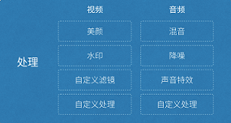
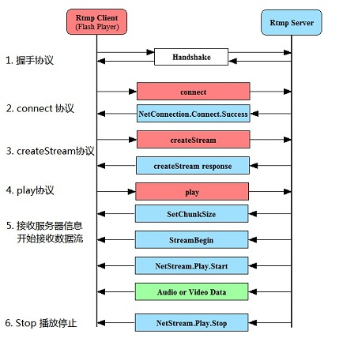
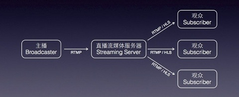
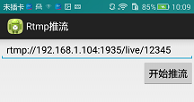
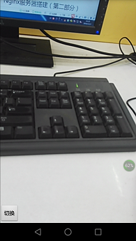
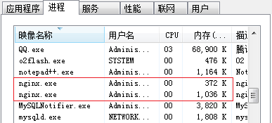
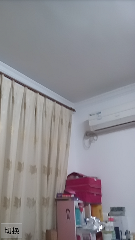
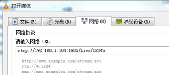
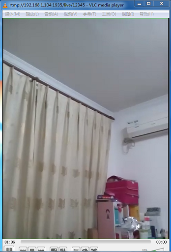

##### 字节跳动-之前有做过直播吗?你们是通过什么方式实现直播的?

> 本专栏专注分享大型Bat面试知识，后续会持续更新，喜欢的话麻烦点击一个star

##### 岗位场景


> **面试官:  之前有做过直播吗?你们是通过什么方式实现直播的?**


> **心理分析**：直播技术实现有很多种，如果之前有过直播经验90% 都会说 我用的某某第三方的直播框架，而面试官是不想听到你只是调用了别人的API而已。他想知道你是否有自己实现过直播技术的

求职过程中如果遇到这个问题，绝对是你面试的岗位中正在做直播功能，就像抖音的岗位。

##### 此问题是一个连环炮  后面大几率会问道 直播优化  [ 直播优化请参考](live-optimitor.md)

> **求职者:**如果你没有做过直播，可以跟面试官说我没做过，但是蹭队直播比较感兴趣，花了相当长的时间对周波进行专研，对直播技术的实现有自己的深入了解。这样面试官觉得  你非常不错


##### 接下来对整个直播流程(音视频编解码，rtmp协议   h264协议)进行讲解 (末尾含源码哦~)


# 视频直播流程

视频直播的流程可以分为如下几步： 
采集 —>处理—>编码和封装—>推流到服务器—>服务器流分发—>播放器流播放


## 1.采集

采集是整个视频推流过程中的第一个环节，它从系统的采集设备中获取原始视频数据，将其输出到下一个环节。视频的采集涉及两方面数据的采集：音频采集和图像采集，它们分别对应两种完全不同的输入源和数据格式。

****

- 音频采集 
  音频数据既能与图像结合组合成视频数据，也能以纯音频的方式采集播放，后者在很多成熟的应用场景如在线电台和语音电台等起着非常重要的作用。音频的采集过程主要通过设备将环境中的模拟信号采集成 PCM 编码的原始数据，然后编码压缩成 MP3 等格式的数据分发出去。常见的音频压缩格式有：MP3，AAC，HE-AAC，Opus，FLAC，Vorbis (Ogg)，Speex 和 AMR等。 
  音频采集和编码主要面临的挑战在于：延时敏感、卡顿敏感、噪声消除（Denoise）、回声消除（AEC）、静音检测（VAD）和各种混音[算法](http://lib.csdn.net/base/datastructure)等。
- 图像采集 
  将图像采集的图片结果组合成一组连续播放的动画，即构成视频中可肉眼观看的内容。图像的采集过程主要由摄像头等设备拍摄成 YUV 编码的原始数据，然后经过编码压缩成 H.264 等格式的数据分发出去。常见的视频封装格式有：MP4、3GP、AVI、MKV、WMV、MPG、VOB、FLV、SWF、MOV、RMVB 和 WebM 等。 
  图像由于其直观感受最强并且体积也比较大，构成了一个视频内容的主要部分。图像采集和编码面临的主要挑战在于：设备兼容性差、延时敏感、卡顿敏感以及各种对图像的处理操作如美颜和水印等。

视频采集的采集源主要有 摄像头采集、屏幕录制和从视频文件推流。

## 2.处理

视频或者音频完成采集之后得到原始数据，为了增强一些现场效果或者加上一些额外的效果，我们一般会在将其编码压缩前进行处理，比如打上时间戳或者公司 Logo 的水印，祛斑美颜和声音混淆等处理。在主播和观众连麦场景中，主播需要和某个或者多个观众进行对话，并将对话结果实时分享给其他所有观众，连麦的处理也有部分工作在推流端完成。



如上图所示，处理环节中分为音频和视频处理，音频处理中具体包含混音、降噪和声音特效等处理，视频处理中包含美颜、水印、以及各种自定义滤镜等处理。

## 3.编码和封装

（1）编码

如果把整个流媒体比喻成一个物流系统，那么编解码就是其中配货和装货的过程，这个过程非常重要，它的速度和压缩比对物流系统的意义非常大，影响物流系统的整体速度和成本。同样，对流媒体传输来说，编码也非常重要，它的编码性能、编码速度和编码压缩比会直接影响整个流媒体传输的用户体验和传输成本。

- 视频编码的意义 
  原始视频数据存储空间大，一个 1080P 的 7 s 视频需要 817 MB 
  原始视频数据传输占用带宽大，10 Mbps 的带宽传输上述 7 s 视频需要 11 分钟 
  而经过 H.264 编码压缩之后，视频大小只有 708 k ，10 Mbps 的带宽仅仅需要 500 ms ，可以满足实时传输的需求，所以从视频采集传感器采集来的原始视频势必要经过视频编码。
- 基本原理 
  为什么巨大的原始视频可以编码成很小的视频呢?这其中的技术是什么呢?核心思想就是去除冗余信息： 
  1）空间冗余：图像相邻像素之间有较强的相关性 
  2）时间冗余：视频序列的相邻图像之间内容相似 
  3）编码冗余：不同像素值出现的概率不同 
  4）视觉冗余：人的视觉系统对某些细节不敏感 
  5）知识冗余：规律性的结构可由先验知识和背景知识得到
- 编码器的选择 
  视频编码器经历了数十年的发展，已经从开始的只支持帧内编码演进到现如今的 H.265 和 VP9 为代表的新一代编码器，下面是一些常见的视频编码器： 
  1）H.264/AVC 
  2）HEVC/H.265 
  3）VP8 
  4）VP9 
  5）FFmpeg 
  注：音频编码器有Mp3, AAC等。

（2）封装 
沿用前面的比喻，封装可以理解为采用哪种货车去运输，也就是媒体的容器。 
所谓容器，就是把编码器生成的多媒体内容(视频，音频，字幕，章节信息等)混合封装在一起的标准。容器使得不同多媒体内容同步播放变得很简单，而容器的另一个作用就是为多媒体内容提供索引，也就是说如果没有容器存在的话一部影片你只能从一开始看到最后，不能拖动进度条，而且如果你不自己去手动另外载入音频就没有声音。下面是几种常见的封装格式： 
1）AVI 格式(后缀为 .avi) 
2）DV-AVI 格式(后缀为 .avi) 
3）QuickTime File Format 格式(后缀为 .mov) 
4）MPEG 格式(文件后缀可以是 .mpg .mpeg .mpe .dat .vob .asf .3gp .mp4等) 
5）WMV 格式(后缀为.wmv .asf) 
6）Real Video 格式(后缀为 .rm .rmvb) 
7）Flash Video 格式(后缀为 .flv) 
8）Matroska 格式(后缀为 .mkv) 
9）MPEG2-TS 格式 (后缀为 .ts) 
目前，我们在流媒体传输，尤其是直播中主要采用的就是 FLV 和 MPEG2-TS 格式，分别用于 RTMP/HTTP-FLV 和 HLS 协议。

## 4.推流到服务器

推流是直播的第一公里，直播的推流对这个直播链路影响非常大，如果推流的网络不稳定，无论我们如何做优化，观众的体验都会很糟糕。所以也是我们排查问题的第一步，如何系统地解决这类问题需要我们对相关理论有基础的认识。 
推送协议主要有三种：

- RTSP（Real Time Streaming Protocol）：实时流传送协议，是用来控制声音或影像的多媒体串流协议, 由Real Networks和Netscape共同提出的；
- RTMP(Real Time Messaging Protocol)：实时消息传送协议，是Adobe公司为Flash播放器和服务器之间音频、视频和数据传输 开发的开放协议；
- HLS(HTTP Live Streaming)：是苹果公司(Apple Inc.)实现的基于HTTP的流媒体传输协议；

RTMP协议基于 TCP，是一种设计用来进行实时数据通信的网络协议，主要用来在 flash/AIR 平台和支持 RTMP 协议的流媒体/交互服务器之间进行音视频和数据通信。支持该协议的软件包括 Adobe Media Server/Ultrant Media Server/red5 等。 
它有三种变种：

- RTMP工作在TCP之上的明文协议，使用端口1935；
- RTMPT封装在HTTP请求之中，可穿越防火墙；
- RTMPS类似RTMPT，但使用的是HTTPS连接；

RTMP 是目前主流的流媒体传输协议，广泛用于直播领域，可以说市面上绝大多数的直播产品都采用了这个协议。 
RTMP协议就像一个用来装数据包的容器，这些数据可以是AMF格式的数据,也可以是FLV中的视/音频数据。一个单一的连接可以通过不同的通道传输多路网络流。这些通道中的包都是按照固定大小的包传输的。 


## 5.服务器流分发

流媒体服务器的作用是负责直播流的发布和转播分发功能。 
流媒体服务器有诸多选择，如商业版的Wowza。但我选择的是Nginx，它是一款优秀的免费Web服务器，后面我会详细介绍如何搭建Nginx服务器。

## 6.播放器流播放

主要是实现直播节目在终端上的展现。因为我这里使用的传输协议是RTMP， 所以只要支持 RTMP 流协议的播放器都可以使用，譬如：

- 电脑端：VLC等
- 手机端：Vitamio以及ijkplayer等

一般情况下我们把上面流程的前四步称为第一部分，即视频主播端的操作。视频采集处理后推流到流媒体服务器，第一部分功能完成。第二部分就是流媒体服务器，负责把从第一部分接收到的流进行处理并分发给观众。第三部分就是观众啦，只需要拥有支持流传输协议的播放器即可。 


# 第一部分：采集推流SDK

目前市面上集视频采集、编码、封装和推流于一体的SDK已经有很多了，例如商业版的NodeMedia，但NodeMedia SDK按包名授权，未授权包名应用使用有版权提示信息。 
我这里使用的是别人分享在github上的一个免费SDK，[下载地址](https://github.com/runner365/android_rtmppush_sdk)。

下面我就代码分析一下直播推流的过程吧： 
先看入口界面： 
 
很简单，一个输入框让你填写服务器的推流地址，另外一个按钮开启推流。

```

public class StartActivity extends Activity {
    public static final String RTMPURL_MESSAGE = "rtmppush.hx.com.rtmppush.rtmpurl";
    private Button _startRtmpPushButton = null;
    private EditText _rtmpUrlEditText = null;
 
    private View.OnClickListener _startRtmpPushOnClickedEvent = new View.OnClickListener() {
        @Override
        public void onClick(View arg0) {
            Intent i = new Intent(StartActivity.this, MainActivity.class);
            String rtmpUrl = _rtmpUrlEditText.getText().toString();
            i.putExtra(StartActivity.RTMPURL_MESSAGE, rtmpUrl);
            StartActivity.this.startActivity(i);
        }
    };
 
    private void InitUI(){
        _rtmpUrlEditText = (EditText)findViewById(R.id.rtmpUrleditText);
        _startRtmpPushButton = (Button)findViewById(R.id.startRtmpButton);
        _rtmpUrlEditText.setText("rtmp://192.168.1.104:1935/live/12345");
        _startRtmpPushButton.setOnClickListener(_startRtmpPushOnClickedEvent);
    }
 
    @Override
    protected void onCreate(Bundle savedInstanceState) {
        super.onCreate(savedInstanceState);
        setContentView(R.layout.activity_start);
        InitUI();
    }
}
```

##### 主要的推流过程在MainActivity里面，同样，先看界面： 

 

##### 布局文件：

```

<RelativeLayout xmlns:android="http://schemas.android.com/apk/res/android"
    xmlns:tools="http://schemas.android.com/tools"
    android:id="@+id/cameraRelative"
    android:layout_width="match_parent"
    android:layout_height="match_parent"
    android:paddingBottom="@dimen/activity_vertical_margin"
    android:paddingLeft="@dimen/activity_horizontal_margin"
    android:paddingRight="@dimen/activity_horizontal_margin"
    android:paddingTop="@dimen/activity_vertical_margin"
    android:theme="@android:style/Theme.NoTitleBar.Fullscreen">
 
<SurfaceView
        android:id="@+id/surfaceViewEx"
        android:layout_width="match_parent"
        android:layout_height="match_parent"/>
    <Button
        android:id="@+id/SwitchCamerabutton"
        android:layout_width="wrap_content"
        android:layout_height="wrap_content"
        android:layout_alignBottom="@+id/surfaceViewEx"
        android:text="@string/SwitchCamera" />
</RelativeLayout>
```

其实就是用一个SurfaceView显示摄像头拍摄画面，并提供了一个按钮切换前置和后置摄像头。从入口函数看起：

```
    @Override
    protected void onCreate(Bundle savedInstanceState) {
        requestWindowFeature(Window.FEATURE_NO_TITLE);
        getWindow().setFlags(WindowManager.LayoutParams.FLAG_FULLSCREEN,
                WindowManager.LayoutParams.FLAG_FULLSCREEN);
        this.getWindow().setFlags(WindowManager.LayoutParams.FLAG_KEEP_SCREEN_ON, WindowManager.LayoutParams.FLAG_KEEP_SCREEN_ON);
        super.onCreate(savedInstanceState);
 
        setContentView(R.layout.activity_main);
        setRequestedOrientation(ActivityInfo.SCREEN_ORIENTATION_PORTRAIT);
 
        Intent intent = getIntent();
        _rtmpUrl = intent.getStringExtra(StartActivity.RTMPURL_MESSAGE);
 
        InitAll();
 
        PowerManager pm = (PowerManager) getSystemService(Context.POWER_SERVICE);
        _wakeLock = pm.newWakeLock(PowerManager.SCREEN_DIM_WAKE_LOCK, "My Tag");

```

首先设置全屏显示，常亮，竖屏，获取服务器的推流url，再初始化所有东西。

```
private void InitAll() {
        WindowManager wm = this.getWindowManager();
 
        int width = wm.getDefaultDisplay().getWidth();
        int height = wm.getDefaultDisplay().getHeight();
        int iNewWidth = (int) (height * 3.0 / 4.0);
 
        RelativeLayout rCameraLayout = (RelativeLayout)findViewById(R.id.cameraRelative);
        RelativeLayout.LayoutParams layoutParams = new RelativeLayout.LayoutParams(RelativeLayout.LayoutParams.MATCH_PARENT,
                RelativeLayout.LayoutParams.MATCH_PARENT);
        int iPos = width - iNewWidth;
        layoutParams.setMargins(iPos, 0, 0, 0);
 
        _mSurfaceView = (SurfaceView) this.findViewById(R.id.surfaceViewEx);
        _mSurfaceView.getHolder().setFixedSize(HEIGHT_DEF, WIDTH_DEF);
        _mSurfaceView.getHolder().setType(SurfaceHolder.SURFACE_TYPE_PUSH_BUFFERS);
        _mSurfaceView.getHolder().setKeepScreenOn(true);
        _mSurfaceView.getHolder().addCallback(new SurceCallBack());
        _mSurfaceView.setLayoutParams(layoutParams);
 
        InitAudioRecord();
 
        _SwitchCameraBtn = (Button) findViewById(R.id.SwitchCamerabutton);
        _SwitchCameraBtn.setOnClickListener(_switchCameraOnClickedEvent);
 
        RtmpStartMessage();//开始推流
}
```

首先设置屏幕比例3:4显示，给SurfaceView设置一些参数并添加回调，再初始化AudioRecord，最后执行开始推流。音频在这里初始化了，那么相机在哪里初始化呢？其实在SurfaceView的回调函数里。

```
      @Override
	 public void surfaceCreated(SurfaceHolder holder) {
            _iDegrees = getDisplayOritation(getDispalyRotation(), 0);
            if (_mCamera != null) {
                InitCamera(); //初始化相机
                return;
            }
            //华为i7前后共用摄像头
            if (Camera.getNumberOfCameras() == 1) {
                _bIsFront = false;
                _mCamera = Camera.open(Camera.CameraInfo.CAMERA_FACING_BACK);
            } else {
                _mCamera = Camera.open(Camera.CameraInfo.CAMERA_FACING_FRONT);
            }
            InitCamera();
        }
 
        @Override
        public void surfaceDestroyed(SurfaceHolder holder) {
        }
	}
```

##### 相机的初始化就在这里啦：

```
public void InitCamera() {
        Camera.Parameters p = _mCamera.getParameters();
 
        Size prevewSize = p.getPreviewSize();
        showlog("Original Width:" + prevewSize.width + ", height:" + prevewSize.height);
 
        List<Size> PreviewSizeList = p.getSupportedPreviewSizes();
        List<Integer> PreviewFormats = p.getSupportedPreviewFormats();
        showlog("Listing all supported preview sizes");
        for (Camera.Size size : PreviewSizeList) {
            showlog("  w: " + size.width + ", h: " + size.height);
        }
 
        showlog("Listing all supported preview formats");
        Integer iNV21Flag = 0;
        Integer iYV12Flag = 0;
        for (Integer yuvFormat : PreviewFormats) {
            showlog("preview formats:" + yuvFormat);
            if (yuvFormat == android.graphics.ImageFormat.YV12) {
                iYV12Flag = android.graphics.ImageFormat.YV12;
            }
            if (yuvFormat == android.graphics.ImageFormat.NV21) {
                iNV21Flag = android.graphics.ImageFormat.NV21;
            }
        }
 
        if (iNV21Flag != 0) {
            _iCameraCodecType = iNV21Flag;
        } else if (iYV12Flag != 0) {
            _iCameraCodecType = iYV12Flag;
        }
        p.setPreviewSize(HEIGHT_DEF, WIDTH_DEF);
        p.setPreviewFormat(_iCameraCodecType);
        p.setPreviewFrameRate(FRAMERATE_DEF);
 
        showlog("_iDegrees="+_iDegrees);
        _mCamera.setDisplayOrientation(_iDegrees);
        p.setRotation(_iDegrees);
        _mCamera.setPreviewCallback(_previewCallback);
        _mCamera.setParameters(p);
        try {
            _mCamera.setPreviewDisplay(_mSurfaceView.getHolder());
        } catch (Exception e) {
            return;
        }
        _mCamera.cancelAutoFocus();//只有加上了这一句，才会自动对焦。
        _mCamera.startPreview();
}
```

##### 还记得之前初始化完成之后开始推流函数吗？

```
private void RtmpStartMessage() {
        Message msg = new Message();
        msg.what = ID_RTMP_PUSH_START;
        Bundle b = new Bundle();
        b.putInt("ret", 0);
        msg.setData(b);
        mHandler.sendMessage(msg);
}
```

Handler处理：

```
   public Handler mHandler = new Handler() {
        public void handleMessage(android.os.Message msg) {
            Bundle b = msg.getData();
            int ret;
            switch (msg.what) {
                case ID_RTMP_PUSH_START: {
                    Start();
                    break;
                }
            }
        }
    };
    }
```

真正的推流实现原来在这里：

```
  private void Start() {
        if (DEBUG_ENABLE) {
            File saveDir = Environment.getExternalStorageDirectory();
            String strFilename = saveDir + "/aaa.h264";
            try {
                if (!new File(strFilename).exists()) {
                    new File(strFilename).createNewFile();
                }
                _outputStream = new DataOutputStream(new FileOutputStream(strFilename));
            } catch (Exception e) {
                e.printStackTrace();
            }
        }
        //_rtmpSessionMgr.Start("rtmp://192.168.0.110/live/12345678");
        _rtmpSessionMgr = new RtmpSessionManager();
        _rtmpSessionMgr.Start(_rtmpUrl); //------point 1
 
        int iFormat = _iCameraCodecType;
        _swEncH264 = new SWVideoEncoder(WIDTH_DEF, HEIGHT_DEF, FRAMERATE_DEF, BITRATE_DEF);
        _swEncH264.start(iFormat); //------point 2
 
        _bStartFlag = true;
 
        _h264EncoderThread = new Thread(_h264Runnable);
        _h264EncoderThread.setPriority(Thread.MAX_PRIORITY);
        _h264EncoderThread.start(); //------point 3
 
        _AudioRecorder.startRecording();
        _AacEncoderThread = new Thread(_aacEncoderRunnable);
        _AacEncoderThread.setPriority(Thread.MAX_PRIORITY);
        _AacEncoderThread.start(); //------point 4
    }
```

里面主要的函数有四个，我分别标出来了，现在我们逐一看一下。首先是point 1，这已经走到SDK里面了

```
public int Start(String rtmpUrl){
        int iRet = 0;
 
        _rtmpUrl = rtmpUrl;
        _rtmpSession = new RtmpSession();
 
        _bStartFlag = true;
        _h264EncoderThread.setPriority(Thread.MAX_PRIORITY);
        _h264EncoderThread.start();
 
        return iRet;
    }
```

##### 其实就是启动了一个线程，这个线程稍微有点复杂

```
 private Thread _h264EncoderThread = new Thread(new Runnable() {
 
        private Boolean WaitforReConnect(){
            for(int i=0; i < 500; i++){
                try {
                    Thread.sleep(10);
                } catch (InterruptedException e) {
                    e.printStackTrace();
                }
                if(_h264EncoderThread.interrupted() || (!_bStartFlag)){
                    return false;
                }
            }
            return true;
        }
        @Override
        public void run() {
            while (!_h264EncoderThread.interrupted() && (_bStartFlag)) {
                if(_rtmpHandle == 0) {
                    _rtmpHandle = _rtmpSession.RtmpConnect(_rtmpUrl);
                    if(_rtmpHandle == 0){
                        if(!WaitforReConnect()){
                            break;
                        }
                        continue;
                    }
                }else{
                    if(_rtmpSession.RtmpIsConnect(_rtmpHandle) == 0){
                        _rtmpHandle = _rtmpSession.RtmpConnect(_rtmpUrl);
                        if(_rtmpHandle == 0){
                            if(!WaitforReConnect()){
                                break;
                            }
                            continue;
                        }
                    }
                }
 
                if((_videoDataQueue.size() == 0) && (_audioDataQueue.size()==0)){
                    try {
                        Thread.sleep(30);
                    } catch (InterruptedException e) {
                        e.printStackTrace();
                    }
                    continue;
                }
                //Log.i(TAG, "VideoQueue length="+_videoDataQueue.size()+", AudioQueue length="+_audioDataQueue.size());
                for(int i = 0; i < 100; i++){
                    byte[] audioData = GetAndReleaseAudioQueue();
                    if(audioData == null){
                        break;
                    }
                    //Log.i(TAG, "###RtmpSendAudioData:"+audioData.length);
                    _rtmpSession.RtmpSendAudioData(_rtmpHandle, audioData, audioData.length);
                }
 
                byte[] videoData = GetAndReleaseVideoQueue();
                if(videoData != null){
                    //Log.i(TAG, "$$$RtmpSendVideoData:"+videoData.length);
                    _rtmpSession.RtmpSendVideoData(_rtmpHandle, videoData, videoData.length);
                }
                try {
                    Thread.sleep(1);
                } catch (InterruptedException e) {
                    e.printStackTrace();
                }
            }
            _videoDataQueueLock.lock();
            _videoDataQueue.clear();
            _videoDataQueueLock.unlock();
            _audioDataQueueLock.lock();
            _audioDataQueue.clear();
            _audioDataQueueLock.unlock();
 
            if((_rtmpHandle != 0) && (_rtmpSession != null)){
                _rtmpSession.RtmpDisconnect(_rtmpHandle);
            }
            _rtmpHandle  = 0;
            _rtmpSession = null;
        }
    });
```

##### 看18行，主要就是一个while循环，每隔一段时间去_audioDataQueue和_videoDataQueue两个缓冲数组中取数据发送给服务器，发送方法_rtmpSession.RtmpSendAudioData和_rtmpSession.RtmpSendVideoData都是Native方法，通过jni调用so库文件的内容，每隔一段时间，这个时间是多少呢？看第4行，原来是5秒钟，也就是说我们的视频数据会在缓冲中存放5秒才被取出来发给服务器，所有直播会有5秒的延时，我们可以修改这块来控制直播延时。 

上面说了我们会从_audioDataQueue和_videoDataQueue两个Buffer里面取数据，那么数据是何时放进去的呢？看上面的point 2,3,4。首先是point 2，同样走进了SDK：

```
     public boolean start(int iFormateType){
        int iType = OpenH264Encoder.YUV420_TYPE;
 
        if(iFormateType == android.graphics.ImageFormat.YV12){
            iType = OpenH264Encoder.YUV12_TYPE;
        }else{
            iType = OpenH264Encoder.YUV420_TYPE;
        }
        _OpenH264Encoder = new OpenH264Encoder();
        _iHandle = _OpenH264Encoder.InitEncode(_iWidth, _iHeight, _iBitRate, _iFrameRate, iType);
        if(_iHandle == 0){
            return false;
        }
 
        _iFormatType = iFormateType;
        return true;
    }
```

其实这是初始化编码器，具体的初始化过程也在so文件，jni调用。point 3,4其实就是开启两个线程，那我们看看线程中具体实现吧。

```
   private Thread _h264EncoderThread = null;
    private Runnable _h264Runnable = new Runnable() {
        @Override
        public void run() {
            while (!_h264EncoderThread.interrupted() && _bStartFlag) {
                int iSize = _YUVQueue.size();
                if (iSize > 0) {
                    _yuvQueueLock.lock();
                    byte[] yuvData = _YUVQueue.poll();
                    if (iSize > 9) {
                        Log.i(LOG_TAG, "###YUV Queue len=" + _YUVQueue.size() + ", YUV length=" + yuvData.length);
                    }
 
                    _yuvQueueLock.unlock();
                    if (yuvData == null) {
                        continue;
                    }
 
                    if (_bIsFront) {
                        _yuvEdit = _swEncH264.YUV420pRotate270(yuvData, HEIGHT_DEF, WIDTH_DEF);
                    } else {
                        _yuvEdit = _swEncH264.YUV420pRotate90(yuvData, HEIGHT_DEF, WIDTH_DEF);
                    }
                    byte[] h264Data = _swEncH264.EncoderH264(_yuvEdit);
                    if (h264Data != null) {
                        _rtmpSessionMgr.InsertVideoData(h264Data);
                        if (DEBUG_ENABLE) {
                            try {
                                _outputStream.write(h264Data);
                                int iH264Len = h264Data.length;
                                //Log.i(LOG_TAG, "Encode H264 len="+iH264Len);
                            } catch (IOException e1) {
                                e1.printStackTrace();
                            }
                        }
                    }
                }
                try {
                    Thread.sleep(1);
                } catch (InterruptedException e) {
                    // TODO Auto-generated catch block
                    e.printStackTrace();
                }
            }
            _YUVQueue.clear();
        }
}
```

也是一个循环线程，第9行，从_YUVQueue中取出摄像头获取的数据，然后进行视频旋转，第24行，对数据进行编码，然后执行26行，InsertVideoData：

```
  public void InsertVideoData(byte[] videoData){
        if(!_bStartFlag){
            return;
        }
        _videoDataQueueLock.lock();
        if(_videoDataQueue.size() > 50){
            _videoDataQueue.clear();
        }
        _videoDataQueue.offer(videoData);
        _videoDataQueueLock.unlock();
    }
```

果然就是插入之前提到的_videoDataQueue的Buffer。这里插入的是视频数据，那么音频数据呢？在另外一个线程，内容大致相同

```
private Runnable _aacEncoderRunnable = new Runnable() {
        @Override
        public void run() {
            DataOutputStream outputStream = null;
            if (DEBUG_ENABLE) {
                File saveDir = Environment.getExternalStorageDirectory();
                String strFilename = saveDir + "/aaa.aac";
                try {
                    if (!new File(strFilename).exists()) {
                        new File(strFilename).createNewFile();
                    }
                    outputStream = new DataOutputStream(new FileOutputStream(strFilename));
                } catch (Exception e1) {
                    e1.printStackTrace();
                }
            }
 
            long lSleepTime = SAMPLE_RATE_DEF * 16 * 2 / _RecorderBuffer.length;
 
            while (!_AacEncoderThread.interrupted() && _bStartFlag) {
                int iPCMLen = _AudioRecorder.read(_RecorderBuffer, 0, _RecorderBuffer.length); // Fill buffer
                if ((iPCMLen != _AudioRecorder.ERROR_BAD_VALUE) && (iPCMLen != 0)) {
                    if (_fdkaacHandle != 0) {
                        byte[] aacBuffer = _fdkaacEnc.FdkAacEncode(_fdkaacHandle, _RecorderBuffer);
                        if (aacBuffer != null) {
                            long lLen = aacBuffer.length;
 
                            _rtmpSessionMgr.InsertAudioData(aacBuffer);
                            //Log.i(LOG_TAG, "fdk aac length="+lLen+" from pcm="+iPCMLen);
                            if (DEBUG_ENABLE) {
                                try {
                                    outputStream.write(aacBuffer);
                                } catch (IOException e) {
                                    // TODO Auto-generated catch block
                                    e.printStackTrace();
                                }
                            }
                        }
                    }
                } else {
                    Log.i(LOG_TAG, "######fail to get PCM data");
                }
                try {
                    Thread.sleep(lSleepTime / 10);
                } catch (InterruptedException e) {
                    e.printStackTrace();
                }
            }
            Log.i(LOG_TAG, "AAC Encoder Thread ended ......");
        }
    };
    private Thread _AacEncoderThread = null;
 }
```

这就是通过循环将音频数据插入_audioDataQueue这个Buffer。 
以上就是视频采集和推流的代码分析，Demo中并没有对视频进行任何处理，只是摄像头采集，编码后推流到服务器端。

# 第二部分：Nginx服务器搭建

流媒体服务器有诸多选择，如商业版的Wowza。但我选择的是免费的Nginx（nginx-rtmp-module）。Nginx本身是一个非常出色的HTTP服务器，它通过nginx的模块nginx-rtmp-module可以搭建一个功能相对比较完善的流媒体服务器。这个流媒体服务器可以支持RTMP和HLS。 
Nginx配合SDK做流媒体服务器的原理是: Nginx通过rtmp模块提供rtmp服务, SDK推送一个rtmp流到Nginx, 然后客户端通过访问Nginx来收看实时视频流。 HLS也是差不多的原理,只是最终客户端是通过HTTP协议来访问的,但是SDK推送流仍然是rtmp的。 
下面是一款已经集成rtmp模块的windows版本的Nginx。下载后，即可直接使用 
下载链接：<https://github.com/illuspas/nginx-rtmp-win32>

1、rtmp端口配置 
配置文件在/conf/nginx.conf 
RTMP监听 1935 端口，启用live 和hls 两个application 
 
所以你的流媒体服务器url可以写成：rtmp://（服务器IP地址）:1935/live/xxx 或 rtmp://（服务器IP地址）:1935/hls/xxx 
例如我们上面写的 rtmp://192.168.1.104:1935/live/12345

HTTP监听 8080 端口，

- :8080/stat 查看stream状态
- :8080/index.html 为一个直播播放与直播发布测试器
- :8080/vod.html 为一个支持RTMP和HLS点播的测试器

2、启动nginx服务 
双击nginx.exe文件或者在dos窗口下运行nginx.exe，即可启动nginx服务： 


1）启动任务管理器，可以看到nginx.exe进程 

2）打开网页输入[http://localhot:8080](http://localhot:8080/),出现如下画面： 
 
显示以上界面说明启动成功。

# 第三部分：直播流的播放

主播界面： 


上面说过了只要支持RTMP流传输协议的播放器都可以收看到我们的直播。下面举两个例子吧： 
（1）window端播放器VLC 




（2）[Android](http://lib.csdn.net/base/android)端播放器ijkplayer 
ijkplayer的使用请参考[Android ijkplayer的使用解析](http://blog.csdn.net/huaxun66/article/details/53401231)

```
private void initPlayer() {
        player = new PlayerManager(this);
        player.setFullScreenOnly(true);
        player.setScaleType(PlayerManager.SCALETYPE_FILLPARENT);
        player.playInFullScreen(true);
        player.setPlayerStateListener(this);
        player.play("rtmp://192.168.1.104:1935/live/12345");
}
```


[Rtmp Push Demo下载地址](http://download.csdn.net/detail/huaxun66/9700372)