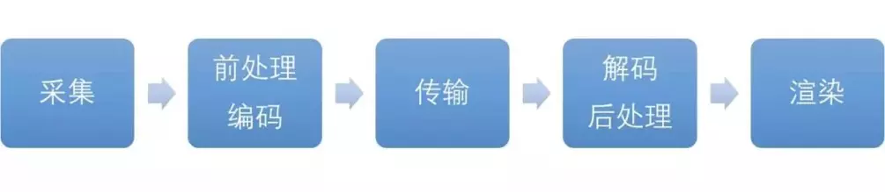

#### 字节跳动---有做过直播特效吗? 说说直播特效的实现原理与难点

本专栏专注分享大型Bat面试知识，后续会持续更新，喜欢的话麻烦点击一个star

> **面试官**:  有做过直播特效吗? 说说直播特效的实现原理与难点

> **心理分析**：该问题比较专业，一般只有音视频领域的岗位才会被问到。这需要有opengl只是和webrtc知识。
>
> 同时挑战也是一份机遇。类似于这种岗位  之前肯定有很多人面试过。肯定都失败了。如果你能答对，这份岗位绝对非你莫属。同时这个岗位的薪资也是非常高的

> **求职者:** 从webrtc入手

- 在这个颜值即正义的时代，不论是通过 Web 还是移动端发起直播，美颜与特效已经是很多直播平台的标配功能。更有甚者，已经开始尝试将AR融入产品，增加更多可以吸引用户的体验。不过要在直播中实现以上任何一个功能，都会对开发者的技术栈提出了进一步的要求。不论是在Web端基于 WebRTC 进行视频通话或在线教育的产品，还是 Android、iOS 上做直播。本文将简要梳理实现特效的原理，以及其中需要注意的难点。

  

  

  

  ## 直播特效的实现原理

  直播的具体流程，包括：采集、前处理、编码、传输、解码、后处理、播放。通常情况下，我们会在摄像头采集到视频图像后，开始对其进行特效处理，也就是在前处理的过程中进行。

  

  

  

  实现直播特效的流程如下：

  - 采集:视频的采集源主要有三种：摄像头采集、屏幕录制和从视频文件推流。直播中常见的是通过摄像头采集的图像。以Android为例，由于需要进行图像的二次处理（滤镜、特效），所以使用 SurfaceTexture来处理图像流，给采集到的图像增添特效、滤镜等。SurfaceTexture 是一个纹理，可以想象成一个 View 的中间件。Camera 把视频采集的内容交给 SurfaceTexture，SurfaceTexture 进行美颜处理，然后把内容交给 SurfaceView，渲染出来。
  - 前处理：对采集到的图像进行处理：比如通过均值模糊、高斯模糊和中值滤波等去噪算法，给原始视频进行“磨皮”；或者利用 GPUImage 库，增加滤镜；又或者是利用 ARCore、ARKit 等工具，为视频添加实时的 AR 特效。
  - 在完成图像的处理后，按照合适码率、格式进行编码。
  - 最后，推流到 CDN。

  要实现美颜效果，不论是基于 WebRTC 的移动端还是Web端，都可以通过 GPUImage 来实现。如果是基于 WebRTC 与 React Native、GPUImage 相结合即可，不过需要修改 react-native-webrtc 的源码。

  ## 开发中的难点

  在直播中实现特效、滤镜，甚至AR特效的例子，我们可以在网上找到很多，我们也曾分享过基于 ARCore、ARKit 来实现。不过其中有很多需要开发者注意的难点。

  **一、缺乏可扩展性、灵活性**

  如果通过 WebRTC 来进行开发，WebRTC 提供的渲染器是基于 GLSurfaceView 的 View 组件。与SurfaceView 相比，它没有动画或者变形特效，因为 GLSurfaceView 是窗口 (window)的一部分。 因此，如果想往其他地方绘制，或者获取视频数据，就会比较麻烦。

  **二、需要大量修改源码**

  通过 WebRTC 的 Native API 是无法获取摄像头数据的，如果要做美颜，需要做大量改动，比如上述提到的修改 react-native-webrtc 源码，也只是其中一部分工作。另外可能还需要调整 WebRTC 源码，并不是拿来即用，这就要求开发者要熟悉 WebRTC。

  **三、性能与功耗问题**

  性能与功耗问题在 Android 平台上比较明显。通常情况下，对图像进行处理时，我们可以选择输入 YUV 数据，让 CPU 进行图像处理，然后交给软件/硬件编码器进行编码。但这样做会产生较高的 CPU 占用率，功耗随之增加，App 响应速度受到影响。所以我们需要尽量使用 GPU 来完成图形处理，更多地利用硬件性能。

  在编码上也存在相同问题。软件编码的优点是灵活度高，但是缺点是功耗高，影响性能。硬件编码则相对速度更快、功耗更低，是更优的选择。但它的问题在于，能做的优化和参数调整，取决于硬件厂商开放的接口。而且硬件编码在部分 Android 手机上的兼容性也存在问题。

  **四、硬件兼容性问题**

  WebRTC 等自研方案还需要考虑硬件的兼容性问题。 但是在 Android 设备上，不同芯片、系统版本等因素，存在兼容问题。

  