#### 网易云--手机QQ的换肤是怎么做到的，你对换肤有了解吗？看过换肤的原理没？

本专栏专注分享大型Bat面试知识，后续会持续更新，喜欢的话麻烦点击一个star

> **面试官**:  网易云QQ的换肤是怎么做到的，你对换肤有了解吗？看过换肤的原理没？


> **心理分析**：没有接触过换肤技术  第一次听到该名词肯定会很茫然。面试官考的是对资源加载，监听布局，有没有了解.本文从换肤实战一对一讲解。告诉你如何做以及实现。文章末尾带换肤项目源码

> **求职者:** 从监听布局开始到 换肤原理，详细给面试官讲解换肤的原理


   接下来我们一起分享这篇干货。 Android的主题换肤 ，可插件化提供皮肤包，无需Activity的重启直接实现无缝切换,可高仿网易云音乐的主题换肤。 

这个链接是本次的Demo打包出来的样本SkinChangeDemo，可以去下载下来先试试效果，皮肤文件需放到存储卡的根目录下。

> 关于Android的主题换肤都是个老生常谈的问题了。网上给出的方案也是层出不穷，最近我也是很想去了解这方面的知识，所以我去搜一下就会有一大堆介绍这方面的文章，但是最后的结果都是不尽人意的，有的确实是给出了一些比较好的解决方案，但是没有一个实质性的Demo可以参考，所以也只能是纸上谈兵罢了，有的呢，确实是给出了一个参考的Demo但是最后的结果不是我想要的。关于Android的换肤方案技术的总结，这篇文章还是挺有参考价值的Android换肤技术总结。感兴趣的同学可以去了解下，就当做是一个知识的普及。

今天我要实现的一个换肤方案是基于github上的这个开源框架Android-Skin-Loader。

**这个框架的换肤机制是使用动态加载的机制去加载皮肤包里面的内容，无需Acitvity重启即可实现皮肤的实时更换，皮肤包是可以与原安装包相分离的，需要自己定做（这个皮肤包其实也就是一个普通的Android项目，只是只有资源文件没有类文件而已），这样做的好处就是可以在线提供皮肤包供用户去下载，也可以大大的减少安装包的体积，同时也很好的实现了插件化。**其实这个框架是可以拿来直接来用的，直接几行代码基本上就可以解决Android的主题换肤，但是作为一个程序员怎么可以只是简单的知道怎么用就行了吗？如果真是这样就真的太low了。遇到一个好的开源项目我们至少需要把他的源码大致看一下，走一下基本的流程，了解一下他的基本原理，这样我们在技术上才会有所提升。本文实现的Demo是基于在我前段时间发布的Android Material Design 兼容库的使用详解一文中的Demo改进的。最后实现的App也是MaterialDesign的设计风格。

好了说了这么多，通过本文你可以学到什么，这个可能是大家比较关心的一点

- 设计出一个基于MaterialDesign风格的App
- 自己实现一个主题换肤的框架
- 高仿网易云音乐的主题换肤（ps：其实本来我想以这个作为标题的，这样做也可以增加流量，可我不想单纯的做个标题党，给大家带来干货才是最重要的）
- 让你的技术更上一层楼（这个说了也是白说）

说了这么久可能就会有人按捺不住了：我是来看干货的，不是来这听你瞎BB的。不要急干货马上来。如果实在感觉枯燥可以直接跳到文末去看源码。下面先来几张效果图来爽一下

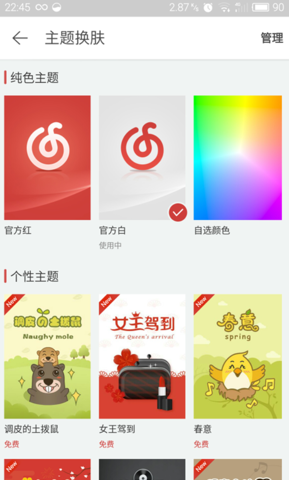

这个是网易云音乐的换肤界面，他提供了几个默认的，也提供了可以在线下载的主题，他的切换效果还是非常赞的，用过这个软件的同学肯定是知道的。学习完本文后就可以做出类似于这个换肤效果。


这个动态图是最终我们这个Demo实现的效果，这个Demo总体来说还是比较简单的，只提供了三种皮肤。实现了一个基本的换肤效果，主要还是用于拿来学习使用。当然更复杂的换肤基于这个Demo也是可以办到的，这里主要还是去讲解原理。

在介绍之前还需要先给大家普及一下**LayoutInflaterFactory**相关的知识。如果已经知道了这方面的知识点，下面这一段可以直接略过。

对于LayoutInflater大家可能都不太陌生，当你需要把xml文件转化成对应View的时候就必须用到它，我想对于他怎么使用的就不用我介绍了。LayoutInflater 提供了setFactory(LayoutInflater.Factory factory)和setFactory2(LayoutInflater.Factory2 factory)两个方法可以让你去自定义布局的填充（有点类似于过滤器，我们在填充这个View之前可以做一些额外的事，但不完全是），Factory2 是在API 11才添加的。 他们提供了下面的方法让你去重写。在这里面你完全可以自己去定义去创建你所想要的View，如果在你在重写的方法中返回null的话，就会以系统默认的方式去创建View。

```javascript
View onCreateView(String name, Context context, AttributeSet attrs)//LayoutInflater.Factory
View onCreateView(View parent, String name, Context context, AttributeSet attrs)//LayoutInflater.Factory2
```

LayoutInflater都被设置了一个默认的Factory，Activity 是实现了LayoutInflater.Factory接口的,因此在你的Activity中直接重写onCreateView就可以自定义View的填充了。

下面这句是对LayoutInflater.Factory一个比较好的理解

> Inflating your own custom views, instead of letting the system do it

这个也是这个Demo其中的一个比较重要技术点。如果有想更详细了解的文末会有参考链接。

------

下面就正式开始介绍怎么去做这个主题换肤吧。

先来看看这个Demo的项目结构：

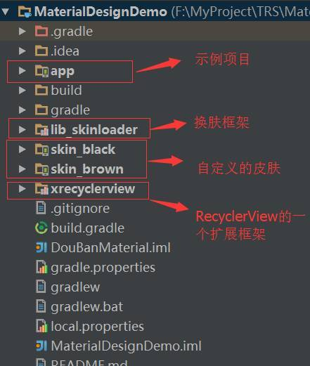

至于xRecyclerView可以不用管，这里我们用不到（这是之前用到的，与本次无关），他只是一个RecyclerView的一个扩展框架，支持下拉刷新和上拉加载，是一个在github上的一个开源项目。

这里我们直接来看看lib_skinloader这个库吧（这里面的内容大部分是来源于Android-Skin-Loader这个框架，我只做了部分修改，主要是适配AppCompatActivity，原框架是基于最初的Activty开发的，在这里再次感谢开源作者），这个库就是今天所讲的核心内容

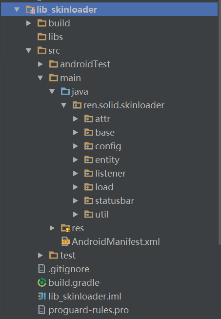

**我们都知道在Android中如果想去获取资源文件都必须通过Resources去获取。这个库的核心思想就是动态的去加载第三方包里面的包，获取到其Resources然后以获取到的这个Resources去获取第三方包里面的资源内容，最后设置到我们有需响应皮肤更改的View上。**

这里我就只介绍load和base两个包，其他包的内容在讲解的时候会涉及到

## **1.load包**

我们先来看看这个load包里面的内容（其实这里就是今天核心内容的核心）。


里面有两个类文件：SkinInflaterFactory、SkinManager

我们先来看看SkinManager的实现，直接跳到load方法

```javascript
 public void load(String skinPackagePath, final ILoaderListener callback) {

        new AsyncTask<String, Void, Resources>() {

            protected void onPreExecute() {
                if (callback != null) {
                    callback.onStart();
                }
            }

            @Override
            protected Resources doInBackground(String... params) {
                try {
                    if (params.length == 1) {
                        String skinPkgPath = params[0];
                        Log.i("loadSkin", skinPkgPath);
                        File file = new File(skinPkgPath);
                        if (file == null || !file.exists()) {
                            return null;
                        }

                        PackageManager mPm = context.getPackageManager();
                        PackageInfo mInfo = mPm.getPackageArchiveInfo(skinPkgPath, PackageManager.GET_ACTIVITIES);
                        skinPackageName = mInfo.packageName;

                        AssetManager assetManager = AssetManager.class.newInstance();
                        Method addAssetPath = assetManager.getClass().getMethod("addAssetPath", String.class);
                        addAssetPath.invoke(assetManager, skinPkgPath);

                        Resources superRes = context.getResources();
                        Resources skinResource = new Resources(assetManager, superRes.getDisplayMetrics(), superRes.getConfiguration());

                        SkinConfig.saveSkinPath(context, skinPkgPath);

                        skinPath = skinPkgPath;
                        isDefaultSkin = false;
                        return skinResource;
                    }
                    return null;
                } catch (Exception e) {
                    e.printStackTrace();
                    return null;
                }
            }

            protected void onPostExecute(Resources result) {
                mResources = result;

                if (mResources != null) {
                    if (callback != null) callback.onSuccess();
                    notifySkinUpdate();
                } else {
                    isDefaultSkin = true;
                    if (callback != null) callback.onFailed();
                }
            }

        }.execute(skinPackagePath);
    }
```

这个方法有两个参数，第一个是皮肤包的路径，第二个就是一个简单的回调

其中doInBackground方法里面就实现了动态的去获取皮肤包的Resources，当获取成功之后，在onPostExecute方法中就将这个Resources赋值到我们定义好的变量中去，以方便我们之后的使用，注意到当获取到的这个Resources不为空时，也就是我们已经获取到了皮肤包里面的资源，我们就调用notifySkinUpdate()这个方法来通知界面去更改皮肤，如果为空就还是使用默认的皮肤。

我们来看看notifySkinUpdate()的实现

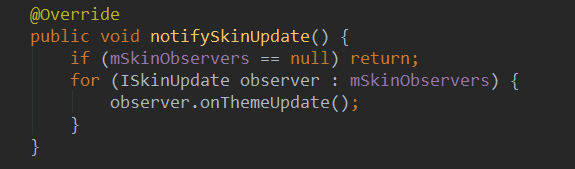

这里很简单，就是去遍历mSkinObservers这个集合，然后去通知更新。对于ISkinUpdate是一个接口，每个需要皮肤更新的Activity都需要去实现这个接口。

SkinManager这个类里面还有诸如getColor(int resId)、getDrawable(int resId)这样的方法，就是去获取第三方包对应的资源文件，值得注意的是如果你的第三方包里没有对应的资源文件，那么就会使用默认的资源文件，如果你有需求，你完全可以去添加一些类似getMipmap(int resID)这样的方法。

对了，还有一个比较重要的方法忘了讲 

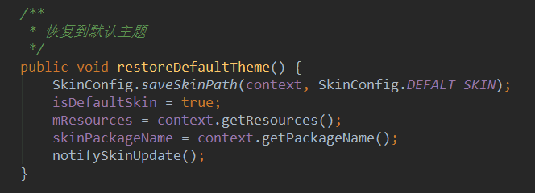

 这个方法就是恢复到系统的默认主题，原理和load都差不多，实现还简单了很多。SkinManager这个类就说这么多，详细实现请到源码中去查看，很多地方我都给了注释。

我们再来看看SkinInflaterFactory，在这里面主要就是做一些填充View相关的一些工作。我实现的是LayoutInflaterFactory这个接口而不是文章之前提到的LayoutInflater.Factory这个接口是因为这里需要与AppCompatActivity兼容，如果你还是用之前的那个就会出现一些错误，反正我刚弄的时候是折腾了很久的。不管怎么样原理始终是一样的。SkinInflaterFactory的作用就是去搜集那些有需要响应皮肤更改的View。 我们来看看onCreateView的实现

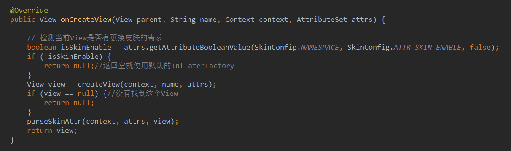

首先我们先去判断这个当前将要View是否有更改皮肤的需求，如果没有我们就返回默认的实现。如果有，我们就自己去处理 来看看createView方法的实现

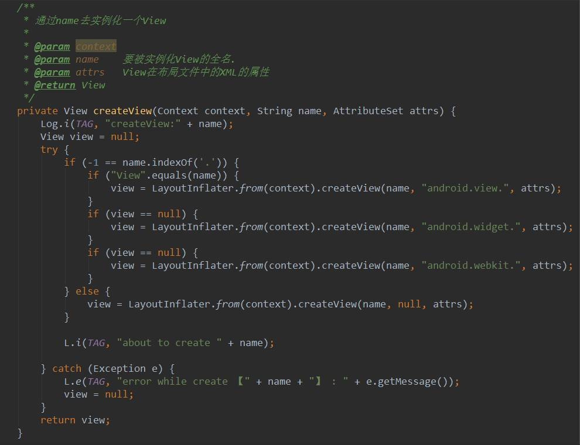

看起来很多，其实这个方法就是去动态的去创建View。

下面来看看parseSkinAttr的实现：

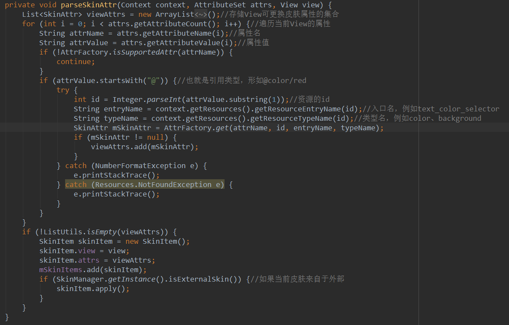

 这个方法其实就是去搜集View中换肤的时候可以更改的属性，当我们换肤的时候就是去更改的这些属性的值，这里你必须要注意一点，这个属性的值一定要是引用类型的（例如:@color/red），千万不能写死，第二个if的判断就是这个作用。**到这里可能你就会有个疑问，我怎么知道哪些属性在换肤的时候需要更改。**如果你细心一点肯定注意到了这行代码

```javascript
SkinAttr mSkinAttr = AttrFactory.get(attrName, id, entryName, typeName);
```

这里有个AttrFacory他的作用就是根据属性名，动态的去创建SkinAttr。在AttrFacory中定义了一些类似于这样的常量： 

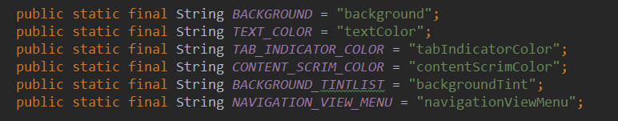

 这就是我们换肤的时候可以更改的那些属性。SkinAttr是一个抽象类，比如background就会去创建一个BackgroundAttr,本项目所用到的属性全都在attr包中。SkinAttr是比较灵活的一个地方,如果你有哪个属性在换肤的时候需要更改，你就去实现一个对应的SkinAttr。

在parseSkinAttr这个方法的最后我们将View和SkinAttr封装成了一个SkinItem然后添加到一个集合中去，最后还需注意的是，如果当前皮肤不是默认皮肤，一定要去apply一下，这样做主要是防止换了皮肤启动一些新的页面有可能导致换肤不及时的问题。SkinInflaterFactory这个类里面还提供了动态的添加SkinItem的方法，原理都和这里差不多，我就不过多的去说了。

load包里面的这两个类讲的差不多了，这里看懂了后面的内容也就是小菜一碟了，我相信你看了这里再去看源码一定会轻松地多。

## **2.base包**


可以看见这个包里面肯定就是Activity、Fragment、Application的实现，作用肯定就是封装一些公用的方法和属性在里面。

下面我们一个一个来分析

- SkinBaseApplication： 

可以看到这里我们对SkinManager做了一些初始化的操作。以后我们有需要皮肤更改需求的应用一定要记得一定要继承于SkinBaseApplication。

- SkinBaseActivity 我们来看看其onCreate方法 

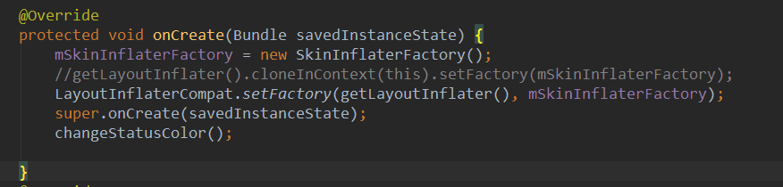

  在这里使用了我们之前自定义的View的InflaterFactory，来替换默认的Factory。记住一定要在super.onCreate(savedInstanceState);这个方法之前调用。SkinBaseActivity里面还提供了动态添加可以响应皮肤更改需求的View的相关方法。当然需要响应换肤更改的Activity都需要继承SkinBaseActivity。详细实现请看源码。

- SkinBaseFragment 这个和SkinBaseActivity的思想差不多。具体实现看源码，这里我只是给大家提供这个换肤框架的思想，让大家在看源码的时候更轻松。

这个框架就介绍到这，下面我们来看看怎么去使用。

在使用的时候一定要记得要Activity要去继承于SkinBaseActivity，Fragment要继承于SkinBaseFragment，Application要继承于SkinBaseApplication。当然把这个框架做为你的项目依赖项肯定是必不可少的。为了Demo的简单，这里我只使用了下面三个颜色作为可以换肤的资源，当然如果你想要使用drawable文件也是可以办到的，前提是你一定要把这个Demo看懂。 

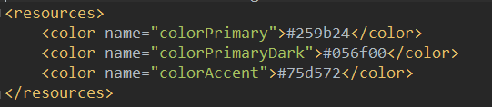

来看一个布局文件 

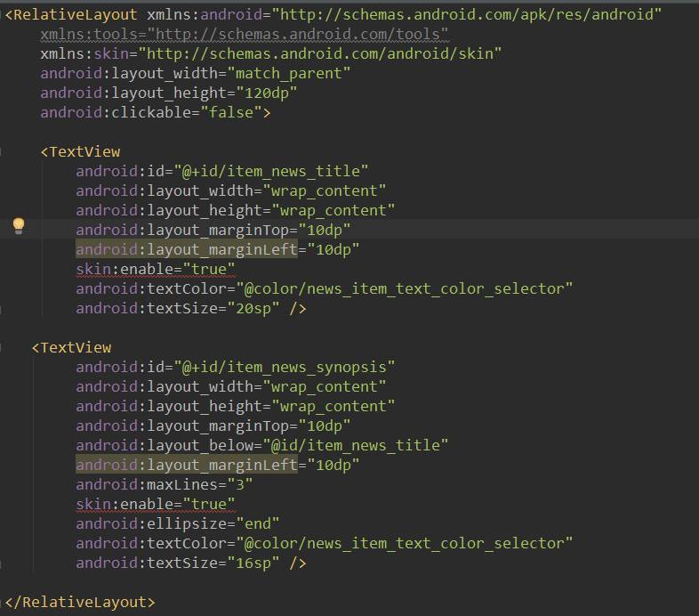

 其中 `xmlns:skin=”http://schemas.android.com/android/skin“` 是我们自定义的，在SkinConfig有。 我们只需在有皮肤更改需求的View中加入skin:enable=”true” 就OK了。

再来看看MainActicvity的部分代码

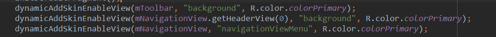

 这里就是动态的添加有皮肤更改需求的View。

上面就介绍完了在布局文件中使用方法和在代码中使用方法。

我们应该怎么去换肤呢？很简单，只需调用SkinManager的load方法就可以了，把皮肤路径传进去就可以了，我的这个Demo为了简单起见，没有做在线换肤的功能，只是在本地提供了可以更换的皮肤，看到这里我相信你对怎样在线换肤已经有想法了。


最最后我们来看看怎么去开发皮肤包。其实这个是最简单的，皮肤包实际上就是一个基本的Android项目，里面不包含类文件，只有资源文件。**这里只需注意 这里的资源文件名字一定要和原项目中的相同，并且只用包含那些在皮肤更改时需要改变的那些就行了！**例如我的这个Demo就只是简单对上面的三种颜色做了简单的切换。开发了棕色和黑色两款皮肤，所以资源文件中只有三个color的值，开发完成之后我们需要将其打包成apk文件，为防止用户点击安装，我们将其后缀改成了skin，这样做也具有标识性。如果还是不太清楚可以直接去源码中查看。

这下再来看一看文章开头效果图是不是突然变得有思路了,快动起你的小手指去敲一个主题换肤的框架吧~~~ 


好了，本文到此结束。很感谢你的耐心看完！

[换肤Github地址](<https://github.com/ximsfei/Skin-Demo>)