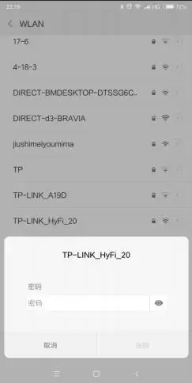
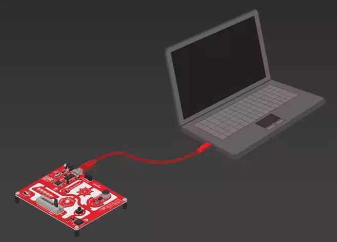
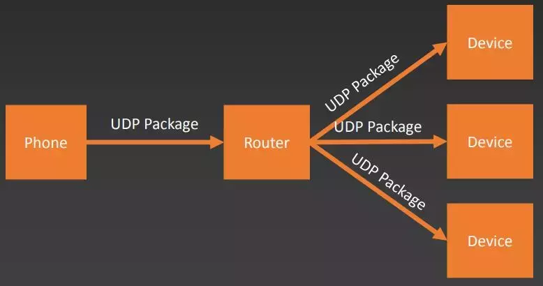
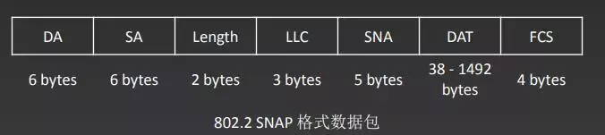
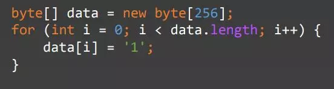
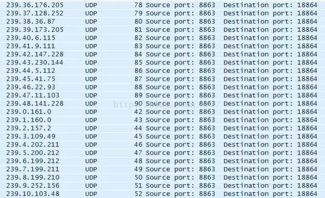
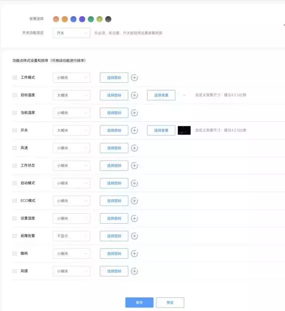

## **物联网**

世界公认的物联网设备目前公认诞生在1982年，是一台CMU的可乐机，可以通过电脑实时监测可乐机中的可乐存量以及温度。不过当时还没有物联网这一概念，直到1999年由Kevin Ashton在宝洁公司的一次内部讲座中提出。他观点认为计算机非常善于处理信息，但是采集信息的方式过于依赖人类，而人类的精力有限且容易犯错，不善于处理这类事情，如果能让计算机自行感知世界，就能将人类解放出来做自己擅长的事情。

其实物联网设备广泛存在与我们身边，比如ATM机、监控摄像头等，不过在消费品市场方面长久以来都处于空白。个人认为主要有两方面原因，一是移动网络的发展限制，只有4G的高带宽、低延时、低功耗的特性才能满足物联网的绝大部分需求。二是智能手机出现之前众多的物联网设备没有统一的管理方式。2010年之后智能手机的普及配合移动网络的升级共同促进了物联网的发展，现阶段物联网的应用领域主要涵盖消费、企业、基础设施以及其他方面应用。

## **中移和物**

我所在部门的业务是物联网平台，围绕该平台我们提供了设备端的多协议接入支持，完善的设备端和应用端SDK，应用的定制化开发以及数据展现和数据分析服务。

接入我们平台的客户大概可以分为三类。第一类是有自己的研发能力，能够实现设备接入和整套应用层面的开发。第二类只关注设备接入，应用程序的开发交由我们定制。第三类也是只关注设备接入，不同是他们不想要应用的定制化开发，而是想通过系统配置自动生成App产品界面。

中移和物这款产品就是为了解决第三类人员的需求，所面临的问题有两个。一是设备如何联网，二是App控制界面如何展示。

### 配网

上图是常见的手机连接wifi的界面，但智能设备通常来说没有这样一个交互界面。

我想到的第一个解决方案就是参考路由器让物联网设备拥有无线AP功能，然后手机连接上热点打开网页进行配置或者提供专用app。这种方案虽然可行不过应用场景存在局限，不太适用于多设备配网。

第二种配网方式是串口AT指令，这比前面的方案更加不便，从图中可以看到需要电脑或手机通过串口线连接到设备，同样只能一次给一台设备配网，假设要配网的产品是一个智能灯泡的话可想而知会有多麻烦。

目前业界主流的配网方式是第三种Smart Config，智能手机通过UDP广播的方式将wifi的参数发给设备。无线局域网是开放的网络环境，wifi芯片有两种工作模式，标准和混杂。标准模式下它会丢弃所有目标IP地址和自身不同的数据包，混杂模式下接受所有经过它的数据包。

上图是wifi芯片获取的UDP数据包的数据格式，一共有7个字段，根据协议应用层能够编辑的字段只有DAT。由于大部分无线路由器都是加密的，因此DAT字段其实是密文无法直接使用。不过Length字段会随着DAT字段的长度产生变化，这样我们就可以利用长度来携带信息。比如要发送一个length值为256的数字，只需向DAT字段中填充256字节长度的数据，代码表示如下。

由于加密的缘故实际数据长度和要发送的长度并不一致，因此在发送正式数据前要发送一份先导包，先分别发送1、2、3个字节长度的数据，再根据wifi芯片实际接收的Length长度计算出加密导致的长度差值。

除了用长度携带数据之外还可以利用UDP组播。UDP组播的地址实际上是一个范围，向该范围中任意的IP地址发送数据都能实现组播的效果，而IP中后面的3个字节可以用来携带数据。通常的做法是用第二个字节表示UDP包的顺序，后面两个字节携带实际数据，这种方式还不用考虑路由器加密的问题。如下所示。

### 设备控制界面

如何在同一个app中展示不同设备的界面也是一个难题，如果采用原生方式开发成本相对比较高也不好维护，每次接入一个新的设备用户都要更新一次app显然是不合理的。我们想到了两个技术方案，混合开发（HTML5+WebView）、React Native/Weex。

和物这款产品在内部迭代了两个版本，第一版的时候React Native还处于早期发展阶段，于是我们采用了混合开发方案。现在发布的版本使用的则是Weex。

上图是开发者后台的截图，设备厂商可以在这里为产品定义数据模型，定制设备控制界面，然后通过扫描二维码的方式进行预览调试。

## **展望**

前面提到的这些其实和本次的主题关系并不是很大，接下来我们正式谈谈安卓在物联网中的应用。个人更感兴趣的是Google在2016年发布的一款物联网操作系统android things，在此之前他们还发布过一款叫Brillo的产品，不过反响不太好。Android things相比Brillo新增了Java API Framework、Google Service、应用层等，这意味着Android things支持的更多新的特性和功能。

### 如何构建一个Android things app

Android things的官方网站上有一个构建Android things app的教程，这里我们一起来简单看下。

第一步是新建Android Studio工程，SDK API版本要高于27，工具版本高于25.0.3。因为标准的SDK中没有Android things的API，所以要通过脚本的形式集成开发套件。

接着进行配置，从图中可以看到activity中有两个Intent-filter，第一个是安卓开发者都比较熟悉的启动界面配置，第二个声明了当前开发的应用可以作为launch存在。

第二步开始连接硬件，这里的GPIO（通用输入输出），可以简单的理解成笔记本上的扩展坞

第三步编写与设备交互的代码，引入核心类PeripheraManager（外设管理器）。

上面三张图展示的是监听按钮事件的全部代码。先通过PeripheraManager的OpenGpio方法传入按钮的编号的到按钮的Gpio对象，配置该对象为输入设备，接着设置事件类型，注册监听器，然后在回调方法中打印一条日志表明按钮被按下，最后就是释放资源。

这样的例子对于有过安卓开发经验的人来说并没有什么看不懂的地方，可以说Android things的出现一定程度上降低了物联网设备的开发门槛。

如果说一台手机搭载Android或iOS后就能被称为智能手机，那么普通设备搭载Android things后也就可以被称为智能设备。不过现阶段的物联网设备管理还过于依赖于人类，好消息是Android things原生支持TensorFlow。

 