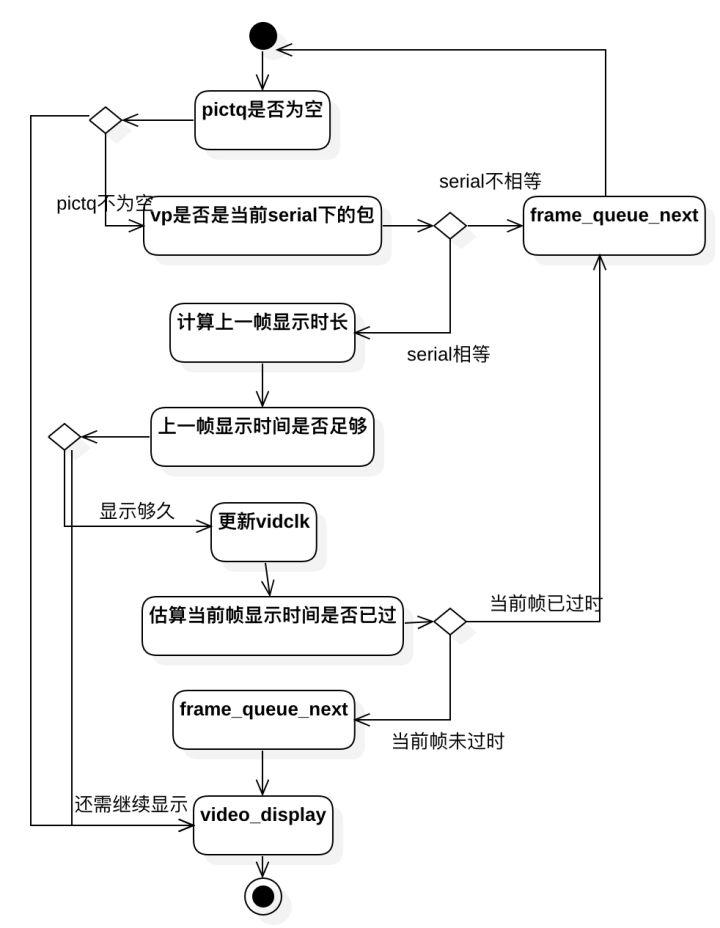

##### 字节跳动-谈下音视频同步原理，音频和视频能绝对同步吗

> 本专栏专注分享大型Bat面试知识，后续会持续更新，喜欢的话麻烦点击一个star
>
> 

> **面试官:  谈下音视频同步原理，音频和视频能绝对同步吗**

> **心理分析**：音视频同步本身比较难，一般使用ijkplayer 第三方做音视频同步。不排除有视频直播  视频通话需要用音视频同步，可以从三种 音频为准 视频为准  自定义时钟为准三种方式实现音视频同步

> **求职者: **如果被问到 放正心态，能回答多少是多少。如果你看了这篇文章肯定是可以回答上的

音视频的直播系统是一个复杂的工程系统，要做到非常低延迟的直播，需要复杂的系统工程优化和对各组件非常熟悉的掌握。下面整理几个简单常用的调优技巧：

## 以fflay来看音视频同步流程

ffplay中将视频同步到音频的主要方案是，如果视频播放过快，则重复播放上一帧，以等待音频；如果视频播放过慢，则丢帧追赶音频。

这一部分的逻辑实现在视频输出函数`video_refresh`中，分析代码前，我们先来回顾下这个函数的流程图：




在这个流程中，“计算上一帧显示时长”这一步骤至关重要。先来看下代码：

```c
static void video_refresh(void *opaque, double *remaining_time)
{
    //……
    //lastvp上一帧，vp当前帧 ，nextvp下一帧

    last_duration = vp_duration(is, lastvp, vp);//计算上一帧的持续时长
    delay = compute_target_delay(last_duration, is);//参考audio clock计算上一帧真正的持续时长

    time= av_gettime_relative()/1000000.0;//取系统时刻
    if (time < is->frame_timer + delay) {//如果上一帧显示时长未满，重复显示上一帧
        *remaining_time = FFMIN(is->frame_timer + delay - time, *remaining_time);
        goto display;
    }

    is->frame_timer += delay;//frame_timer更新为上一帧结束时刻，也是当前帧开始时刻
    if (delay > 0 && time - is->frame_timer > AV_SYNC_THRESHOLD_MAX)
        is->frame_timer = time;//如果与系统时间的偏离太大，则修正为系统时间

    //更新video clock
    //视频同步音频时没作用
    SDL_LockMutex(is->pictq.mutex);
    if (!isnan(vp->pts))
        update_video_pts(is, vp->pts, vp->pos, vp->serial);
    SDL_UnlockMutex(is->pictq.mutex);

    //……

    //丢帧逻辑
    if (frame_queue_nb_remaining(&is->pictq) > 1) {
        Frame *nextvp = frame_queue_peek_next(&is->pictq);
        duration = vp_duration(is, vp, nextvp);//当前帧显示时长
        if(time > is->frame_timer + duration){//如果系统时间已经大于当前帧，则丢弃当前帧
            is->frame_drops_late++;
            frame_queue_next(&is->pictq);
            goto retry;//回到函数开始位置，继续重试(这里不能直接while丢帧，因为很可能audio clock重新对时了，这样delay值需要重新计算)
        }
    }
}
```

> 代码只保留了同步相关的部分，完整的代码可以参考ffmpeg源码，或阅读我的这篇分析：<https://zhuanlan.zhihu.com/p/44122324>

这段代码的逻辑在上述流程图中有包含。主要思路就是一开始提到的如果视频播放过快，则重复播放上一帧，以等待音频；如果视频播放过慢，则丢帧追赶音频。实现的方式是，参考audio clock，计算上一帧（在屏幕上的那个画面）还应显示多久（含帧本身时长），然后与系统时刻对比，是否该显示下一帧了。

这里与系统时刻的对比，引入了另一个概念——frame_timer。可以理解为帧显示时刻，如更新前，是上一帧的显示时刻；对于更新后（`is->frame_timer += delay`），则为当前帧显示时刻。

上一帧显示时刻加上delay（还应显示多久（含帧本身时长））即为上一帧应结束显示的时刻。具体原理看如下示意图：


这里给出了3种情况的示意图：

- time1：系统时刻小于lastvp结束显示的时刻（frame_timer+dealy），即虚线圆圈位置。此时应该继续显示lastvp
- time2：系统时刻大于lastvp的结束显示时刻，但小于vp的结束显示时刻（vp的显示时间开始于虚线圆圈，结束于黑色圆圈）。此时既不重复显示lastvp，也不丢弃vp，即应显示vp
- time3：系统时刻大于vp结束显示时刻（黑色圆圈位置，也是nextvp预计的开始显示时刻）。此时应该丢弃vp。

## delay的计算

那么接下来就要看最关键的lastvp的显示时长delay是如何计算的。

这在函数compute_target_delay中实现：

```c
static double compute_target_delay(double delay, VideoState *is)
{
    double sync_threshold, diff = 0;

    /* update delay to follow master synchronisation source */
    if (get_master_sync_type(is) != AV_SYNC_VIDEO_MASTER) {
        /* if video is slave, we try to correct big delays by
           duplicating or deleting a frame */
        diff = get_clock(&is->vidclk) - get_master_clock(is);

        /* skip or repeat frame. We take into account the
           delay to compute the threshold. I still don't know
           if it is the best guess */
        sync_threshold = FFMAX(AV_SYNC_THRESHOLD_MIN, FFMIN(AV_SYNC_THRESHOLD_MAX, delay));
        if (!isnan(diff) && fabs(diff) < is->max_frame_duration) {
            if (diff <= -sync_threshold)
                delay = FFMAX(0, delay + diff);
            else if (diff >= sync_threshold && delay > AV_SYNC_FRAMEDUP_THRESHOLD)
                delay = delay + diff;
            else if (diff >= sync_threshold)
                delay = 2 * delay;
        }
    }

    av_log(NULL, AV_LOG_TRACE, "video: delay=%0.3f A-V=%f\n",
            delay, -diff);

    return delay;
}
```

上面代码中的注释全部是源码的注释，代码不长，注释占了快一半，可见这段代码重要性。

这段代码中最难理解的是sync_threshold，画个图帮助理解：


图中坐标轴是diff值大小，diff为0表示video clock与audio clock完全相同，完美同步。图纸下方色块，表示要返回的值，色块值的delay指传入参数，结合上一节代码，即lastvp的显示时长。

从图上可以看出来sync_threshold是建立一块区域，在这块区域内无需调整lastvp的显示时长，直接返回delay即可。也就是在这块区域内认为是准同步的。

如果小于-sync_threshold，那就是视频播放较慢，需要适当丢帧。具体是返回一个最大为0的值。根据前面frame_timer的图，至少应更新画面为vp。

如果大于sync_threshold，那么视频播放太快，需要适当重复显示lastvp。具体是返回2倍的delay，也就是2倍的lastvp显示时长，也就是让lastvp再显示一帧。

如果不仅大于sync_threshold，而且超过了AV_SYNC_FRAMEDUP_THRESHOLD，那么返回delay+diff，由具体diff决定还要显示多久（这里不是很明白代码意图，按我理解，统一处理为返回2*delay，或者delay+diff即可，没有区分的必要）


至此，基本上分析完了视频同步音频的过程，简单总结下：

- **基本策略是：如果视频播放过快，则重复播放上一帧，以等待音频**；
- **如果视频播放过慢，则丢帧追赶音频。**
- 这一策略的实现方式是：引入frame_timer概念，标记帧的显示时刻和应结束显示的时刻，再与系统时刻对比，决定重复还是丢帧。
- lastvp的应结束显示的时刻，除了考虑这一帧本身的显示时长，还应考虑了video clock与audio clock的差值。
- 并不是每时每刻都在同步，而是有一个“准同步”的差值区域。