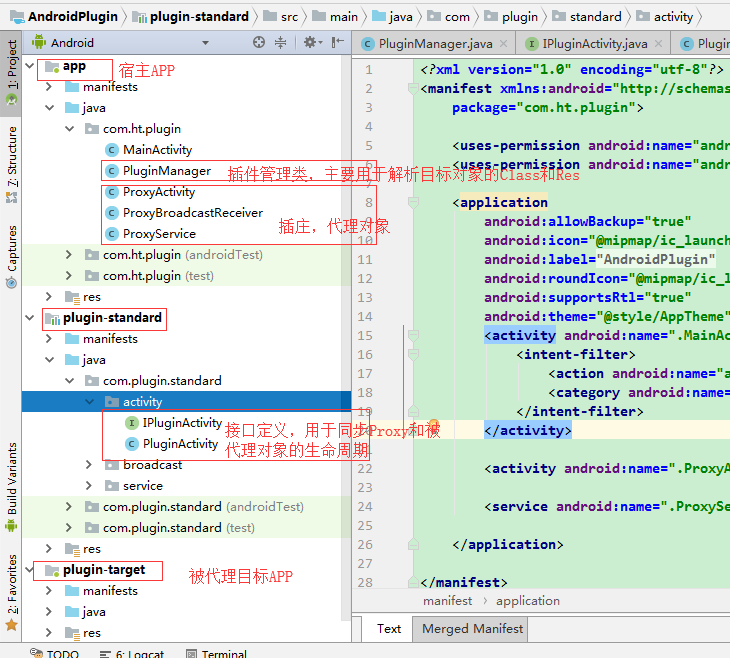

### 插桩式插件化原理是什么  你是如何理解的

> 本专栏专注分享大型Bat面试知识，后续会持续更新，喜欢的话麻烦点击一个star

**Android插件化技术，可以实现功能模块的按需加载和动态更新，其本质是动态加载未安装的apk。**

> 本文涉及源码为API 28

### 插件化原理

> 插件化要解决的三个核心问题：`类加载`、`资源加载`、`组件生命周期管理`。

**前言**
		在现在一些大型的Android应用中都采用了插件化的开发方式，比如美团，支付宝及我们常用的微信等采用了插修的化的开发方式来进行开发的，既然国内一流的互联网公司都采用这样的方式来开发那它一定能带给开发部署大型应用带来很大的便捷，那么插件化的优势在哪里呢？

##### 1.1 插件化的好处

首先在大型的项目里往往是一堆人负责一个不同功能的APP，最终于上线的项目会把这些功能集成到一起，采用插件化开发就不用后期繁杂的集成过程，安全快捷。

其次，各个功能的APP单独开发单独编译，提高开发效率。

再次，可以利用插件化这种思想来修复Bug.

由于插件化开发只上线宿主APP,具体的功能APP是用户点击之后动态的从网络端加载后执行这就大大减小了上线APP的体积大小，当然这也会导致用户第一次进入时加载变慢的情况。 

插件化开发会定义自己的插化实现标准，这就使得一个宿主APP可以加载任意实现这套标准的APK,这就让宿主可以加载海量的插件而不必从新开发打包。

1. 插件化的实现方式
   本文介绍的插件化的实现原理如下：
2. 通过 DexClassLoader 加载目标APK的Class对象，主要是Activity, Service, BroadcaseReceiver, Provider等四大组件的加载。
3. 通过Resource访问目标对象的res资源。
4. 通过反射或者手动解析AndroidManifest文件获取类文件名，本方是通过反射PackageParse和PackageInfo的方式来获取的。
5. 通过代理（插庄）ProxyActivity, ProxyService, ProxyBroadcaseReceiver等方式代理目标APK里的相应对象。
6. 通过定义接口的方式模拟各各件的生命周期方法来达到Proxy的生命周期同步管理被代理对象的生命周期，对生命周期的管理是插件化开发的一个重点工作。

插件化实现结构及主要功能
首先先上一个大致的代码结构图，如下：

整个Demo实现包括以下3个方面：

1. 首先app是项目的主app,也就是插件化的宿主部分，是最终我们打包上线的apk，其中主要包含了PluginManager用于解析目标对象的Class和Res等信息，ProxyActivity，ProxyService，ProxyBroadcaseReceiver等插庄代理对象，用于代理目标对象中对应的Class。

2. plugin-standard是一个依懒模块，在其中主要定义两个东西，一个是用于管理目标被代理对象的接口，在这个接口中声明被代理对象的生命周期方法（与明白点，就是目标被代理对象必须实现这个接口，在Proxy中通过反射得到对象后强转成这个interface类型然后调用其生命周期方法来做到同步生命周期管理的目的），其次是一个PluginXXX的类，需要被代理的对象需要extends对应的类，在这个类中做一些公用的操作，如定义Context,重写其中某些方法来达到代理的目的(比如被代理的APK没有Context的实例，我们需要在其中注入context，然后利用注入的context进行相应的操作）。

3. plugin-target，这个就很直接了，就是一个被代理的apk，在里面定义的一系列的Activity，Service，BroadcaseReceiver，Provider等，这些被代理的组件对象都必须依懒实现plugin-standard中相对应的定义的Base对象以达到被控制生命周期和其中某些方法被重新实现。这个在实际开发中肯定是存在多个的。

4. 主要代码实现
4.1. 加载插件apk，初始化DexClassLoader和Resources及PackageInfo
实际情况是肯定是用户在点击某一个功能的入口后从网络上去下载然后加载到宿主进程中，在这里我们就简单的将plugin-target打包成apk后放到sdcard中，直接读apk文件，根据文件的路径创建DexClassLoader和Resources对象，用于访问class和res目录下的资源文件

       public void loadPath(Context context) {
     	  File filesDir = context.getDir("plugin", Context.MODE_PRIVATE);
        String name = "plugin.apk";
        String path = new File(filesDir, name).getAbsolutePath();
     
        //获取被代理apk的PackageInfo
        PackageManager packageManager = context.getPackageManager();
        packageInfo = packageManager.getPackageArchiveInfo(path, PackageManager.GET_ACTIVITIES);
     
        //获取被代理apk的ClassLoader
        File dexOutFile = context.getDir("dex", Context.MODE_PRIVATE);
        dexClassLoader = new DexClassLoader(path, dexOutFile.getAbsolutePath()
                , null, context.getClassLoader());
     
        //获取被代理apk的Resource
        try {
            AssetManager assetManager = AssetManager.class.newInstance();
            Method addAssetPath = AssetManager.class.getMethod("addAssetPath", String.class);
            addAssetPath.invoke(assetManager, path);
            resources = new Resources(assetManager, context.getResources().getDisplayMetrics(), context.getResources().getConfiguration());
        } catch (Exception e) {
            e.printStackTrace();
        }
        parseReceivers(context, path);
    }
DexClassLoader和Resource被初始后，在代理的ProxyXXX中就可以通过PluginManager提供的get方法获取插件apk的ClassLoader和Resource及PackageInfo。

 

    /*	* Get Rerource for target apk
         *
         * @return
         */
        public Resources getResources() {
            return resources;
        }
    /**
     * Get ClassLoader for target apk
     *
     * @return
     */
    public DexClassLoader getDexClassLoader() {
        return dexClassLoader;
    }
     
    public PackageInfo getPackageInfo() {
        return packageInfo;
    }
##### 4.2 Activity插件化实现

##### 4.2.1. 声明接口，用面向对象的方式控制生命周期

在plugin-stand定义IPluginActivity接口，它主要定义了Activity的生命周期方法，如onCreate,onDestory等，凡是Activity的生命周期方法都需要在它里面重新声明一次，后面我们会把通过ClassLoader反射出来的Activity对象转换成这个接口对象来控制它的生命周期；其次就是需要定义一个注入Context的方法public void attach(Activity proxyActivity)，由于被代理的Activity并没有通过Android真正加载，所以其实是没有Context对象的，也就是说我们通常在开发中用的this.xxx,MainActivity.this等都会抛NullPointException,我们通过attach方法注入ProxyActivity对象到真实的Activity中，凡是要用到context都用注入的对象进行操作。

    public interface IPluginActivity {
        public void attach(Activity proxyActivity);
    /**
     * 生命周期
     * @param savedInstanceState
     */
    public void onCreate(Bundle savedInstanceState);
    public void onStart();
    public void onResume();
    public void onPause();
    public void onStop();
    public void onDestroy();
    public void onSaveInstanceState(Bundle outState);
    public boolean onTouchEvent(MotionEvent event);
    public void onBackPressed();
}

##### 4.2.2. 定义PluginActivity，重写Activity中与context(this)相关的方法

在plugin-standard中定义PluginActivity extends Activity implements IPluginActivity，插件APP中所有的Activity都必须要继承这个类，在这个类中实现了通过attach方法获取ProxyActivity的Context上下文对象并保存了类变量that，然后在android.app.Activity中的关于context的方法都必须要重写，用传入的这个context替换，如setContentView需要重写成that.setContentView，其它的都类似,实现代码如下：

    public class PluginActivity extends Activity implements IPluginActivity {
    /**
     * Activity context -> ProxyActivity
     */
    protected  Activity that;
     
    @Override
    public void attach(Activity proxyActivity) {
        this.that = proxyActivity;
    }

 

    @Override
    public void setContentView(View view) {
        if (that != null) {
            that.setContentView(view);
        }else {
            super.setContentView(view);
        }
    }
     
    @Override
    public void setContentView(int layoutResID) {
        if(that != null) {
            that.setContentView(layoutResID);
        }else {
            super.setContentView(layoutResID);
        }
    }
     
    @Override
    public ComponentName startService(Intent service) {
        if(that != null) {
            Intent m = new Intent();
            m.putExtra("serviceName", service.getComponent().getClassName());
            return that.startService(m);
        }
        return super.startService(service);
    }
     
    @Override
    public View findViewById(int id) {
        if(that != null) {
            return that.findViewById(id);
        }
        return super.findViewById(id);
    }
     
    @Override
    public Intent getIntent() {
        if(that!=null){
            return that.getIntent();
        }
        return super.getIntent();
    }
    @Override
    public ClassLoader getClassLoader() {
        if(that != null) {
            return that.getClassLoader();
        }
        return super.getClassLoader();
    }
     
    @Override
    public Intent registerReceiver(BroadcastReceiver receiver, IntentFilter filter) {
        if(that != null) {
            return that.registerReceiver(receiver, filter);
        }
        return super.registerReceiver(receiver, filter);
    }
     
    @Override
    public void sendBroadcast(Intent intent) {
        if(that != null) {
            that.sendBroadcast(intent);
        }else {
            super.sendBroadcast(intent);
        }
    }
     
    @Override
    public void startActivity(Intent intent) {
        if(that != null) {
            //ProxyActivity --->className
            Intent m = new Intent();
            m.putExtra("className", intent.getComponent().getClassName());
            that.startActivity(m);
        }else {
            super.startActivity(intent);
        }
    }
     
    @NonNull
    @Override
    public LayoutInflater getLayoutInflater() {
        if(that != null) {
            return that.getLayoutInflater();
        }
        return super.getLayoutInflater();
    }
     
    @Override
    public ApplicationInfo getApplicationInfo() {
        if(that != null) {
            return that.getApplicationInfo();
        }
        return super.getApplicationInfo();
    }

 

    @Override
    public Window getWindow() {
        if(that != null) {
            return that.getWindow();
        }
        return super.getWindow();
    }

 

    @Override
    public WindowManager getWindowManager() {
        if(that != null) {
            return that.getWindowManager();
        }
        return super.getWindowManager();
    }

 

 

    @SuppressLint("MissingSuperCall")
    @Override
    public void onCreate(Bundle savedInstanceState) {
     
    }
     
    @SuppressLint("MissingSuperCall")
    @Override
    public void onStart() {
     
    }
     
    @SuppressLint("MissingSuperCall")
    @Override
    public void onResume() {
     
    }
     
    @SuppressLint("MissingSuperCall")
    @Override
    public void onPause() {
     
    }
     
    @SuppressLint("MissingSuperCall")
    @Override
    public void onStop() {
     
    }
     
    @SuppressLint("MissingSuperCall")
    @Override
    public void onDestroy() {
     
    }
     
    @SuppressLint("MissingSuperCall")
    @Override
    public void onSaveInstanceState(Bundle outState) {
     
    }
     
    @SuppressLint("MissingSuperCall")
    @Override
    public boolean onTouchEvent(MotionEvent event) {
        return false;
    }
     
    @SuppressLint("MissingSuperCall")
    @Override
    public void onBackPressed() {
     
    }
}

##### 4.2.3. 代理ProxyActivity实现

ProxyActivity运行在宿主进程中，其实它就是一个普通的Activity组件，需要在AndroidManifest中声明，需要加载插件app的时候就先调用PluginManager.getInstance().loadPath方法将ClassLoader，Resources和PackageInfo等系统对象生成，然后直接用intent方式跳转Activity就可以了。实现代码如下:

    public class ProxyActivity extends Activity {
    //被加载插件的apk的Launch Activity全名
    private String className;
     
    /**
     * 目标插件apk的activity
     */
    IPluginActivity mTargetActivity;
     
    @Override
    public void onCreate(@Nullable Bundle savedInstanceState) {
        super.onCreate(savedInstanceState);
        className = getIntent().getStringExtra("className");
     
        try {
            //这里需要用DexClassLoader,不能用Class.forName,因为目标还是java文件没有被编译成class文件
            Class activityClass = getClassLoader().loadClass(className);
            Constructor activityConstructor = activityClass.getConstructor(new Class[]{});
            Object activityObject = activityConstructor.newInstance(new Object[]{});
            mTargetActivity = (IPluginActivity) activityObject;
     
            mTargetActivity.attach(this);
            Bundle bundle = new Bundle();
            mTargetActivity.onCreate(bundle);
     
        } catch (Exception e) {
            e.printStackTrace();
        }
    }
     
    @Override
    public void startActivity(Intent intent) {
        String className1 = intent.getStringExtra("className");
        Intent intent1 = new Intent(this, ProxyActivity.class);
        intent1.putExtra("className", className1);
        super.startActivity(intent1);
    }
     
    /**
     * 插件apk中调用startService时，相当于调用传入的Activity context.startService方法，这
     * 里重写这个方法，相当于绑定一个ProxyService代理插件中的Service，在ProxyService的生命
     * 周期方法中调用被代理对象的生命周期方法。
     * @param service
     * @return
     */
    @Override
    public ComponentName startService(Intent service) {
        String serviceName = service.getStringExtra("serviceName");
        Intent intent1 = new Intent(this, ProxyService.class);
        intent1.putExtra("serviceName", serviceName);
        return super.startService(intent1);
    }
     
    /**
     * 插件apk中调用bindService时，相当于调用传入的Activity context.bindService方法，这
     * 里重写这个方法，相当于绑定一个ProxyService代理插件中的Service，在ProxyService的生命
     * 周期方法中调用被代理对象的生命周期方法。
     * @param service
     * @param conn
     * @param flags
     * @return
     */
    @Override
    public boolean bindService(Intent service, ServiceConnection conn, int flags) {
        String serviceName = service.getStringExtra("serviceName");
        Intent intent1 = new Intent(this, ProxyService.class);
        intent1.putExtra("serviceName", serviceName);
        return super.bindService(intent1, conn, flags);
    }
     
    @Override
    public ClassLoader getClassLoader() {
        return PluginManager.getInstance().getDexClassLoader();
    }
     
    /**
     * 插件apk中动态注册广播时会调用传入的Activity context.registerReceiver
     * 在这里重写这个方法，注册一个ProxyBroadcastReceiver代理插件中的广播，在
     * ProxyBroadcastReceiver的生命周期方法中调用被代理对象的生命周期方法。
     * @param receiver
     * @param filter
     * @return
     */
    @Override
    public Intent registerReceiver(BroadcastReceiver receiver, IntentFilter filter) {
        IntentFilter newInterFilter = new IntentFilter();
        for (int i=0;i<filter.countActions();i++) {
            newInterFilter.addAction(filter.getAction(i));
        }
        return super.registerReceiver(new ProxyBroadcastReceiver(receiver.getClass().getName(),this),newInterFilter);
    }
     
    @Override
    public Resources getResources() {
        return PluginManager.getInstance().getResources();
    }

 

    @Override
    protected void onStart() {
        super.onStart();
        mTargetActivity.onStart();
    }
     
    @Override
    protected void onDestroy() {
        super.onDestroy();
        mTargetActivity.onDestroy();
    }
     
    @Override
    protected void onPause() {
        super.onPause();
        mTargetActivity.onPause();
    }

其中我们重写了getClassLoader方法**，使其返回PluginManager初始化的ClassLoader**，否则它返回的对象为Null，为什么？其实就是我们这个插件APK根本就没有被Android加载，自然也就没有初始化这些对象，和前面提到的Context一样。

其次我们在onCreate方法中首先通过ClassLoader去加载目标Activity对象，通过反射的方式生成它的一个实例对象，因为这个对象前面提到过必须继承PluginActivity，当然它肯定就是一个IPluginActivity接口对象的一个实例，所以我们把它强制转换成IPluginActivity并保存在类成员变量mTargetActivity中，然后然后的关键调用mTargetActivity.onCreate(bundle)方法，这个时候也就是插件中的Activity中的生命周期方法开始调用，当然在调用onCreate方法之前需要调用mTargetActivity.attach(this)将this注入到插件中的Activity中。

前面提到将插件中的Activity对象保存在mTargetActivity中，所以在ProxyActivity的所有生命周期方法中都必须要调用mTargetActivity对应的那个生命周期方法，这样是不是就达到了生命周期转移的目的，插件中的Activity的生命周期就和ProxyActivity的生命周期完全一样了。这一点是插庄实现插件化的关键点-生命周期的控制。

另外，对于Activity还有一点必须要说明，在ProxyActivity中必须要重写startActivity方法，试想一个我们在插件中的Activity也肯定有需要再次启动另外一个Activity,这时就会调用这个方法，我们的实现办法是在Intent中传入它自身的class，也就是说其实还是设置到它自己这个Activity，只是次传入的className换成目标的ClassName，说到这里还得说一点，第一次调用启动插件时传入的是插件apk的Launch Activity，还记得我们在PluginManager实例化了一个PackageInfo对象吗？我们就是通过这个对象来获取启动的ClassName的。

其它的如startService,bindService,registerReceiver方法我们在后面介绍Service和BroacastReceiver时再说明。

4.2.4. 测试页面跳转及简单的插件apk
首先是目标apk的打包生成，这个就很简单了就是简单的两个页面就可以了.

    public class MainActivity extends PluginActivity {
    @Override
    public void onCreate(Bundle savedInstanceState) {
        super.onCreate(savedInstanceState);
        setContentView(R.layout.activity_main);
        findViewById(R.id.img).setOnClickListener(new View.OnClickListener() {
            @Override
            public void onClick(View view) {
                Toast.makeText(that, "Target toast show...", Toast.LENGTH_SHORT).show();
                startActivity(new Intent(that, SecondActivity.class));
                startService(new Intent(that, TestService.class));
            }
        });
    }
     
    @Override
    public void onStart() {
        super.onStart();
    }
     
    @Override
    public void onResume() {
        super.onResume();
    }
     
    @Override
    public void onPause() {
        super.onPause();
    }
     
    @Override
    public void onStop() {
        super.onStop();
    }
     
    @Override
    public void onSaveInstanceState(Bundle outState) {
        super.onSaveInstanceState(outState);
    }
     
    @Override
    public boolean onTouchEvent(MotionEvent event) {
        return super.onTouchEvent(event);
    }
     
    @Override
    public void onDestroy() {
        super.onDestroy();
    }
     
    @Override
    public void onBackPressed() {
        super.onBackPressed();
    }
    }

MainActivity为插件apk的LaunchActivity，也就是第一个跳转的页面，然后其中加了一个按纽跳转到插件中的另一个简单的Activity，这里就不在多说了。

然后是宿主App的页面中加载这个apk,将这个apk从sdcard中copy到宿主进程的data目录下，其实就是模拟第一次点击插件按纽从时从网络上下载这个apk并保存到本地的过程，然后调用PluginManager.getInstance().loadPath(this)初始化插件APK的ClassLoader,Resources及PackageInfo对象，最后调用startActivity启动插件，这里需要注意，调用startActivity时需要传入className为插件的LaunchActivity通PackageInfo获取，然后跳转的目标Activity为ProxyActivity，最终是在ProxyActivity中去实现的目标Activity的跳转，这点上面已说明，代码如下：

    public class MainActivity extends AppCompatActivity {
    @Override
    protected void onCreate(Bundle savedInstanceState) {
        super.onCreate(savedInstanceState);
        setContentView(R.layout.activity_main);
        PluginManager.getInstance().setContext(this);
    }
     
    private void loadPlugin() {
        File filesDir = this.getDir("plugin", Context.MODE_PRIVATE);
        String name = "plugin.apk";
        String filePath = new File(filesDir, name).getAbsolutePath();
        File file = new File(filePath);
        if (file.exists()) {
            file.delete();
        }
        InputStream is = null;
        FileOutputStream os = null;
        try {
            Log.i(TAG, "加载插件 " + new File(Environment.getExternalStorageDirectory(), name).getAbsolutePath());
            is = new FileInputStream(new File(Environment.getExternalStorageDirectory(), name));
            os = new FileOutputStream(filePath);
            int len = 0;
            byte[] buffer = new byte[1024];
            while ((len = is.read(buffer)) != -1) {
                os.write(buffer, 0, len);
            }
            File f = new File(filePath);
            if (f.exists()) {
                Toast.makeText(this, "dex overwrite", Toast.LENGTH_SHORT).show();
            }
            PluginManager.getInstance().loadPath(this);
        } catch (IOException e) {
            e.printStackTrace();
        } finally {
            try {
                if(os != null) {
                    os.close();
                    os = null;
                }
                if(is != null) {
                    is.close();
                    is = null;
                }
            } catch (IOException e) {
                e.printStackTrace();
            }
        }
    }
     
    @Override
    protected void onStart() {
        super.onStart();
    }
     
    public void click(View view) {
        Intent intent = new Intent(this, ProxyActivity.class);
        intent.putExtra("className", PluginManager.getInstance().getPackageInfo().activities[0].name);
        startActivity(intent);
    }
}
到这里，Activity的件件化就已经可以实现了，写博客其实是给自己记个笔记，方便以后自己查看，路过的朋友有兴趣可以自己尝试。

5. ##### 最后

  本文讲了插庄式插件化实现在大致原理和一些简单的实现代码，并在这个原理的基础上实现了Activity的插件化，本来是想在这里把Service的插件化也一起记录下来，但抬头一看篇幅已有点长了，那Service及BrodcastReceier等我们就放到后面有时间再继续记录，