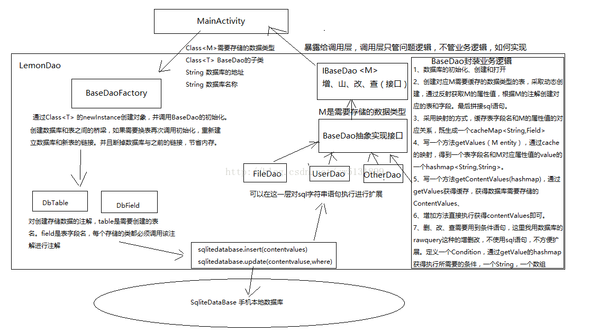

#### 腾讯---你曾经有没有对SqliteDatabase做过封装，你自己有设计过数据库框架吗?或者只是停留在使用ormlite  greenDao这类框架

本专栏专注分享大型Bat面试知识，后续会持续更新，喜欢的话麻烦点击一个star

> **面试官:  你曾经有没有对SqliteDatabase做过封装，你自己有设计过数据库框架吗?或者只是停留在使用ormlite  greenDao这类框架**

> **心理分析**：面试官比较在架构方面的知识，特别是数据库的，大多数开发者 并不理解为什么能够拿来直接用的，腾讯反而要求你自己写。其实小公司大多是拿来主义。而大公司不一样，需要考虑的需求和变化都比较多。所以当问到有没有做过数据框架的时候，很多人直接说 我使用过。这并不能成为你录取你的理由

> **求职者:**应该从 为什么sqlitedatabase这种api死板，不能服用，容易出错开始讲起。再到整体数据库架构设计的角度出发，一步一步告诉面试官你是如何实现数据库框架

  

​       **数据库**在某些特定需求下是很重要的，像持久化数据，一些不需要实时或者长时间不变的数据，可以放在**数据库中做缓存**，这样就算用户网络不好或者断网的情况下，依然是可以查看一些以前的数据。像新闻或者咨询类。这样做是不可避免的。提高用户的体验。

​     谷歌为我们开发者提供了最基础的数据库操作类，同时也提供了SqliteDatabase直接创建修改数据库和表。

**但是只是这样不能满足我们平时的敏捷开发**

作为一个应用层程序员，很多时候只是想去关心存储和读取数据，数据处理等问题的解决。

而不是花时间和精力在如何去存，如何去取数据库数据。这就是架构出现的前提。将一些面向过程的算法或者业务逻辑封装，可再次调用。易扩展、高灵敏。让程序猿专心的去整理项目需求和逻辑。解放大脑，提高工作效率。

     现在数据库有很多三方框架，比如GreenDao,Afinal、xUtils、ThinkAndroid、volley等等。但是这些三方导入后，文件数太大了。而且很多都集成了网络加载框架，图片加载框架。这样就有了一定的耦合性。比如我只喜欢xUtils的数据库框架，不喜欢它的网络加载，想用Volley的网络加载框架。咋办呢？两个都导入？是的，可以这样，但是项目的文件数就太大了。编译时压力大。而且一些公司想让程序猿写自己的框架，不使用别人发布的框架，这样代码是可以高扩展的。出现什么问题也是可以及时修改。如果导入的三方库在项目成熟阶段出现问题。那是不是要推翻这个库，重新去导入一个，重新在写一遍逻辑，而且又有谁能保证，再次导入的库不会出错呢？
    
  我把大致的封装思路，以图片的形式展示出来。

**对应的UML图**

 使用起来也非常方便，这里的映射逻辑和GreenDao的底层源码使用的是一个原理。采用表和类属性映射，并对其进行了缓存。只有在切换表的链接时，会重新建立链接。

 **优点：**

1、支持sql语句自拼接。数据库直接执行sql语句。

2、支持传入类对象进行增删改查，比如User，在insert的时候，插入User的实例，属性都封装在user中。通过反射获取它的属性值，存入数据库。

3、高扩展，每个新建的存储类型。直接继承DefaultBaseDao即可。可以在这里做一些该类独有的操作。

4、支持多数据库切换，多数据库操作。同时支持数据库分库管理，多数据库多版本多用户同时升级，采取XML脚本升级。这里的脚本语句没有封装。

5、支持boolean、byte、short、int、long、float、double数据类型的存储和读取。

 

**使用注意事项：**

1、创建存储数据类时，需要使用注解去标注类名（表名@DbTable）、类属性（表字段@DbField）。若是有主键（@DbPrimaryField）也需要标注。

2、需要创建一个相应的Dao层类和数据库的链接。

具体使用参照：https://github.com/SingleShu/LemonDaoDemo