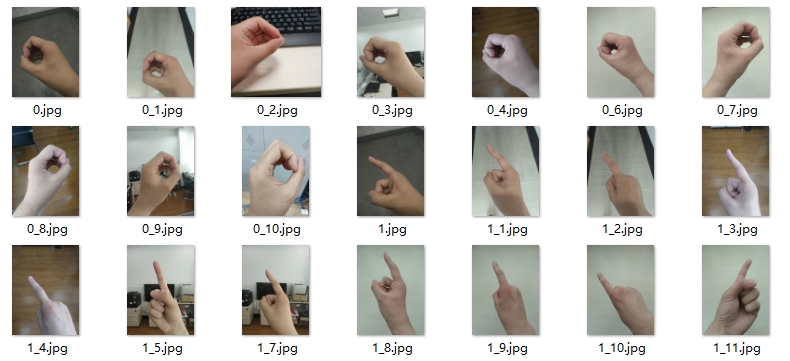
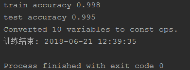
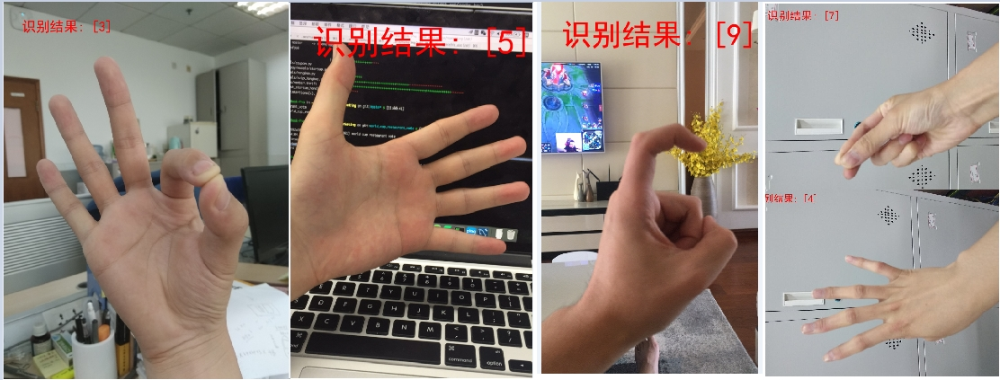
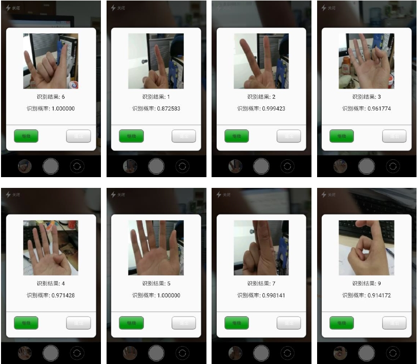

#### 字节跳动---对于Tersorflow你怎么理解的，有做过人工智能的应用吗

本专栏专注分享大型Bat面试知识，后续会持续更新，喜欢的话麻烦点击一个star

> **面试官:  对于Tersorflow你怎么理解的，有做过人工智能的应用吗**


> **心理分析**：了解tersorflow并且应用到项目中的，可谓少之又少。国内几乎没有多少Android开发者对人工智能有过认识。也不明白人工智能对Android带来的风险与机会。如果面试官问到了tersorflow  一定是想深挖你。在问这个问题就已经决定要你了。人工智能可以说相当重要，
>
> 往往会忽略调并发处理 ，这道题会难住绝大多数人。

> **求职者:**对人工智能的理解入手。告诉面试官 我以前做过一个电视机识别 手势的功能

接下来我们来分享什么是人工智能，对Android来说能做什么。如何训练模型  设定神经网络，集成AndroidStudio出发。全方位的带你理解tersorflow人工智能

 我以前做过 电视机识别手势。数字手势识别APP，具体分享下如何一步步训练一个卷积神经网络模型（CNN）模型，然后把模型集成到Android Studio中，开发一个数字手势识别APP。整个project的源码已经开源在github上，github地址：Chinese-number-gestures-recognition，欢迎star，哈哈。先说下这个数字手势识别APP的功能：能够识别做出的 0，1，2，3，4，5，6，7，8，9，10这11个手势。

####一、数据集的收集
   

 这么点照片想训练模型简直天方夜谭，只能祭出 data augmentation（数据增强）神器了，通过旋转，平移，拉伸 等操作每张图片生成100张，这样图片就变成了21500张。下面是 data augmentation 的代码：
```
from keras.preprocessing.image import ImageDataGenerator, img_to_array, load_img
import os

datagen = ImageDataGenerator(
    rotation_range=20,
    width_shift_range=0.15,
    height_shift_range=0.15,
    zoom_range=0.15,
    shear_range=0.2,
    horizontal_flip=True,
    fill_mode='nearest')
dirs = os.listdir("picture")
print(len(dirs))
for filename in dirs:
    img = load_img("picture//{}".format(filename))
    x = img_to_array(img)
    # print(x.shape)
    x = x.reshape((1,) + x.shape) #datagen.flow要求rank为4
    # print(x.shape)
    datagen.fit(x)
    prefix = filename.split('.')[0]
    print(prefix)
    counter = 0
    for batch in datagen.flow(x, batch_size=4 , save_to_dir='generater_pic', save_prefix=prefix, save_format='jpg'):
        counter += 1
        if counter > 100:
            break  # 否则生成器会退出循环
```
###二、数据集的处理
####1.缩放图片

  接下来对这21500张照片进行处理，首先要把每张照片缩放到64*64的尺寸，这么做的原因如下：

- 不同手机拍出的照片的size各不相同，要统一
- 如果手机拍出来的高分辨率图片，太大，GPU显存有限，要压缩下，减少体积。
- APP通过手机摄像头拍摄出来的照片，不同机型有差异，要统一。


对图片的缩放不能简单的直接缩小尺寸，那样的话会失真严重。所以要用到一些缩放算法，TensorFlow中已经提供了四种缩放算法，分别为：  双线性插值法（Bilinear interpolation）、**最近邻居法**（Nearest neighbor interpolation）、双三次插值法（Bicubic interpolation）和面积插值法（area interpolation）。 我这里使用了面积插值法（area interpolation）。代码为：
 ```
#压缩图片,把图片压缩成64*64的
def resize_img():
    dirs = os.listdir("split_pic//6")
    for filename in dirs:
        im = tf.gfile.FastGFile("split_pic//6//{}".format(filename), 'rb').read()
        # print("正在处理第%d张照片"%counter)
        with tf.Session() as sess:
            img_data = tf.image.decode_jpeg(im)
            image_float = tf.image.convert_image_dtype(img_data, tf.float32)
            resized = tf.image.resize_images(image_float, [64, 64], method=3)
            resized_im = resized.eval()
            # new_mat = np.asarray(resized_im).reshape(1, 64, 64, 3)
            scipy.misc.imsave("resized_img6//{}".format(filename),resized_im)
 ```
#### 2.把图片转成 .h5文件

 h5文件的种种好处，这里不再累述。我们首先把图片转成RGB矩阵，即每个图片是一个64*64*3的矩阵（因为是彩色图片，所以通道是3）。这里不做归一化，因为我认为归一化应该在你用到的时候自己代码归一化，如果直接把数据集做成了归一化，有点死板了，不灵活。在我们把矩阵存进h5文件时，此时标签一定要对应每一张图片（矩阵），直接上代码：
 ```
#图片转h5文件
def image_to_h5():
    dirs = os.listdir("resized_img")
    Y = [] #label
    X = [] #data
    print(len(dirs))
    for filename in dirs:
        label = int(filename.split('_')[0])
        Y.append(label)
        im = Image.open("resized_img//{}".format(filename)).convert('RGB')
        mat = np.asarray(im) #image 转矩阵
        X.append(mat)

    file = h5py.File("dataset//data.h5","w")
    file.create_dataset('X', data=np.array(X))
    file.create_dataset('Y', data=np.array(Y))
    file.close()

    #test
    # data = h5py.File("dataset//data.h5","r")
    # X_data = data['X']
    # print(X_data.shape)
    # Y_data = data['Y']
    # print(Y_data[123])
    # image = Image.fromarray(X_data[123]) #矩阵转图片并显示
    # image.show()
 ```
#### 训练模型
  接下来就是训练模型了，首先把数据集划分为训练集和测试集，然后先坐下归一化，把标签转化为one-hot向量表示，代码如下：
```
#load dataset
def load_dataset():
    #划分训练集、测试集
    data = h5py.File("dataset//data.h5","r")
    X_data = np.array(data['X']) #data['X']是h5py._hl.dataset.Dataset类型，转化为array
    Y_data = np.array(data['Y'])
    # print(type(X_data))
    X_train, X_test, y_train, y_test = train_test_split(X_data, Y_data, train_size=0.9, test_size=0.1, random_state=22)
    # print(X_train.shape)
    # print(y_train[456])
    # image = Image.fromarray(X_train[456])
    # image.show()
    # y_train = y_train.reshape(1,y_train.shape[0])
    # y_test = y_test.reshape(1,y_test.shape[0])
    print(X_train.shape)
    # print(X_train[0])
    X_train = X_train / 255.  # 归一化
    X_test = X_test / 255.
    # print(X_train[0])
    # one-hot
    y_train = np_utils.to_categorical(y_train, num_classes=11)
    print(y_train.shape)
    y_test = np_utils.to_categorical(y_test, num_classes=11)
    print(y_test.shape)

    return X_train, X_test, y_train, y_test
```
构建CNN模型，这里用了最简单的类LeNet-5，具体两层卷积层、两层池化层、一层全连接层，一层softmax输出。具体的小trick有：dropout、relu、regularize、mini-batch、adam。具体看代码吧：
```
def weight_variable(shape):
    tf.set_random_seed(1)
    return tf.Variable(tf.truncated_normal(shape, stddev=0.1))

def bias_variable(shape):
    return tf.Variable(tf.constant(0.0, shape=shape))

def conv2d(x, W):
    return tf.nn.conv2d(x, W, strides=[1,1,1,1], padding='SAME')

def max_pool_2x2(z):
    return tf.nn.max_pool(z, ksize=[1,2,2,1], strides=[1,2,2,1], padding='SAME')


def random_mini_batches(X, Y, mini_batch_size=16, seed=0):
    """
    Creates a list of random minibatches from (X, Y)

    Arguments:
    X -- input data, of shape (input size, number of examples)
    Y -- true "label" vector (containing 0 if cat, 1 if non-cat), of shape (1, number of examples)
    mini_batch_size - size of the mini-batches, integer
    seed -- this is only for the purpose of grading, so that you're "random minibatches are the same as ours.

    Returns:
    mini_batches -- list of synchronous (mini_batch_X, mini_batch_Y)
    """

    m = X.shape[0]  # number of training examples
    mini_batches = []
    np.random.seed(seed)

    # Step 1: Shuffle (X, Y)
    permutation = list(np.random.permutation(m))
    shuffled_X = X[permutation]
    shuffled_Y = Y[permutation,:].reshape((m, Y.shape[1]))

    # Step 2: Partition (shuffled_X, shuffled_Y). Minus the end case.
    num_complete_minibatches = math.floor(m / mini_batch_size)  # number of mini batches of size mini_batch_size in your partitionning
    for k in range(0, num_complete_minibatches):
        mini_batch_X = shuffled_X[k * mini_batch_size: k * mini_batch_size + mini_batch_size]
        mini_batch_Y = shuffled_Y[k * mini_batch_size: k * mini_batch_size + mini_batch_size]
        mini_batch = (mini_batch_X, mini_batch_Y)
        mini_batches.append(mini_batch)

    # Handling the end case (last mini-batch < mini_batch_size)
    if m % mini_batch_size != 0:
        mini_batch_X = shuffled_X[num_complete_minibatches * mini_batch_size: m]
        mini_batch_Y = shuffled_Y[num_complete_minibatches * mini_batch_size: m]
        mini_batch = (mini_batch_X, mini_batch_Y)
        mini_batches.append(mini_batch)

    return mini_batches


def cnn_model(X_train, y_train, X_test, y_test, keep_prob, lamda, num_epochs = 450, minibatch_size = 16):
    X = tf.placeholder(tf.float32, [None, 64, 64, 3], name="input_x")
    y = tf.placeholder(tf.float32, [None, 11], name="input_y")
    kp = tf.placeholder_with_default(1.0, shape=(), name="keep_prob")
    lam = tf.placeholder(tf.float32, name="lamda")
    #conv1
    W_conv1 = weight_variable([5,5,3,32])
    b_conv1 = bias_variable([32])
    z1 = tf.nn.relu(conv2d(X, W_conv1) + b_conv1)
    maxpool1 = max_pool_2x2(z1) #max_pool1完后maxpool1维度为[?,32,32,32]

    #conv2
    W_conv2 = weight_variable([5,5,32,64])
    b_conv2 = bias_variable([64])
    z2 = tf.nn.relu(conv2d(maxpool1, W_conv2) + b_conv2)
    maxpool2 = max_pool_2x2(z2) #max_pool2,shape [?,16,16,64]

    #conv3  效果比较好的一次模型是没有这一层，只有两次卷积层，隐藏单元100，训练20次
    # W_conv3 = weight_variable([5, 5, 64, 128])
    # b_conv3 = bias_variable([128])
    # z3 = tf.nn.relu(conv2d(maxpool2, W_conv3) + b_conv3)
    # maxpool3 = max_pool_2x2(z3)  # max_pool3,shape [?,8,8,128]

    #full connection1
    W_fc1 = weight_variable([16*16*64, 200])
    b_fc1 = bias_variable([200])
    maxpool2_flat = tf.reshape(maxpool2, [-1, 16*16*64])
    z_fc1 = tf.nn.relu(tf.matmul(maxpool2_flat, W_fc1) + b_fc1)
    z_fc1_drop = tf.nn.dropout(z_fc1, keep_prob=kp)

    #softmax layer
    W_fc2 = weight_variable([200, 11])
    b_fc2 = bias_variable([11])
    z_fc2 = tf.add(tf.matmul(z_fc1_drop, W_fc2),b_fc2, name="outlayer")
    prob = tf.nn.softmax(z_fc2, name="probability")
    #cost function
    regularizer = tf.contrib.layers.l2_regularizer(lam)
    regularization = regularizer(W_fc1) + regularizer(W_fc2)
    cost = tf.reduce_mean(tf.nn.softmax_cross_entropy_with_logits_v2(labels=y, logits=z_fc2)) + regularization

    train = tf.train.AdamOptimizer().minimize(cost)
    # output_type='int32', name="predict"
    pred = tf.argmax(prob, 1, output_type="int32", name="predict")  # 输出结点名称predict方便后面保存为pb文件
    correct_prediction = tf.equal(pred, tf.argmax(y, 1, output_type='int32'))
    accuracy = tf.reduce_mean(tf.cast(correct_prediction, tf.float32))
    tf.set_random_seed(1)  # to keep consistent results

    seed = 0

    init = tf.global_variables_initializer()
    with tf.Session() as sess:
        sess.run(init)
        for epoch in range(num_epochs):
            seed = seed + 1
            epoch_cost = 0.
            num_minibatches = int(X_train.shape[0] / minibatch_size)
            minibatches = random_mini_batches(X_train, y_train, minibatch_size, seed)
            for minibatch in minibatches:
                (minibatch_X, minibatch_Y) = minibatch
                _, minibatch_cost = sess.run([train, cost], feed_dict={X: minibatch_X, y: minibatch_Y, kp: keep_prob, lam: lamda})
                epoch_cost += minibatch_cost / num_minibatches
            if epoch % 10 == 0:
                print("Cost after epoch %i: %f" % (epoch, epoch_cost))
                print(str((time.strftime('%Y-%m-%d %H:%M:%S'))))

        # 这个accuracy是前面的accuracy，tensor.eval()和Session.run区别很小
        train_acc = accuracy.eval(feed_dict={X: X_train[:1000], y: y_train[:1000], kp: 0.8, lam: lamda})
        print("train accuracy", train_acc)
        test_acc = accuracy.eval(feed_dict={X: X_test[:1000], y: y_test[:1000], lam: lamda})
        print("test accuracy", test_acc)

        #save model
        saver = tf.train.Saver({'W_conv1':W_conv1, 'b_conv1':b_conv1, 'W_conv2':W_conv2, 'b_conv2':b_conv2,
                                'W_fc1':W_fc1, 'b_fc1':b_fc1, 'W_fc2':W_fc2, 'b_fc2':b_fc2})
        saver.save(sess, "model_500_200_c3//cnn_model.ckpt")
        #将训练好的模型保存为.pb文件，方便在Android studio中使用
        output_graph_def = graph_util.convert_variables_to_constants(sess, sess.graph_def, output_node_names=['predict'])
        with tf.gfile.FastGFile('model_500_200_c3//digital_gesture.pb', mode='wb') as f:  # ’wb’中w代表写文件，b代表将数据以二进制方式写入文件。
            f.write(output_graph_def.SerializeToString())
```
**这里有一个非常非常非常重要的事情**，要注意，具体请参考上一篇博客中的 2. 模型训练注意事项 链接为：将TensorFlow训练好的模型迁移到Android APP上（TensorFlowLite）。整个模型训练几个小时即可，当然调参更是门艺术活，不多说了。 
  这里小小感慨下，i7-7700k跑一个epoch需要2分钟，750ti需要36秒，1070需要6秒。。。这里再次感谢宋俞璋的神机。。关于如何搭建TensorFlow GPU环境，请参见我的博客：ubuntu16.04+GTX750ti+python3.6.5配置cuda9.0+cudnn7.05+TensorFlow-gpu1.8.0

训练完的模型性能：
 

但是在APP上因为面临的环境更加复杂，准备远没有这么高。

PC端随便实测的效果图： 


###4.在Android Studio中调用训练好的模型

  关于如何把模型迁移到Android studio中，请参考我的上一篇博客：将TensorFlow训练好的模型迁移到Android APP上（TensorFlowLite）。这里面解释下为何会用到OpenCV，这一切都要源于那个图片缩放，还记得我们在上面提到的area interpolation吗，这个算法不像那些双线性插值法等，网上并没有java版本的实现，无奈去仔细翻了遍TensorFlow API文档，发现这么一段话：

 > Each output pixel is computed by first transforming the pixel’s footprint into the input tensor and then averaging the pixels that intersect the footprint. An input pixel’s contribution to the average is weighted by the fraction of its area that intersects the footprint. This is the same as OpenCV’s INTER_AREA.


这就是为什么会用OpenCV了，OpenCV在Android studio中的配置也是坑多，具体的配置请参见我的博客：Android Studio中配置OpenCV。这里只说下，TensorFlowLite只提供了几个简单的接口，虽然在我的博客将[TensorFlow训练好的模型迁移到Android APP](https://blog.csdn.net/u012328159/article/details/81101074)上（TensorFlowLite）也提过了，但是这里还是想提一下，提供的接口[官网地址](https://www.tensorflow.org/mobile/linking_libs)
```
// Load the model from disk.
TensorFlowInferenceInterface inferenceInterface =
new TensorFlowInferenceInterface(assetManager, modelFilename);

// Copy the input data into TensorFlow.
inferenceInterface.feed(inputName, floatValues, 1, inputSize, inputSize, 3);

// Run the inference call.
inferenceInterface.run(outputNames, logStats);

// Copy the output Tensor back into the output array.
inferenceInterface.fetch(outputName, outputs);
```

注释也都说明了各个接口的作用，就不多说了。

  我也不知道是不是因为OpenCV里的area interpolation算法实现的和TensorFlow不一样还是其他什么原因，总感觉在APP上测得效果要比在PC上模型性能差。。也许有可能只是我感觉。。 
关于Android APP代码也没啥好说的了，代码都放到github上了，地址：Chinese-number-gestures-recognition，欢迎star，哈哈。

下面上几张测试的效果图吧，更多的展示效果见github，：[Chinese-number-gestures-recognition]()
