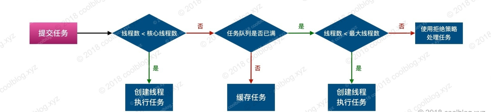

#### Android线程池原理


> 本专栏专注分享大型Bat面试知识，后续会持续更新，喜欢的话麻烦点击一个star

## 1.简介

线程池可以简单看做是一组线程的集合，通过使用线程池，我们可以方便的复用线程，避免了频繁创建和销毁线程所带来的开销。在应用上，线程池可应用在后端相关服务中。比如 Web 服务器，数据库服务器等。以 Web 服务器为例，假如 Web 服务器会收到大量短时的 HTTP 请求，如果此时我们简单的为每个 HTTP 请求创建一个处理线程，那么服务器的资源将会很快被耗尽。当然我们也可以自己去管理并复用已创建的线程，以限制资源的消耗量，但这样会使用程序的逻辑变复杂。好在，幸运的是，我们不必那样做。在 JDK 1.5 中，官方已经提供了强大的线程池工具类。通过使用这些工具类，我们可以用低廉的代价使用多线程技术。

线程池作为 Java 并发重要的工具类，在会用的基础上，我觉得很有必要去学习一下线程池的相关原理。毕竟线程池除了要管理线程，还要管理任务，同时还要具备统计功能。所以多了解一点，还是可以扩充眼界的，同时也可以更为熟悉线程池技术。

## 2.继承体系

线程池所涉及到的接口和类并不是很多，其继承体系也相对简单。相关继承关系如下：


如上图，最顶层的接口 Executor 仅声明了一个方法`execute`。ExecutorService 接口在其父类接口基础上，声明了包含但不限于`shutdown`、`submit`、`invokeAll`、`invokeAny` 等方法。至于 ScheduledExecutorService 接口，则是声明了一些和定时任务相关的方法，比如 `schedule`和`scheduleAtFixedRate`。线程池的核心实现是在 ThreadPoolExecutor 类中，我们使用 Executors 调用`newFixedThreadPool`、`newSingleThreadExecutor`和`newCachedThreadPool`等方法创建线程池均是 ThreadPoolExecutor 类型。

以上是对线程池继承体系的简单介绍，这里先让大家对线程池大致轮廓有一定的了解。接下来我会介绍一下线程池的实现原理，继续往下看吧。

## 3.原理分析

### 3.1 核心参数分析

#### 3.1.1 核心参数简介

如上节所说，线程池的核心实现即 ThreadPoolExecutor 类。该类包含了几个核心属性，这些属性在可在构造方法进行初始化。在介绍核心属性前，我们先来看看 ThreadPoolExecutor 的构造方法，如下：

```js
public ThreadPoolExecutor(int corePoolSize,
                          int maximumPoolSize,
                          long keepAliveTime,
                          TimeUnit unit,
                          BlockingQueue<Runnable> workQueue,
                          ThreadFactory threadFactory,
                          RejectedExecutionHandler handler)
```

如上所示，构造方法的参数即核心参数，这里我用一个表格来简要说明一下各个参数的意义。如下：

| 参数            | 说明                                                         |
| --------------- | ------------------------------------------------------------ |
| corePoolSize    | 核心线程数。当线程数小于该值时，线程池会优先创建新线程来执行新任务 |
| maximumPoolSize | 线程池所能维护的最大线程数                                   |
| keepAliveTime   | 空闲线程的存活时间                                           |
| workQueue       | 任务队列，用于缓存未执行的任务                               |
| threadFactory   | 线程工厂。可通过工厂为新建的线程设置更有意义的名字           |
| handler         | 拒绝策略。当线程池和任务队列均处于饱和状态时，使用拒绝策略处理新任务。默认是 AbortPolicy，即直接抛出异常 |

以上是各个参数的简介，下面我将会针对部分参数进行详细说明，继续往下看。

#### 3.1.2 线程创建规则

在 Java 线程池实现中，线程池所能创建的线程数量受限于 corePoolSize 和 maximumPoolSize 两个参数值。线程的创建时机则和 corePoolSize 以及 workQueue 两个参数有关。下面列举一下线程创建的4个规则（线程池中无空闲线程），如下：

1. 线程数量小于 corePoolSize，直接创建新线程处理新的任务
2. 线程数量大于等于 corePoolSize，workQueue 未满，则缓存新任务
3. 线程数量大于等于 corePoolSize，但小于 maximumPoolSize，且 workQueue 已满。则创建新线程处理新任务
4. 线程数量大于等于 maximumPoolSize，且 workQueue 已满，则使用拒绝策略处理新任务

简化一下上面的规则：

| 序号 | 条件                                                        | 动作             |
| ---- | ----------------------------------------------------------- | ---------------- |
| 1    | 线程数 < corePoolSize                                       | 创建新线程       |
| 2    | 线程数 ≥ corePoolSize，且 workQueue 未满                    | 缓存新任务       |
| 3    | corePoolSize ≤ 线程数 ＜ maximumPoolSize，且 workQueue 已满 | 创建新线程       |
| 4    | 线程数 ≥ maximumPoolSize，且 workQueue 已满                 | 使用拒绝策略处理 |

#### 3.1.3 资源回收

考虑到系统资源是有限的，对于线程池超出 corePoolSize 数量的空闲线程应进行回收操作。进行此操作存在一个问题，即回收时机。目前的实现方式是当线程空闲时间超过 keepAliveTime 后，进行回收。除了核心线程数之外的线程可以进行回收，核心线程内的空闲线程也可以进行回收。回收的前提是`allowCoreThreadTimeOut`属性被设置为 true，通过`public void allowCoreThreadTimeOut(boolean)` 方法可以设置属性值。

#### 3.1.4 排队策略

如3.1.2 线程创建规则一节中规则2所说，当线程数量大于等于 corePoolSize，workQueue 未满时，则缓存新任务。这里要考虑使用什么类型的容器缓存新任务，通过 JDK 文档介绍，我们可知道有3中类型的容器可供使用，分别是`同步队列`，`有界队列`和`无界队列`。对于有优先级的任务，这里还可以增加`优先级队列`。以上所介绍的4中类型的队列，对应的实现类如下：

| 实现类                | 类型       | 说明                                                         |
| --------------------- | ---------- | ------------------------------------------------------------ |
| SynchronousQueue      | 同步队列   | 该队列不存储元素，每个插入操作必须等待另一个线程调用移除操作，否则插入操作会一直阻塞 |
| ArrayBlockingQueue    | 有界队列   | 基于数组的阻塞队列，按照 FIFO 原则对元素进行排序             |
| LinkedBlockingQueue   | 无界队列   | 基于链表的阻塞队列，按照 FIFO 原则对元素进行排序             |
| PriorityBlockingQueue | 优先级队列 | 具有优先级的阻塞队列                                         |

#### 3.1.5 拒绝策略

如3.1.2 线程创建规则一节中规则4所说，线程数量大于等于 maximumPoolSize，且 workQueue 已满，则使用拒绝策略处理新任务。Java 线程池提供了4中拒绝策略实现类，如下：

| 实现类              | 说明                                          |
| ------------------- | --------------------------------------------- |
| AbortPolicy         | 丢弃新任务，并抛出 RejectedExecutionException |
| DiscardPolicy       | 不做任何操作，直接丢弃新任务                  |
| DiscardOldestPolicy | 丢弃队列队首的元素，并执行新任务              |
| CallerRunsPolicy    | 由调用线程执行新任务                          |

以上4个拒绝策略中，AbortPolicy 是线程池实现类所使用的策略。我们也可以通过方法`public void setRejectedExecutionHandler(RejectedExecutionHandler)`修改线程池决绝策略。

### 3.2 重要操作

#### 3.2.1 线程的创建与复用

在线程池的实现上，线程的创建是通过线程工厂接口`ThreadFactory`的实现类来完成的。默认情况下，线程池使用`Executors.defaultThreadFactory()`方法返回的线程工厂实现类。当然，我们也可以通过

 `public void setThreadFactory(ThreadFactory)`方法进行动态修改。具体细节这里就不多说了，并不复杂，大家可以自己去看下源码。

在线程池中，线程的复用是线程池的关键所在。这就要求线程在执行完一个任务后，不能立即退出。对应到具体实现上，工作线程在执行完一个任务后，会再次到任务队列获取新的任务。如果任务队列中没有任务，且 keepAliveTime 也未被设置，工作线程则会被一致阻塞下去。通过这种方式即可实现线程复用。

说完原理，再来看看线程的创建和复用的相关代码（基于 JDK 1.8），如下：

```js
+----ThreadPoolExecutor.Worker.java
Worker(Runnable firstTask) {
    setState(-1);
    this.firstTask = firstTask;
    // 调用线程工厂创建线程
    this.thread = getThreadFactory().newThread(this);
}

// Worker 实现了 Runnable 接口
public void run() {
    runWorker(this);
}

+----ThreadPoolExecutor.java
final void runWorker(Worker w) {
    Thread wt = Thread.currentThread();
    Runnable task = w.firstTask;
    w.firstTask = null;
    w.unlock();
    boolean completedAbruptly = true;
    try {
        // 循环从任务队列中获取新任务
        while (task != null || (task = getTask()) != null) {
            w.lock();
            // If pool is stopping, ensure thread is interrupted;
            // if not, ensure thread is not interrupted.  This
            // requires a recheck in second case to deal with
            // shutdownNow race while clearing interrupt
            if ((runStateAtLeast(ctl.get(), STOP) ||
                 (Thread.interrupted() &&
                  runStateAtLeast(ctl.get(), STOP))) &&
                !wt.isInterrupted())
                wt.interrupt();
            try {
                beforeExecute(wt, task);
                Throwable thrown = null;
                try {
                    // 执行新任务
                    task.run();
                } catch (RuntimeException x) {
                    thrown = x; throw x;
                } catch (Error x) {
                    thrown = x; throw x;
                } catch (Throwable x) {
                    thrown = x; throw new Error(x);
                } finally {
                    afterExecute(task, thrown);
                }
            } finally {
                task = null;
                w.completedTasks++;
                w.unlock();
            }
        }
        completedAbruptly = false;
    } finally {
        // 线程退出后，进行后续处理
        processWorkerExit(w, completedAbruptly);
    }
}
```

#### 3.2.2 提交任务

通常情况下，我们可以通过线程池的`submit`方法提交任务。被提交的任务可能会立即执行，也可能会被缓存或者被拒绝。任务的处理流程如下图所示：



上面的流程图不是很复杂，下面再来看看流程图对应的代码，如下：

```js
+---- AbstractExecutorService.java
public Future<?> submit(Runnable task) {
    if (task == null) throw new NullPointerException();
    // 创建任务
    RunnableFuture<Void> ftask = newTaskFor(task, null);
    // 提交任务
    execute(ftask);
    return ftask;
}

+---- ThreadPoolExecutor.java
public void execute(Runnable command) {
    if (command == null)
        throw new NullPointerException();

    int c = ctl.get();
    // 如果工作线程数量 < 核心线程数，则创建新线程
    if (workerCountOf(c) < corePoolSize) {
        // 添加工作者对象
        if (addWorker(command, true))
            return;
        c = ctl.get();
    }
    
    // 缓存任务，如果队列已满，则 offer 方法返回 false。否则，offer 返回 true
    if (isRunning(c) && workQueue.offer(command)) {
        int recheck = ctl.get();
        if (! isRunning(recheck) && remove(command))
            reject(command);
        else if (workerCountOf(recheck) == 0)
            addWorker(null, false);
    }
    
    // 添加工作者对象，并在 addWorker 方法中检测线程数是否小于最大线程数
    else if (!addWorker(command, false))
        // 线程数 >= 最大线程数，使用拒绝策略处理任务
        reject(command);
}

private boolean addWorker(Runnable firstTask, boolean core) {
    retry:
    for (;;) {
        int c = ctl.get();
        int rs = runStateOf(c);

        // Check if queue empty only if necessary.
        if (rs >= SHUTDOWN &&
            ! (rs == SHUTDOWN &&
               firstTask == null &&
               ! workQueue.isEmpty()))
            return false;

        for (;;) {
            int wc = workerCountOf(c);
            // 检测工作线程数与核心线程数或最大线程数的关系
            if (wc >= CAPACITY ||
                wc >= (core ? corePoolSize : maximumPoolSize))
                return false;
            if (compareAndIncrementWorkerCount(c))
                break retry;
            c = ctl.get();  // Re-read ctl
            if (runStateOf(c) != rs)
                continue retry;
            // else CAS failed due to workerCount change; retry inner loop
        }
    }

    boolean workerStarted = false;
    boolean workerAdded = false;
    Worker w = null;
    try {
        // 创建工作者对象，细节参考上一节所贴代码
        w = new Worker(firstTask);
        final Thread t = w.thread;
        if (t != null) {
            final ReentrantLock mainLock = this.mainLock;
            mainLock.lock();
            try {
                int rs = runStateOf(ctl.get());
                if (rs < SHUTDOWN ||
                    (rs == SHUTDOWN && firstTask == null)) {
                    if (t.isAlive()) // precheck that t is startable
                        throw new IllegalThreadStateException();
                    // 将 worker 对象添加到 workers 集合中
                    workers.add(w);
                    int s = workers.size();
                    // 更新 largestPoolSize 属性
                    if (s > largestPoolSize)
                        largestPoolSize = s;
                    workerAdded = true;
                }
            } finally {
                mainLock.unlock();
            }
            if (workerAdded) {
                // 开始执行任务
                t.start();
                workerStarted = true;
            }
        }
    } finally {
        if (! workerStarted)
            addWorkerFailed(w);
    }
    return workerStarted;
}
```

上面的代码略多，不过结合上面的流程图，和我所写的注释，理解主逻辑应该不难。

#### 3.2.3 关闭线程池

我们可以通过`shutdown`和`shutdownNow`两个方法关闭线程池。两个方法的区别在于，shutdown 会将线程池的状态设置为`SHUTDOWN`，同时该方法还会中断空闲线程。shutdownNow 则会将线程池状态设置为`STOP`，并尝试中断所有的线程。中断线程使用的是`Thread.interrupt`方法，未响应中断方法的任务是无法被中断的。最后，shutdownNow 方法会将未执行的任务全部返回。

调用 shutdown 和 shutdownNow 方法关闭线程池后，就不能再向线程池提交新任务了。对于处于关闭状态的线程池，会使用拒绝策略处理新提交的任务。

## 4.几种线程池

一般情况下，我们并不直接使用 ThreadPoolExecutor 类创建线程池，而是通过 Executors 工具类去构建线程池。通过 Executors 工具类，我们可以构造5中不同的线程池。下面通过一个表格简单介绍一下几种线程池，如下：

| 静态构造方法                             | 说明                                                         |
| ---------------------------------------- | ------------------------------------------------------------ |
| newFixedThreadPool(int nThreads)         | 构建包含固定线程数的线程池，默认情况下，空闲线程不会被回收   |
| newCachedThreadPool()                    | 构建线程数不定的线程池，线程数量随任务量变动，空闲线程存活时间超过60秒后会被回收 |
| newSingleThreadExecutor()                | 构建线程数为1的线程池，等价于 newFixedThreadPool(1) 所构造出的线程池 |
| newScheduledThreadPool(int corePoolSize) | 构建核心线程数为 corePoolSize，可执行定时任务的线程池        |
| newSingleThreadScheduledExecutor()       | 等价于 newScheduledThreadPool(1)                             |