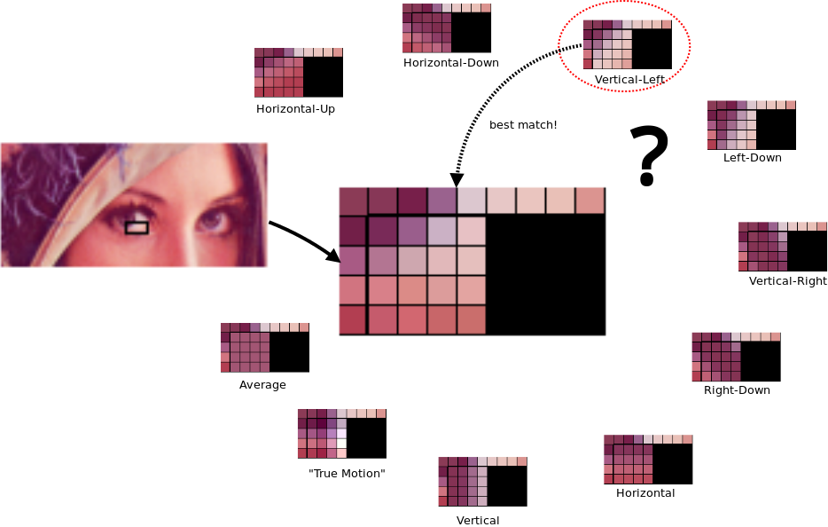
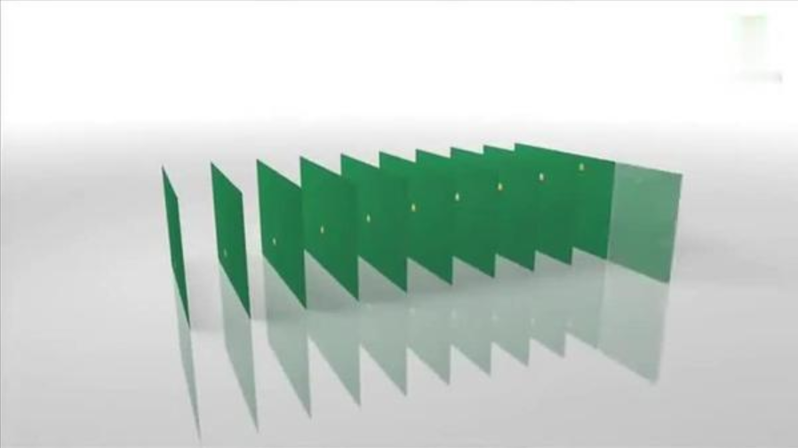
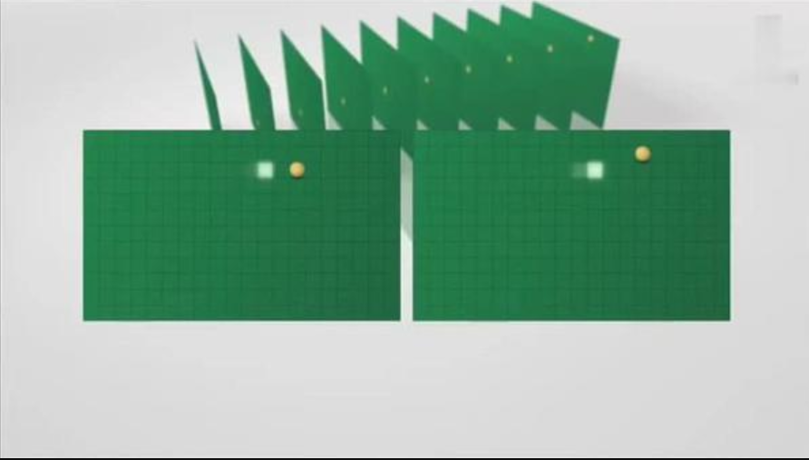
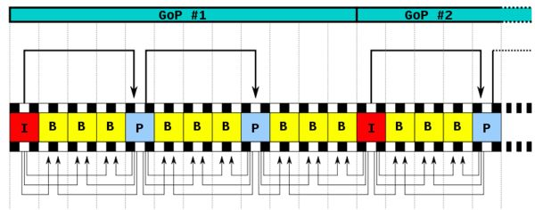

#### 腾讯-视频压缩压缩的是什么信息? 帧内压缩与帧间压缩原理

本专栏专注分享大型Bat面试知识，后续会持续更新，喜欢的话麻烦点击一个star

> **面试官: 视频压缩压缩的是什么信息? 帧内压缩与帧间压缩原理**

> **心理分析**：视频压缩在音视频领域是一个恒久不变的话题，有压缩也就意味有解压操作，我们把压缩与解压称为编解码。它们是成对出现的，做音视频最难的就在音视频编解码。如何提高音视频播放效率，在不牺牲视频质量下 做高度压缩就显得格外重要了。面试官想问的问题并不是压缩了什么，而是编码中对视频帧做了什么

> **求职者:**需要求职者对视频编码有所了解，接下来我们从帧内压缩，与帧间压缩讲起

### **1.1视频中哪些信息可以被省略 甚至可以去掉的？**

1  某一帧中大块大块的相同颜色，每一个颜色都是一个像素，像素是一个int，大块的相同像素意味着有很多歌相同的int值  

2  如果一个视频帧率为30FPS（每秒帧数）意味着视频的一秒播放等于30帧  这30帧每一帧的像素值并不会发生很大 ，甚至30帧完全是静止图像

### 1.2视频压缩分为帧内压缩与帧间压缩

压缩的常用技术是调整大小或降低分辨率。这是因为视频的分辨率越高，每帧中包含的信息就越多。例如，1280×720视频在每帧中有921,600像素的可能性，假设它是一个i帧（稍微多一点）。相比之下，640×360视频每帧可能有230,400像素。

##### 这种调整会牺牲视频的质量，虽然视频每一帧大小降低了，同时用户的体验也降低了。用户是愿意看2k的电视，还是看8k呢？

##  

**1.3  帧内压缩**

一种可能未被广泛实现的视频压缩技术是帧间帧。这是一个逐帧减少“冗余”信息的过程。例如，具有30的FPS（每秒帧数）的视频意味着视频的一秒等于30帧或静止图像。

##### 为了更好地理解这个概念，让我们把它想象一下。

当一起玩时，它们模拟运动。然而，在这30帧（称为GOP，图像组）内，帧与帧之间的元素几乎保持不变。意识到这一点，引入了帧间来删除冗余数据。基本上减少了用于传达元素在帧中没有变化的数据。

这是一个被抛出和尖刺的排球的静止图像。在这个例子中有相当多的运动，排球被抛出，球被尖刺，沙子飞扬，元素像树木和水一样从风中移动。无论如何，有些部分可以重复使用，特别是天空区域。这些在封闭区域中可见，因为这些元素不会改变。因此，不是花费宝贵的数据来传达天空的某些部分没有改变，而是简单地重复使用它们以节省空间。因此，只有视频的以下元素实际上在本系列的帧之间发生变化。

**1. 分块（MacroBlocking）**
 将图片划分成多个宏块（macro blocks），典型的宏块由一个 16×16 的亮度像素(luma pixel)块和两个 8×8 的色度像素(chroma pixel)块组成。分块越小，预测越准，需要记录的信息也越多。一般来说，细节越丰富的地方，分块越细，即使用 4×4 分块预测。细节相对不丰富的地方使用 16×16 分块。（这一过程相当于 JPEG 编码中的色彩空间转换）
 

.jpg)

图3.1-分块

**2. 帧内预测**
 WebP 有损压缩使用了帧内预测编码，这一技术也被用于 VP8 视频编码中的关键帧压缩。VP8 有四种常见的帧内预测模型。

- H_PRED(horizontal prediction)
   像素块中每一行使用其左边一列（col L）的数据填充（如图3.2 Horizontal）
- V_PRED (vertical prediction)
   像素块中每一列使用其上边一行（row A）的数据填充（如图3.2 Vertical）
- DC_PRED (DC prediction)
   像素块中每个单元使用 row A 和 col L 的所有像素的平均值填充（如图3.2 Average）
- TM_PRED (TrueMotion prediction)
   一种我还没搞清楚的预测模式，比较接近真实数据

下图展示了 4×4 分块的所有帧内预测模型

##### 1.4 帧间压缩（ I帧，P帧，B帧和GOP）

> 我们来看一下例子，下面是捕获的一组运动的台球的视频帧，台球从右上角滚到了左下角。

对于视频数据主要有两类数据冗余，一类是时间上的数据冗余，另一类是空间上的数据冗余。其中时间上的数据冗余是最大的。下面我们就先来说说视频数据时间上的冗余问题。

为什么说时间上的冗余是最大的呢？假设摄像头每秒抓取30帧，这30帧的数据大部分情况下都是相关联的。也有可能不止30帧的的数据，可能几十帧，上百帧的数据都是关联特别密切的。对于这些关联特别密切的帧，其实我们只需要保存一帧的数据，其它帧都可以通过这一帧再按某种规则预测出来，所以说视频数据在时间上的冗余是最多的。

image.png

H264编码器会按顺序，每次取出两幅相邻的帧进行宏块比较，计算两帧的相似度。如下图：

image.png

通过宏块扫描与宏块搜索可以发现这两个帧的关联度是非常高的。进而发现这一组帧的关联度都是非常高的。因此，上面这几帧就可以划分为一组。其算法是：在相邻几幅图像画面中，一般有差别的像素只有10%以内的点,亮度差值变化不超过2%，而色度差值的变化只有1%以内，我们认为这样的图可以分到一组。**在这样一组帧中，经过编码后，我们只保留第一帖的完整数据，其它帧都通过参考上一帧计算出来。我们称第一帧为IDR／I帧，其它帧我们称为P／B帧，这样编码后的数据帧组我们称为GOP。**

- I帧：关键帧，采用帧内压缩技术。

- P帧：向前参考帧，在压缩时，只参考前面已经处理的帧。采用帧音压缩技术。

- B帧：双向参考帧，在压缩时，它即参考前而的帧，又参考它后面的帧。采用帧间压缩技术。

- GOP:两个I帧之间是一个图像序列，在一个图像序列中只有一个I帧。如下图所示：

  

  

