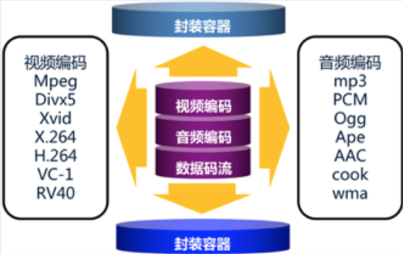
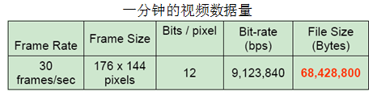

#### 腾讯-音视频是什么，视频为什么需要压缩

本专栏专注分享大型Bat面试知识，后续会持续更新，喜欢的话麻烦点击一个star

> **面试官: 音视频是什么，视频为什么需要压缩**


> **心理分析**：很多人对音视频的概念停留在 苍老师的小电影上，只能理解他是一个视频文件。面试官考的对视频文件下的封装格式，视频文件组成和音视频开发有没相关的概念

> **求职者:**首先需要从视频文件组成开始讲解，慢慢深入到视频编码

#### 1.1  视频的构成




一个完整的视频文件是由**音频和视频两部分组成**封装格式和编码格式

外壳类似于"苍老师.mp4"文件，外壳的核心还有一层编码文件，编码文件经过封装后，才成为我们现在看到的.mp4 .avi等视频。

苍老师的激战的画面内容被编码成了H264或mpeg-4，我们把H264视频编码格式, 

苍老师的销魂声音编码成MP3、AAC， 我们把MP3称为音频编码格式。

**例如：**将一个H.264视频编码文件和一个MP3视频编码文件按MP4封装标准封装以后，就得到一个MP4后缀的视频文件，这个就是我们常见的AVI视频文件了。

部分技术先进的容器还可以同时封装多个视频、音频编码文件，甚至同时封装进字幕，如MKV封装格式。MKV文件可以做到一个文件包括多语种发音、多语种字幕，适合不同人的需要。


#### 1.2 封装格式


```
 （1）封装格式（也叫容器）就是将已经编码压缩好的视频轨和音频轨按照一定的格式放到一个文件中，也就是说仅仅是一个外壳，可以把它当成一个放视频轨和音频轨的文件夹也可以。
 （2）通俗点说视频轨相当于饭，而音频轨相当于菜，封装格式就是一个碗，或者一个锅，用来盛放饭菜的容器。
 （3）封装格式和专利是有关系的，关系到推出封装格式的公司的盈利。
 （4）有了封装格式，才能把字幕，配音，音频和视频组合起来。
 （5）常见的AVI、RMVB、MKV、ASF、WMV、MP4、3GP、FLV等文件都指的是一种封装格式。
```

举例MKV格式的封装：


### 1.3 视频为什么需要压缩

- 未经压缩的数字视频的数据量巨大
- 存储困难：一张DVD只能存储几秒钟的未压缩数字视频。
- 传输困难 1兆的带宽传输一秒的数字电视视频需要大约4分钟。


 