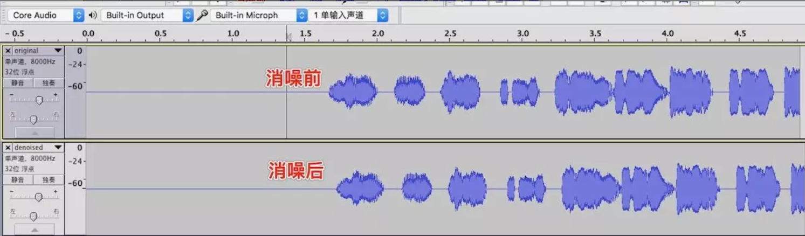
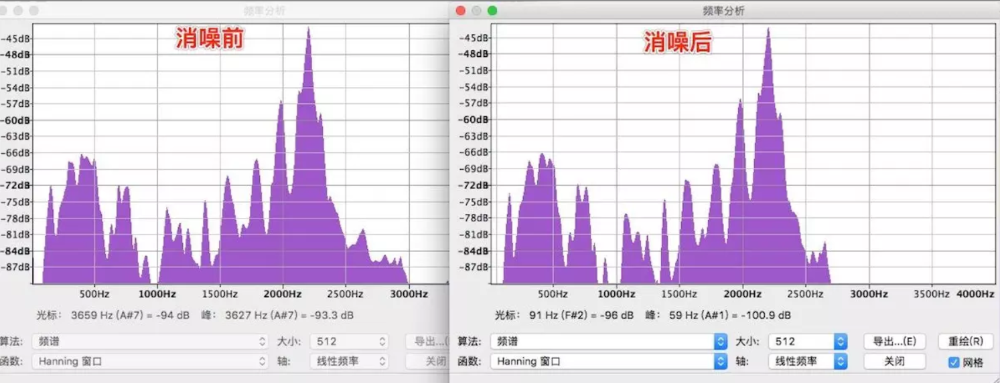

#### 腾讯-音视频是什么，视频为什么需要压缩

本专栏专注分享大型Bat面试知识，后续会持续更新，喜欢的话麻烦点击一个star

> **面试官: 音视频是什么，视频为什么需要压缩**


> **心理分析**：很多人对音视频的概念停留在 苍老师的小电影上，只能理解他是一个视频文件。面试官考的对视频文件下的封装格式，视频文件组成和音视频开发有没相关的概念

> **求职者:**首先需要从视频文件组成开始讲解，慢慢深入到视频编码

`WebRTC`很强大，包含了很多功能，如：音视频采集、编解码、传输、增益、消噪等，还支持跨平台，我这里只用到`WebRTC`的消噪相关模块([点击这里下载](https://link.jianshu.com/?t=https%3A%2F%2Fgithub.com%2Fs2eker%2FLBResources%2Fraw%2Fmaster%2FWebRTC%2FWebRtcMoudle.zip))，代码逻辑其实很简单，只用到4个函数


```
1.创建：WebRtcNs_Create
2.初始化：WebRtcNs_Init
3.设置消噪级别：WebRtcNs_set_policy
4.循环取10ms数据，进行消噪处理：WebRtcNs_Process
```

### 具体代码如下：

```objectivec
#include <stdio.h>
#include <stdlib.h>
#include <string.h>

#include "signal_processing_library.h"
#include "noise_suppression_x.h"
#include "noise_suppression.h"
#include "gain_control.h"

@interface AudioManager()
{
    NsHandle *_nshandle;
}

@end

@implementation AudioManager
+ (instancetype)sharedInstance {
    static id instance = nil;
    static dispatch_once_t onceToken;
    dispatch_once(&onceToken, ^{
        instance = [[self alloc] init];
    });
    return instance;
}
/**
 消噪

 @param buffer PCM原始数据
 @param length PCM数据长度
 @param fs 采样率
 @param quality 消噪质量(0,1,2,3)，0质量最差，3质量最好
 */
+ (void)denoise:(unsigned char *)buffer length:(NSUInteger)length fs:(NSUInteger)fs quality:(int)quality{
    AudioManager *audio = [AudioManager sharedInstance];
    NsHandle *nsHandle = NULL;
    int level = quality < 0 ? 0 : (quality > 3 ? 3 :quality);
    if (audio->_nshandle == NULL) {
        if (0 != WebRtcNs_Create(&nsHandle)) {
            NSLog(@"WebRTC 创建失败");
            return;
        }
        if (0 != WebRtcNs_Init(nsHandle, (uint32_t)fs)) {
            NSLog(@"WebRTC 初始化失败");
            return;
        }
        if (0 != WebRtcNs_set_policy(nsHandle, level)) {
            NSLog(@"WebRTC 设置失败");
            return;
        }
        audio->_nshandle = nsHandle;
    }else {
        nsHandle = audio->_nshandle;
    }
    NSLog(@"消噪级别=%d", level);
    //我们的PCM音频数据为16位，采样率8000Hz，而WebRTC每次只处理10ms的数据，经计算:sizeof(short)*fs/100，即为2*80=160个字节
    for (int i = 0; i < length; i+=sizeof(short)*fs/100) {
        short inP[80] = {0};
        short outP[80] = {0};
        memcpy(inP, buffer+i, 80*sizeof(short));
        if (0 != WebRtcNs_Process(nsHandle, inP, NULL, outP, NULL)) {
            NSLog(@"消噪失败:%d", i);
        }
        memcpy(buffer+i, outP, 80*sizeof(short));
    }
}
```


### 用Audacity软件分析

波形图如下：




频谱图如下：



[开源库Speex编解码](https://link.jianshu.com/?t=http://blog.sina.com.cn/s/blog_4e0987310101nxel.html)