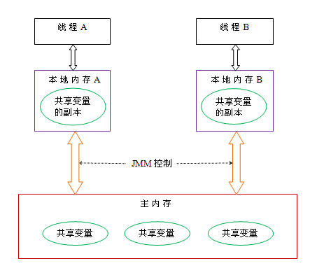

#### 腾讯-谈谈volatile关键字与synchronized关键字在内存的区别

> volatile关键字与synchronized关键字 作为Android开发者 我们总是傻傻的分不清。这一小节中，我们从腾讯面试中给大家讲解他们之间的作用和区别，在了解他们区别之前 我们得看看什么是线程安全性

##### 线程安全性：

线程安全性包括两个方面，

> ①可见性。
>
> ②原子性。

1、**线程之间的通信**：线程的通信是指线程之间以何种机制来交换信息。在命令式编程中，线程之间的通信机制有两种共享内存和消息传递。

（1）在共享内存的并发模型里，线程之间共享程序的公共状态，线程之间通过写-读内存中的公共状态来隐式进行通信，典型的共享内存通信方式就是通过共享对象进行通信。
（2）在消息传递的并发模型里，线程之间没有公共状态，线程之间必须通过明确的发送消息来显式进行通信，在java中典型的消息传递方式就是wait()和notify()。

                             Java内存模型

1、可见性：一个线程对共享变量值得修改，能够及时地被其他线程看到。

2、共享变量：如果一个变量在多个线程的工作内存都存在副本，那么这个变量就是这几个线程的共享变量。

##### 3、线程的工作内存：JMM抽象出的一种内存模型。

   首先，所有的变量都是储存在主内存中的，每个线程都有自己的独立的工作内存，里面保存的是该线程使用到的变量的副本（它们是内存这些变量的一份拷贝，而变量的原件是保存在主内存的）。
   线程修改的变量的值是修改的该线程的工作内存中的变量的副本，然后再将修改后的值刷新到主内存中。
   此时，其他线程能否及时地看到主内存中该变量的更新的值，这时就涉及到了“可见性”问题。

##### 4、JMM中有两条规定：

   （1）线程对共享变量的所有操作都必须在自己的工作内存中进行，不能直接在主内存中读写；
   （2）不同的线程之间不能直接访问其他线程工作内存的变量，线程之间变量值得传递只能通过主内存来传递。

##### 5、实现共享变量的可见性，必须保证两点：

   （1）线程修改后的共享变量值能够及时从线程工作内存中刷新到主内存中；
   （2）其他线程能够及时把共享变量的在、最新值从主内存更新到自己的工作内存中。

##### 6、java支持的可见性实现的两种方式：synchronized、volatile。

（1）synchronized能够保证同步方法或同步代码块中变量的复合操作的原子性；也能保证变量的可见性。
（2）volatile不能保证变量的复合操作的原子性；只能保证变量的可见性。

##### 7、JMM关于synchronized的两条规定（synchronized如何实现内存可见性）：

（1）线程加锁时，将清空工作内存中共享变量的值，从而使用共享变量时需要从主内存中重新读取最新的值。
（2）线程解锁时，必须把共享变量的最新值刷新到主内存中。

##### 8、synchronized线程执行互斥代码的六个过程：

（1）获得互斥锁；
（2）清空工作内存；
（3）从主内存中拷贝变量的最新值到工作内存；
（4）执行代码；
（5）将更改后的共享变量的值刷新到主内存；
（6）释放互斥锁。

##### 9、指令重排序：重排序不会对单线程带来内存可见性问题。但是多线程交互时，指令重排序可能会造成内存可见性问题。

10、volatile如何实现内存可见性：通过加入内存屏障和禁止重排序来优化实现的。
（1）对volatile变量执行写操作时，会在写操作后加入一条store屏障指令；
（2）对volatile变量执行读操作时，会在读操作前加入一条load屏障指令。

##### 11、volatile如何实现内存可见性：

（1）线程写volatile变量的过程：
    1.改变线程工作内存中volatile变量副本的值
    2.将改变后的副本的值从工作内存刷新的主内存

（2）线程读volatile变量的过程：
   1.从主内存中读取volatile变量的最新值到线程的工作内存中
   2.从工作内存中读取volatile变量的副本

##### 12、volatile不能保证变量复合操作的原子性：

> private int number = 0;                              
> number++; //不是原子操作 
>
> number++的步骤                                      
> 1.读取number的值  
> 2.将number的值加1  
> 3.写入最新的number的值                             

    synchronized(this){  //加入synchronized，变为原子操作
       number++;
    }

**private volatile int number = 0;**//变为volatile变量，无法保证原子性	

##### volatile和synchronized的区别

1. volatile本质是在告诉jvm当前变量在寄存器（工作内存）中的值是不确定的，需要从主存中读取； synchronized则是锁定当前变量，只有当前线程可以访问该变量，其他线程被阻塞住。
2. volatile仅能使用在变量级别；synchronized则可以使用在变量、方法、和类级别的
3. volatile仅能实现变量的修改可见性，不能保证原子性；而synchronized则可以保证变量的修改可见性和原子性。
4. volatile不会造成线程的阻塞；synchronized可能会造成线程的阻塞。
5. volatile标记的变量不会被编译器优化；synchronized标记的变量可以被编译器优化。